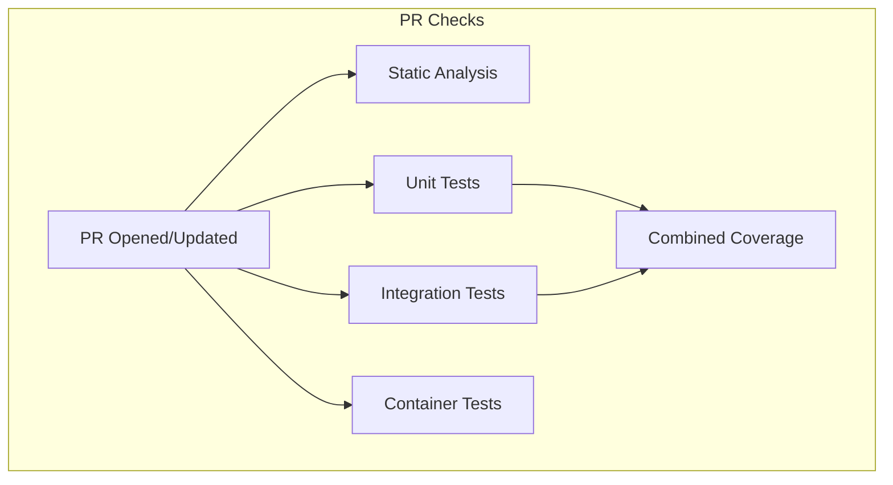
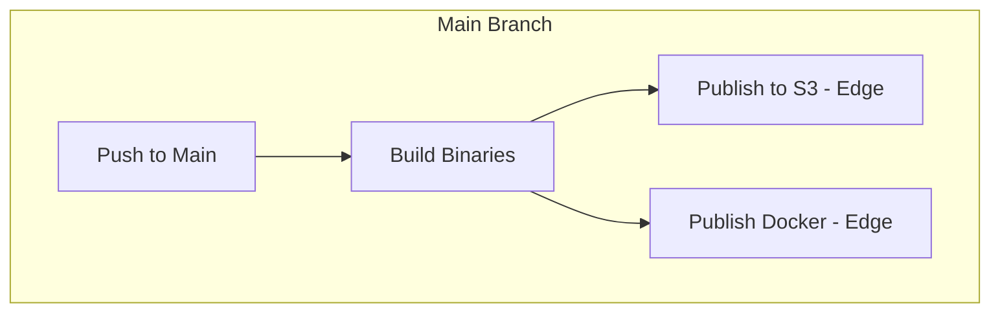
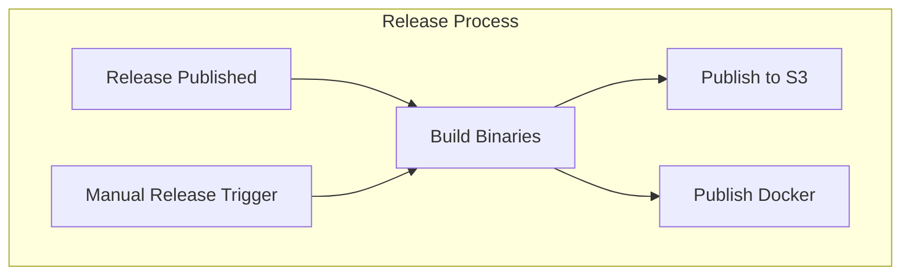

# GitHub Actions Documentation

This guide documents the CI/CD infrastructure for the Bacalhau project, implemented using GitHub Actions.


## Overview

The Bacalhau project uses GitHub Actions for continuous integration, testing, and deployment. The CI/CD pipeline consists of:

### **PR Checks**
Run on all pull requests to validate code quality and correctness


### **Main Branch Builds**
Triggered on pushes to the main branch to build and publish "edge" artifacts



### **Release Process**
Run when a new GitHub release is created to publish official releases


## Workflow Architecture

The repository uses a modular approach with reusable workflows:

- **Core Reusable Workflows**
    - `_build.yml` - Builds binaries for multiple platforms
    - `_test.yml` - Runs Go tests with configurable parameters
    - `_test_container.yml` - Tests containerized applications
    - `_test_coverage.yml` - Combines and processes test coverage reports
    - `_static-analysis.yml` - Runs linting and other static analysis tools
    - `_s3_publish.yml` - Publishes artifacts to S3
    - `_docker_publish.yml` - Builds and publishes Docker images

- **Parent Workflows**
    - `pr-checks.yml` - Entry point for PR validation
    - `main.yml` - Entry point for main branch processing
    - `release.yml` - Entry point for release processing

- **Custom Actions**
    - `build-bacalhau` - Builds Bacalhau binaries for specific platforms
    - `get-version-info` - Extracts version information from Git
    - `docker-test-image` - Performs smoke tests on Docker images
    - `swagger-validation` - Validates Swagger/OpenAPI specifications

## Workflow Triggers

| Workflow | Trigger | Description |
|----------|---------|-------------|
| PR Checks | Pull request opened/synchronized/reopened | Validates code changes before merging |
| Main | Push to `main` branch | Builds and publishes "edge" artifacts |
| Release | GitHub release published/pre-released | Publishes official release artifacts |

## Build Matrix

The build process creates binaries for the following platforms:

| OS | Architecture |
|----|-------------|
| linux | amd64 |
| linux | arm64 |
| linux | armv7 |
| linux | armv6 |
| darwin | amd64 |
| darwin | arm64 |
| windows | amd64 |

## Artifact Publishing

Artifacts are published to multiple destinations:

1. **S3 Bucket**:
    - Edge builds: `s3://{bucket}/public/releases/edge/{git_version}/`
    - Pre-releases: `s3://{bucket}/public/releases/pre/{git_version}/`
    - Stable releases: `s3://{bucket}/public/releases/stable/{git_version}/`

2. **Docker Images (GHCR)**:
    - Base image: `ghcr.io/bacalhau-project/bacalhau:{tags}`
    - DIND image: `ghcr.io/bacalhau-project/bacalhau:{tags}-dind`

### Image Tagging Strategy

| Build Type | Tags Applied |
|------------|--------------|
| Edge (main) | `{git_version}`, `edge` |
| Pre-release | `{git_version}`, `pre` |
| Stable release | `{git_version}`, `latest` |

## Testing Strategy

Tests are categorized and run separately:

1. **Unit Tests**: Fast tests that don't require external dependencies
    - Run with `-tags=unit`

2. **Integration Tests**: Tests that require integration with other services
    - Run with `-tags=integration`

3. **Container Tests**: Tests that run in Docker containers
    - Uses the custom-built binary in a container environment

## Using the Workflows

### Running the PR Checks Locally

You can simulate the PR checks locally with:

```bash
# Static analysis
go install github.com/golangci/golangci-lint/cmd/golangci-lint@v1.64.5
golangci-lint run --timeout=5m

# Unit tests
go test ./pkg/... ./cmd/... -tags=unit

# Integration tests
go test ./pkg/... ./cmd/... -tags=integration
```

### Creating a Release

1. Create a GitHub release from the tag (pre-release or full release)

2. The release workflow will automatically build and publish all artifacts

### Manual Workflow Trigger

You can manually trigger workflows from the GitHub Actions tab:

1. Navigate to the Actions tab in your repository
2. Select the desired workflow (e.g., "Release")
3. Click "Run workflow"
4. Select the branch and enter any required parameters
5. Click "Run workflow"


## Troubleshooting

### Common Issues

1. **Build Failures**:
    - Check that required secrets are properly configured
    - Verify that the GO version is correct in go.work
    - Check for recent changes to the build system

2. **Test Failures**:
    - Look for test reports in the workflow artifacts
    - Check if the failures are environment-specific
    - Verify external dependencies are accessible

3. **Publishing Failures**:
    - Check that AWS credentials are correct and have sufficient permissions
    - Verify the S3 bucket exists and is accessible
    - Check Docker login credentials for GHCR
