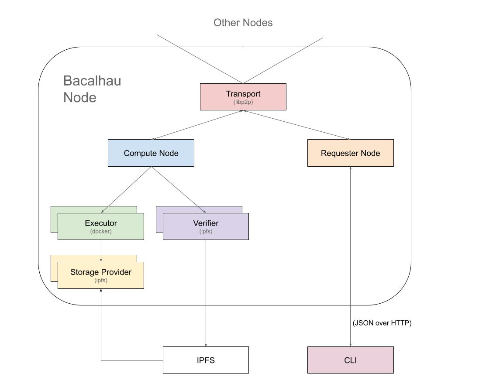
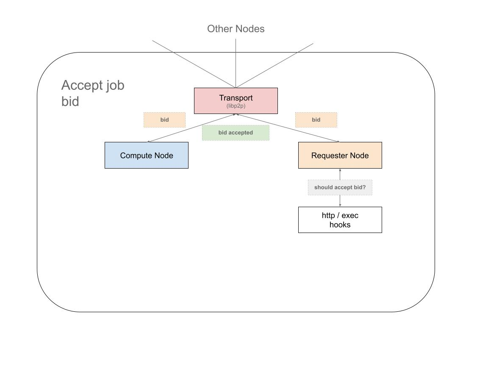
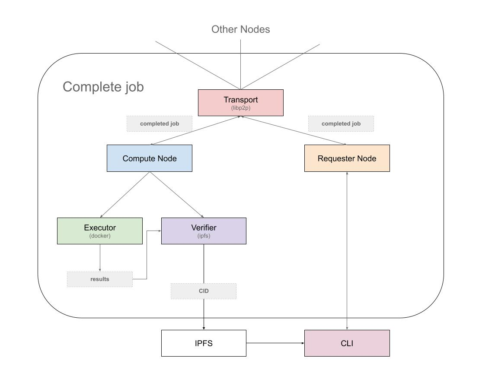

# Architecture

## Purpose

The purpose of Bacalhau is to provide a platform for public, transparent, and optionally verifiable computation. Bacalhau enables users to run arbitrary docker containers and wasm images as tasks against data stored in IPFS. This architecture is also referred to as Compute Over Data (or CoD). The Portuguese word for salted Cod fish is "Bacalhau" which is the origin of the project's name.



Bacalhau operates as a peer-to-peer network of nodes where each node has both a requestor and compute component.  To interact with the cluster - Bacalhau CLI requests are sent to a node in the cluster (via JSON over HTTP), which then broadcasts messages over the transport layer to other nodes in the cluster.  All other nodes in the network are connected to the transport layer and as such have a shared view of the world.

## System Components


Bacalhau's architecture is divided among the following core components and interfaces: 

### Transport (interface)

The transport component is responsible for connecting different bacalhau nodes in the peer to peer network. Its job is to broadcast messages about jobs as they are created, bid upon and executed by compute nodes.

As well as handling the distribution of messages to other nodes, It’s also responsible for handling the “identity” of an individual bacalhau node.

The main implementation of the transport interface in a production Bacalhau network is the libp2p transport.  This uses the GossipSub handler to distribute job messages to other nodes on the network.

### Requester node (component)

The requestor node is responsible for handling requests from clients using JSON over HTTP and is the main “custodian” of jobs submitted to it.

When you submit a job to a given Requestor node - it handles the process of broadcasting that job to the network and then accepting or rejecting the various bids that will come back in for that job.  There is only ever a single requestor node for a given job and that is the requestor node that job was originally submitted to.

### Compute node (component)

When a new job is seen on the network - the Compute node will decide whether it wants to “bid” on that job or not.  If a bid is made and subsequently accepted by the requester node - a “bid accepted” event will then trigger the Compute node to “run” the job using its collection of “executors” (each of which in turn has a collection of “storage providers”).

Once the executor has run the job and has produced some results - the Compute node will then pass those results off to the “verifier” to process them.  The Compute node has a collection of named verifiers and will pick the most appropriate one based on the job spec.

### Executor (interface)

The Executor is what actually “runs” the job and checks for the locality of storage used by a job.   It will handle “presenting” the input and output storage volumes into the job when it is run.

Storage means something entirely different between something like docker and WASM and so if a job mentions “use this IPFS cid” - it will result in two different storage providers being used depending on if the job is using the docker or WASM executor.

Put another way - the executor has two main jobs:
- Present the storage volumes in a way that is appropriate for the executor
- Run the job

When it’s finished running the job (and there was not an error in the job), the executor should result in a local folder containing the results of the job.

The idea is that Bacalhau makes it really easy to write new executors and it grows into a polyglot network of different compute implementations.

### Storage Provider (interface)

Storage providers are responsible for presenting some upstream storage source (e.g. ipfs cid) into an executor in an opinionated way.

For example - we might have the following two storage providers:

- IPFS posix - a storage provider that manifests a CID as a POSIX filesystem
- IPFS library - a storage provider that streams the contents of a CID via a library call

And we might have the following two executor implementations:

- Docker - run docker containers
- WASM - run WASM binaries

If we submit a job with a volume of type “ipfs” to both executors - it should result in the docker executor using the “IPFS posix” storage provider and the WASM executor using the “IPFS library” provider.

As such - an executor implementation will “contain” the storage providers it can operate with and they are loosely coupled (the IPFS posix/library storage providers can be used across multiple executors where appropriate).

### Verifier (interface)

The verifier takes over once the executor has run the job.  Its main two tasks is to check the results produced by the executor (against results produced by other nodes) and to transport those results back to the client somehow.

How the results are checked depend on the nature of the job.  For example - if the job is deterministic - the “check the hash of the results are the same” verifier can be used but if the job is non-deterministic, another approach must be used.


The job will state which verifier to use and there are currently the following verifier implementations:
- noop - does nothing and just returns the local folder given to it as the "results" (useful for tests)
- ipfs - publishes the results to ipfs so the client / requester can download the files produced by the job
Note: currently neither of these verifiers actually perform any verification. They are concerned only with transporting the results. However, this will be used when the WASM executor is introduced in a future release.


## Job Lifecycle

### Job Submission

Jobs submitted via the Bacalhau CLI are forwarded to a bacalhau cluster node at bootstrap.production.bacalhau.org via port 1234 by default. This bacalhau node will act as the “requestor node” for the duration of the job lifecycle.

When jobs are submitted to the requestor node - all compute nodes hear of this new job and can choose to “bid” on it.  The job deal will have a “concurrency” setting which means “how many different nodes I want to run this job”.  The job might also mention the use of “volumes” (for example some IPFS CIDs).  The compute node can choose to bid on the job if the data for the volumes resides locally to the compute node or it can choose to bid anyway.  Bacalhau will support the use of external http or exec hooks to decide if a node wants to bid on a job.  This means a node operator can give fine grained rules as to what jobs they are willing to run.


### Job Acceptance

As these bids from compute nodes arrive back at the originating requester node - it can choose which bids to accept and which ones to reject.  This can be based on the previous reputation of each compute node or any other factors the requestor node might take into account (like locality, hardware resources, cost etc).  The requestor node will also have the same http or exec hooks to decide if it wants to accept a bid from a given compute node.  This means a node operator can give fine grained rules as to what jbids they are willing to accept.




### Job Execution

As accepted bids are received by compute nodes - they will “execute” the job using the executor for that job and the storage providers that executor provides for that job.

For example - a job could use the “docker” executor and “ipfs” storage volumes.  This would result in a POSIX mount of the IPFS storage into a running container.  Alternatively - a job could use the “WASM” executor and “ipfs” storage volumes.  This would result in a WASM style syscall to stream the storage bytes into the WASM runtime.  The point is that each “executor” will deal with storage in a different way and so even though each job mentions “ipfs” storage volumes - they would both end up with different implementations at runtime.


### Job Completion

Once the executor has completed the running of the job - its results are then passed to the “verifier”.  Its task is to decide how to validate and return the results back to the client.  Again - this depends on the nature of the job.  If the nature of the job is deterministic - then the “output hash” verifier can be used (where all hashes of the outputs from all compute nodes must match).  Whereas if the job is non-deterministic, another style of verifier might be used (or none at all!)

The outcome of this lifecycle is that a requestor node is able to list the results of a job to the original client that requested it.




### Input / Output Volumes

A job includes the concept of input and output volumes and the docker executor implements support for these. This means you can specific ipfs CIDs and input paths and also write results to an output volume - this can be seen by the following example:

```
cid=$(ipfs add file.txt)
bacalhau docker run \
  -v $cid:/file.txt \
  -o apples:/output_folder \
  ubuntu \
  bash -c 'cat /file.txt > /output_folder/file.txt'
```

The above example demonstrates an input volume flag “-v $cid:/file.txt”, which mounts the contents of $cid within the docker container at location /file.txt (root).

Output volumes are mounted to the docker container at the location specified. In the example above, any content written to /output_folder will be made available within the apples folder in the job results CID.

Once the job has run on the executor - the contents of stdout and stderr will be added to any named output volumes the job has used (in this case apples) and all those entities will be packaged into the results folder which is then published to ipfs via the verifier.

### Networking

Jobs should only require dependencies that are baked into their Docker images and the input files mounted from IPFS in order to produce their output, therefore egress access to the network is currently disabled.
