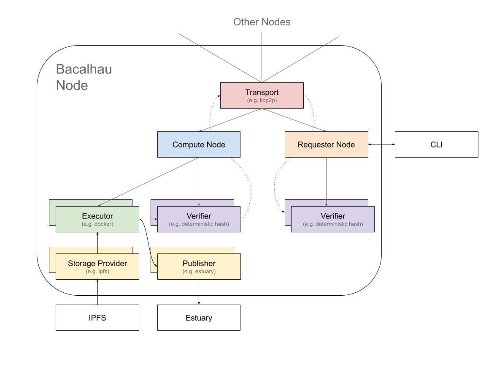
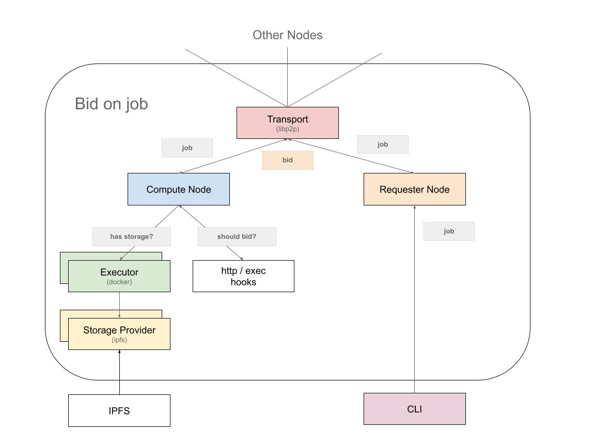
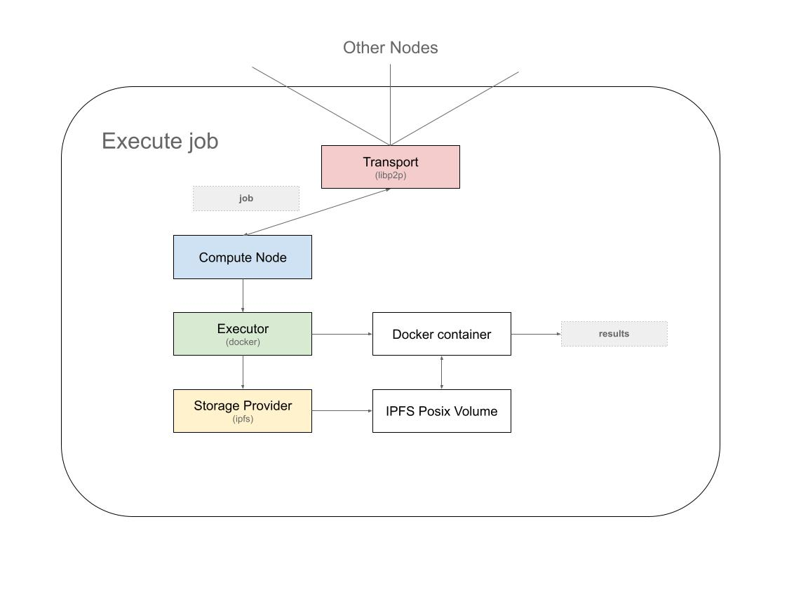
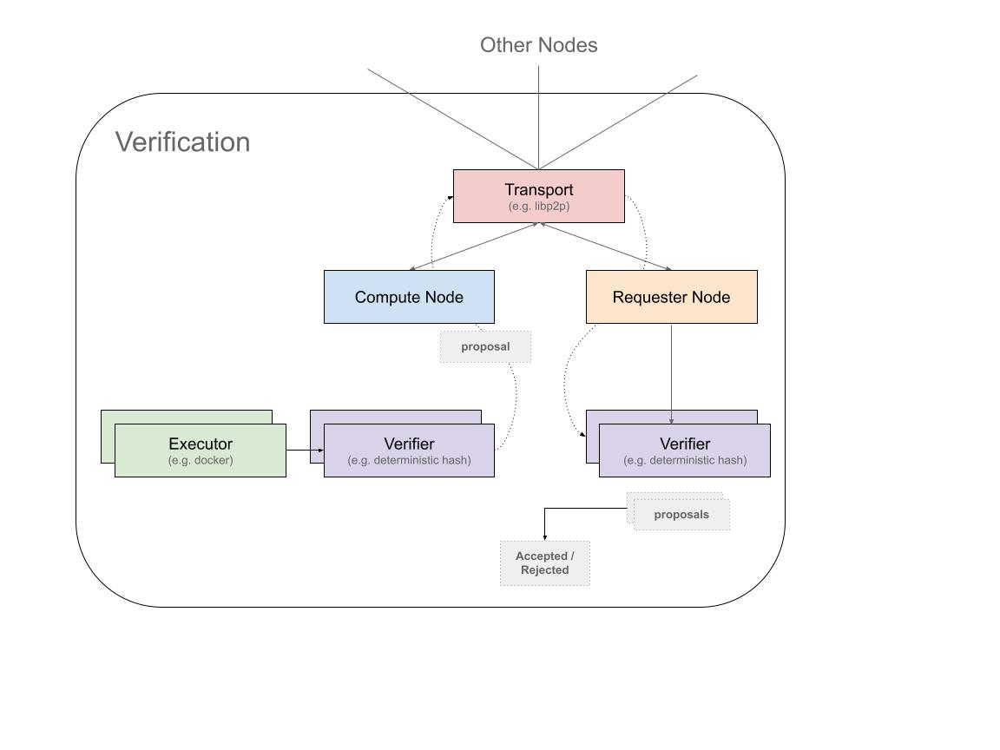
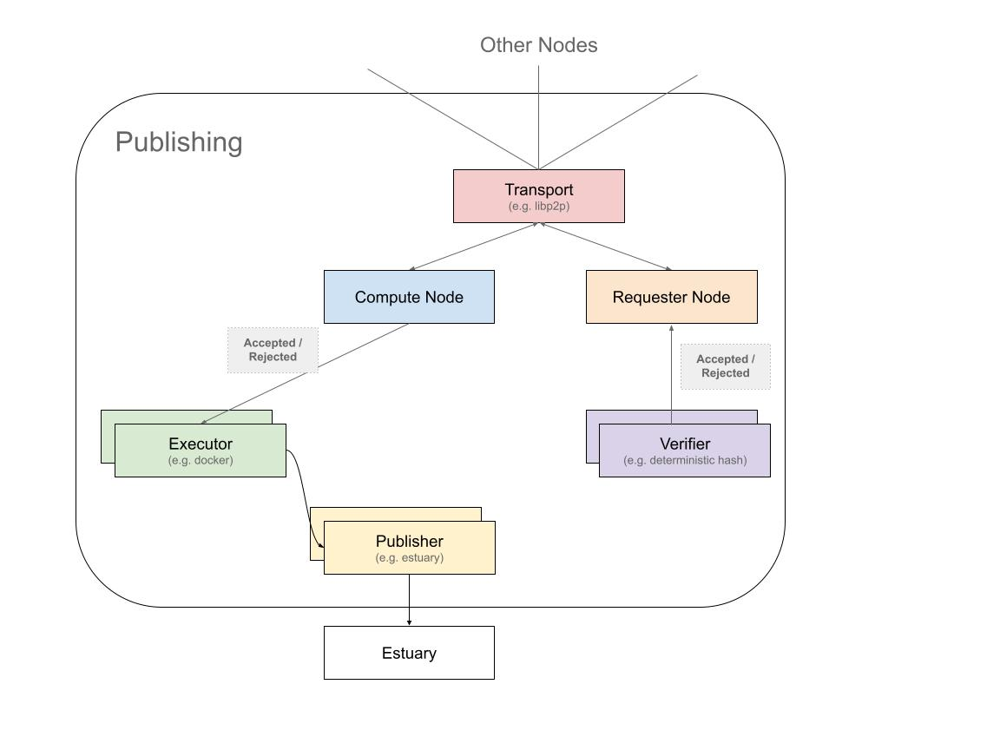

# Architecture

Bacalhau operates as a peer-to-peer network of nodes where each node has both a requestor and compute component.  To interact with the Bacalhau network, Bacalhau CLI requests are sent to a node in the network (via JSON over HTTP), which then broadcasts messages over the transport layer to other nodes in the network.  All other nodes in the network are connected to the transport layer and as such have a shared view of the world.




## System Components


Bacalhau's architecture is divided among the following core components and interfaces: 

### Transport (interface)

The transport component is responsible for connecting different Bacalhau nodes in the peer to peer network. Its job is to broadcast messages about jobs as they are created, bid upon and executed by compute nodes.

In addition to handling the distribution of messages to other nodes, the transport component is also responsible for handling the identity of an individual Bacalhau node.

The main implementation of the transport interface in a production Bacalhau network is the [libp2p](https://libp2p.io/) transport.  This uses the [GossipSub](https://docs.libp2p.io/concepts/publish-subscribe/) handler to distribute job messages to other nodes on the network.

### Requester node (component)

The requestor node is responsible for handling requests from clients using JSON over HTTP and is the main custodian of jobs submitted to it.

When you submit a job to a given Requestor node, it handles the process of broadcasting that job to the network and then accepting or rejecting the various bids that will come back in for that job. There is only ever a single requestor node for a given job -- the requestor node that job was originally submitted to.

Once compute nodes have executed the job, they will produce verification proposals, of which the requester node will collate and combine when enough have been proposed. At this point, the proposals will be `accepted` or `rejected`, and the compute nodes will then publish their raw results.

### Compute node (component)

When a new job is seen on the network, the Compute node will decide whether it wants to `bid` on that job or not.  If a bid is made and subsequently accepted by the requester node, a `bid accepted` event will then trigger the Compute node to run the job using its collection of `executors` (each of which in turn has a collection of `storage providers`).

Once the executor has run the job and has produced some results, the Compute node will then produce a verification proposal which the requester node will collate alongside proposals from other compute nodes that ran the same job. These proposals will then be accepted or rejected which will result in the compute node then publishing the raw results (via the publisher interface). The Compute node has a collection of named executors, verifiers, and publishers -- it will pick the most appropriate ones based on the job specifications.

### Executor (interface)

The Executor is what runs the job and checks for the locality of storage used by a job. It handles presenting the input and output storage volumes into the job when it is run.

Storage means something entirely different between Docker and WebAssembly (wasm), so if a job mentions “use this IPFS cid”, it will result in two different storage providers being used. This choice depends the executor used on the job.

Put another way - the executor has two main tasks:
- Present the storage volumes in a way that is appropriate for the executor.
- Run the job.

When it’s finished running the job, the executor will combine `stdout`, `stderr`, and named output volumes into a results folder. This results folder is then used to create the verification proposal which is sent off to the requester. Once `results accepted` or `results rejected` events are seen - this results folder is then sent off to the publisher to be published.


### Storage Provider (interface)

Storage providers are responsible for presenting some upstream storage source (e.g. ipfs cid) into an executor in an opinionated way.

For example, we might have the following two storage providers:

- IPFS posix - a storage provider that manifests a CID as a POSIX filesystem
- IPFS library - a storage provider that streams the contents of a CID via a library call

And we might have the following two executor implementations:

- Docker - run docker containers
- WASM - run WASM binaries

If we submit a job with a volume of type `ipfs` to both executors, it should result in the Docker executor using the `IPFS posix` storage provider and the WASM executor using the `IPFS library` provider.

As such, an executor implementation will contain the storage providers it can work with and they are loosely coupled, e.g. the IPFS posix & library storage providers can be used across multiple executors where appropriate.


### Verifier (interface)

The verifier takes over once the executor has run the job. Its main two tasks are to check the results produced by the executor (against results produced by other nodes) and to transport those results back to the requester node.

How the results are checked depend on the nature of the job.  For example, if the job is deterministic, the “deterministic hash” verifier can be used. If the job is non-deterministic, another approach must be used.

The verifier exists on both the compute node and requester node - the task of the compute node verifier is to produce a verification proposal based on having run a job. The task of the requester node verifier is to collate the proposals from various compute nodes, and when enough proposals have arrived, to decide on which compute nodes have actually performed the work. Once it has decided, it will emit events to the network `accepting` or `rejecting` the verification proposals.

### Publisher (interface)

Once verification has been complete, the publisher will handle uploading the raw results to a place that clients can read from. Its important to make a distinction between verification proposals and published results.  Before verification has happened, the published results need to remain private between the compute node that ran the job and the requester node looking after that job. This is to prevent compute nodes simply copying the results produced by other nodes.

The publisher interface is responsible for uploading the local folder of results to somewhere that can be read by the rest of the world. The default publisher is either Estuary (if an API key has been provided) or IPFS.  In both cases, the published results of a job will end up on IPFS with a cid that can be used to read them.  If Estuary is used as the publisher, then the results will also end up on Filecoin.


## Job Lifecycle

### Job Submission

Jobs submitted via the Bacalhau CLI are forwarded to a Bacalhau network node at `bootstrap.production.bacalhau.org` via port 1234 by default. This Bacalhau node will act as the requestor node for the duration of the job lifecycle. Jobs can also be submitted to any requestor node on the Bacalhau network.

When jobs are submitted to the requestor node, all compute nodes hear of this new job and can choose to `bid` on it. The job deal will have a `concurrency` setting, which refers to how many different nodes you may want to run this job. It will also have `confidence` and `min-bids` properties.  Confidence is how many verification proposals must agree for the job to be deemed successful. `Min-bids` is how many bids must have been made before we will choose to accept any.

The job might also mention the use of `volumes` (for example some IPFS CIDs). The compute node can choose to bid on the job if the data for the volumes resides locally to the compute node, or it can choose to bid anyway. Bacalhau supports the use of external http or exec hooks to decide if a node wants to bid on a job. This means that a node operator can give granular rules about the jobs they are willing to run.




### Job Acceptance

As bids from compute nodes arrive back at the originating requester node, it can choose which bids to accept and which ones to reject. This can be based on the previous reputation of each compute node, or any other factors the requestor node might take into account (like locality, hardware resources, cost etc). The requestor node will also have the same http or exec hooks to decide if it wants to accept a bid from a given compute node. The `min-bids` setting is useful to ensure that we don’t accept bids on a first bid first accepted basis.


### Job Execution


As accepted bids are received by compute nodes, they will `execute` the job using the executor for that job, and the storage providers that executor has mapped in.

For example, a job could use the `docker` executor and `ipfs` storage volumes. This would result in a POSIX mount of the IPFS storage into a running container. Alternately, a job could use the `WASM` executor and “ipfs” storage volumes. This would result in a WASM style `syscall` to stream the storage bytes into the WASM runtime. Each executor will deal with storage in a different way, so even though each job mentions `ipfs` storage volumes, they would both end up with different implementations at runtime.





### Verification

Once the executor has completed the running of the job, a verification proposal will be generated by the verifier module running on the compute node. The nature of this proposal depends on the module used. For example, the deterministic hash verifier will:

- Calculate a `sha256` hash of the contents of the results folder
- Encrypt this hash using the public key of the requester node
- Broadcast the encrypted hash over the network
  - Nodes that are NOT the requester node cannot copy the hash because they do not have the requesters private key
  - The requester will use it’s private key to decrypt the message and read the hash
  -  This means that bad actors cannot simply copy the results hash from other nodes
- The requester node will wait for enough proposals before comparing the results hashes
- It will then broadcast “results accepted” and “results rejected” events based on it’s decision for verification

In the case of a deterministic job, a user can guard against malicious compute nodes that join the network that bid and propose wrong results by using `--verifier deterministic --min-bids N --concurrency 3` (where N is, say, >half of the size  of the network, currently 9) this will require that _N_ bids are received before the requestor node chooses between them randomly. So when you submit wasm jobs (which are deterministic) this can give you a good level of confidence the jobs are evenly spread across nodes and malicious nodes will be, on average, caught out.

It’s possible to use other types of verification methods by re-implementing the verification interface and using another technique.



### Publishing

Once verification has resulted in `results accepted` or `results rejected` events, the publisher will publish the raw results folder currently residing on the compute node.

The default publisher is `Estuary` (if no API key is provided this falls back to the IPFS publisher).  The publisher interface mainly consists of a single function, which has the task of uploading the local results folder somewhere and returning a storage reference to where it has been uploaded.



### Networking

Jobs should only require dependencies that are baked into their Docker images and the input files mounted from IPFS in order to produce their output, therefore egress access to the network is currently disabled.


### Input / Output Volumes

A job includes the concept of input and output volumes, and the Docker executor implements support for these. This means you can specify ipfs CIDs and input paths and also write results to an output volume. This can be seen by the following example:

```
cid=$(ipfs add file.txt)
bacalhau docker run \
  -v $cid:/file.txt \
  -o apples:/output_folder \
  ubuntu \
  bash -c 'cat /file.txt > /output_folder/file.txt'
```

The above example demonstrates an input volume flag `-v $cid:/file.txt`, which mounts the contents of $cid within the docker container at location `/file.txt` (root).

Output volumes are mounted to the Docker container at the location specified. In the example above, any content written to `/output_folder` will be made available within the apples folder in the job results CID.

Once the job has run on the executor, the contents of `stdout` and `stderr` will be added to any named output volumes the job has used (in this case apples), and all those entities will be packaged into the results folder which is then published to IPFS via the verifier.
