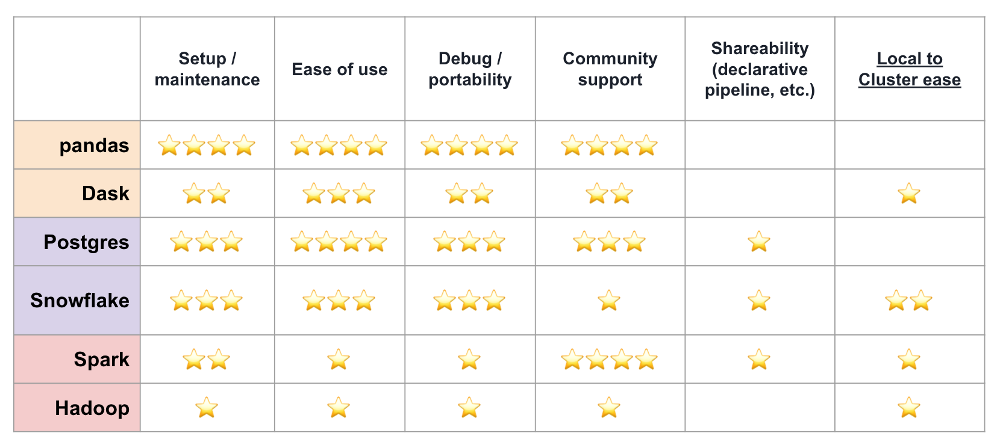

# Compute Over Data - Landscape Analysis

This page is an introduction to a landscape analysis of general-purpose compute frameworks.
Its purpose is to map the roughness of the existing technologies and serve as a background intro for those who are new to the Bacalhau community.
Feel free to watch the video below for a short walk-through and read the sections below. 
More detailed content is available in the [Landscape Analysis slides](https://docs.google.com/presentation/d/1wOh-ASGshgc1Ivkoyaz9zGpVGTxX9LDMZQB4-eXOBP4/edit?usp=sharing) or in the [code repository](https://github.com/winderai/bacalhau-landscape-analysis-benchmarks).

*Placeholder for introductory video*

## Compute Landscape

The traditional compute landscape counts several dozens of frameworks capable of processing generic workloads.
Some are specifically designed to take advantage of data locality by bringing the computation close to where data lives.
This landscape analysis reviewed a selection of these tools in order to summarize their pros and cons.

> The [Landscape Analysis slides](https://docs.google.com/presentation/d/1wOh-ASGshgc1Ivkoyaz9zGpVGTxX9LDMZQB4-eXOBP4/edit?usp=sharing) contain a detailed overview of the compute frameworks and include sample code snippets. 

The Python data stack includes tools like Pandas and Dask that offer a very convenient data structure named "dataframe", particularly suitable for handling tabular data.

The database world offers a variety of choices optimized for different use cases (e.g. tabular data, real-time time series, etc.).
This research looked at Postgres and Snowflake, a couple of fairly generic tools in this space.

Big data tools like Apache Spark and Hadoop are also part of this analysis.
They are capable of processing structured and unstructured data in very large clusters.
This category introduced first the concept of data-locality to avoid data transfers over the cluster network.

Last but not least some web3 tools are also part of this analysis.
They aim at supporting distributed storage and computation. 
Note that at the time of writing they're under heavy development. 
In many cases, it's still unclear how they work and what direction they'll take in the future.

Unfortunately, many of these systems are far from being easy to operate on your localhost or at scale.
Traditional frameworks are plagued by significant operational overhead resulting in inefficient resource usage.
Moreover, there's often a significant setup burden even to running a getting started guide, setting a relatively high barrier to entry.
The table below summarizes their score in terms of different requirements, find more details in the slide deck linked at the bottom of this page.

Why is Bachalau not on this list?

This analysis is not a direct comparison between Bacalhau and existing frameworks.
Instead, this research aims at helping the Bacalhau community to learn the drawbacks affecting traditional systems.
Ultimately Bacalhau aims at combining efficient distributed computation with ease of use.

## Sample code & benchmarks

A good starting point to navigate the compute waters is taking a look at the [code repository](https://github.com/winderai/bacalhau-landscape-analysis-benchmarks) where you'll find working examples of embarrassingly parallel workloads (e.g. word count, dataset aggregation, etc.).
Take a look at the dedicated folder for viewing the demos in a notebook format, no installation is needed. 
Setup instructions guide you through the installation process in case you'd like to run those examples yourself, and please give it a try to get an idea of the headaches a simple single-node setup can get you.

The repository above ships also benchmark scripts that run a parallel workload on a large dataset, time its execution, and log resource usage. 
Explore the related section to familiarize yourself with the rough edges of the installation process.
Instructions on how to spawn a multi-node cluster are provided for each framework.
The plot below reports the benchmark running time for each framework, missing bars imply that the tool doesn't support a fully-fledged multi-node set-up (i.e can only scale vertically).

> Do you want to learn more about the benchmark results? 
Check out the [Landscape Analysis slides](https://docs.google.com/presentation/d/1wOh-ASGshgc1Ivkoyaz9zGpVGTxX9LDMZQB4-eXOBP4/edit?usp=sharing) or dive into the [code repository](https://github.com/winderai/bacalhau-landscape-analysis-benchmarks).

## Key findings

* These tools are optimized to tackle a different kind of workloads. Although Spark/Dask strive to be as generic as possible, their performance/support shine with structured data.
* Most tools have poor performance with unsharded large files, i.e. strive to parallelize.
* We tested vanilla configurations. Tweaking parameters improves performance but adds complexities. Modern tools shall provide out of the box experience. 
* Declarative pipelines are missing, as well as first-class support for repeatable containerized jobs.
* The local to multi-node cluster journey is quite rough and requires additional installations, configurations and a different approach to writing your code.