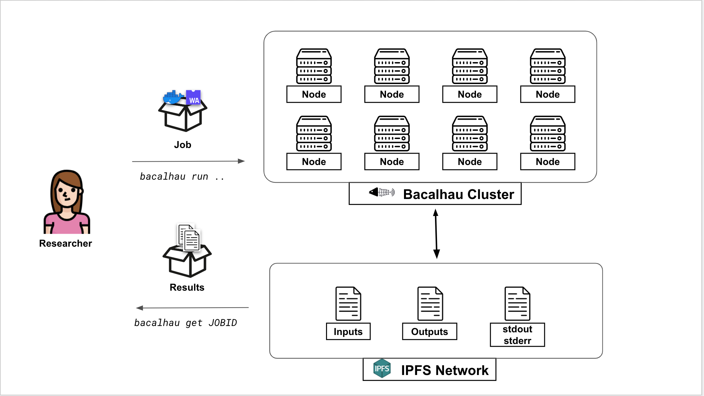

# Our Vision

Bacalhau seeks to transform data processing for large-scale datasets to improve cost and efficiency, and to open up data processing to larger audiences. Our goals with the project center around creating an open, collaborative Compute ecosystem.

We created Bacalhau to bring useful Compute resources to data stored in Filecoin. We believe that the same benefits of open collaboration on datasets stored in IPFS and Filecoin should be available to generic compute tasks.

Initially, the Bacalhau project will focus on serving data processing and analytics use cases. Over time, Bacalhau will expand to other Compute workloads.

# High Level Network View

