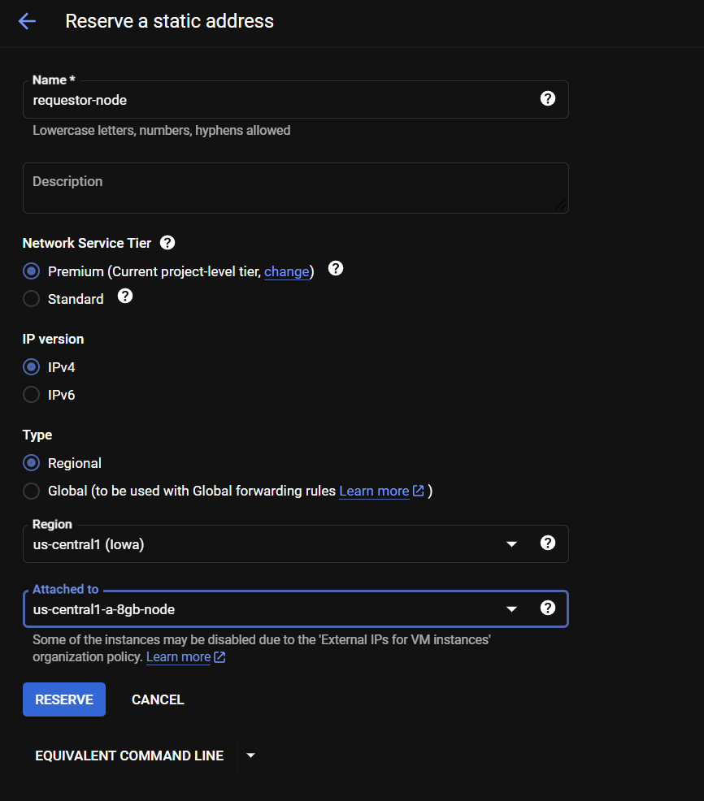

# Setup GCP Infrastructure using Terraform

## Create 3 Compute and 1 Requestor node on GCP using Terraform

To deploy the infrastructure, follow these steps:

1. Access your [GCP project you want to deploy to](https://console.cloud.google.com/home/dashboard) and take not of the Project ID.
2. Install Terraform on your local hmachine if you haven’t already: **[https://www.terraform.io/downloads.html](https://www.terraform.io/downloads.html)**
3. Create a new directory for your terraform files and account, and save the service account key and terrafrom files. `cd` into this file. 
4. Create a service account on GCP
    1. Go to the Google Cloud Console: **[https://console.cloud.google.com/](https://console.cloud.google.com/)**
    2. Make sure you have the correct project selected at the top.
    3. Navigate to **`IAM & Admin > Service Accounts`** from the sidebar.
    4. Click **`+ CREATE SERVICE ACCOUNT`** at the top of the page.
    5. Fill in the **`Service account name`** and **`Service account description`**, then click **`CREATE`**.
    6. In the [https://console.cloud.google.com/iam-admin/iam](https://console.cloud.google.com/iam-admin/iam) section, click **`+`Grant access**.
    7. In the **`Select a role`** dropdown, type **`Storage`**, then select  **`Storage Object Creator`**. Click **`SAVE`**.
    8. Again Navigate to [https://console.cloud.google.com/iam-admin/serviceaccounts](https://console.cloud.google.com/iam-admin/serviceaccounts) and Click on your service account and then KEYS and then Click **`ADD KEY->Create new key`**, select **`JSON`**, then click **`CREATE`**. This will download a JSON file with your credentials to your computer. **Save this file in a secure place**, because Google will not keep a copy.
    9. Click **`DONE`**.
5. Save the scripta in files named **`main.tf, variables.tf`** in the same directory

main.tf

```bash
provider "google" {
  project = var.project_id
  region  = "us-central1"
}

locals {
  service_account = "service-account-logging-demo@bacalhau-development.iam.gserviceaccount.com"

  node_configs = {
    "us-central1-a-node" = {
      zone         = "us-central1-a"
      machine_type = var.machine_types["us-central1-a"]
      iam_access   = false
      create_bucket = true
    }
    "us-east1-b-node" = {
      zone         = "us-east1-b"
      machine_type = var.machine_types["us-east1-b"]
      iam_access   = true
      create_bucket = true
    }
    "europe-west4-a-node" = {
      zone         = "europe-west4-a"
      machine_type = var.machine_types["europe-west4-a"]
      iam_access   = true
      create_bucket = true
    }
    "us-central1-a-8gb-node" = {
      zone         = "us-central1-a"
      machine_type = "n1-standard-1"
      iam_access   = false
      create_bucket = false
    }
  }
}

resource "google_compute_instance" "gcp_instance" {
  for_each = local.node_configs

  name         = each.key
  machine_type = each.value.machine_type
  zone         = each.value.zone

  boot_disk {
    initialize_params {
      image = "projects/ubuntu-os-cloud/global/images/family/ubuntu-2004-lts"
    }
  }

  network_interface {
    network = "default"
    access_config {
      // Ephemeral IP
    }
  }

  service_account {
    email  = local.service_account
    scopes = ["cloud-platform"]
  }

  metadata_startup_script = <<-EOT
    #!/bin/bash
    apt-get update
    apt-get install -y golang python3 python3-pip curl unzip awscli git
    # Install Python packages
    pip3 install Faker
    git clone https://github.com/bacalhau-project/logrotate
    cd logrotate
    chmod +x ./log-rotate.sh
    sudo ./log-rotate.sh

  # Install Docker
    apt-get update
    apt-get install -y docker.io
    systemctl start docker
    systemctl enable docker

    # Install IPFS
    wget https://dist.ipfs.io/go-ipfs/v0.9.1/go-ipfs_v0.9.1_linux-amd64.tar.gz
    tar xvf go-ipfs_v0.9.1_linux-amd64.tar.gz
    cd go-ipfs
    sudo bash install.sh
    ipfs init
    systemctl start ipfs
    systemctl enable ipfs

    curl -sL https://get.bacalhau.org/install.sh | bash
  EOT
}

resource "google_storage_bucket" "node_bucket" {
  for_each = { for k, v in local.node_configs : k => v if v.create_bucket }
  
  name     = "${each.key}-archive-bucket"
  location = "US"

  lifecycle_rule {
    condition {
      age = "3"
    }
    action {
      type = "Delete"
    }
  }

  storage_class = "ARCHIVE"
}
```

variables.tf

```bash
variable "project_id" {
  description = "The project ID to deploy to."
}

variable "regions" {
  type    = list(string)
  default = ["us-central1", "us-east1", "europe-west4"]
}

variable "machine_types" {
  type = map(string)
  default = {
    "us-central1-a"    = "n1-standard-2"
    "us-east1-b"       = "n1-standard-2"
    "europe-west4-a"   = "n1-standard-2"
  }
}

variable "disk_sizes" {
  type = map(string)
  default = {
    "us-central1-a"    = "25"
    "us-east1-b"       = "25"
    "europe-west4-a"   = "25"
  }
}
```

## Run Terraform Scripts

First, you will need to init terraform and add the access token that you downloaded when you created your IAM service account.
 
```bash
terraform init
export GOOGLE_CLOUD_ACCESS_TOKEN=$(gcloud auth application-default print-access-token)
```

Next you are going to the terraform execution plan and set the project id variable which you can [find on the GCP project dashboard](https://console.cloud.google.com/home/dashboard, then apply the 

``
terraform plan -out=tfplan -var=project_id=<your_project_id>
terraform apply tfplan
```

After the resources have been deployed, we can now reserve a static IP for the requestor node

```
1. **Reserve a Static IP Address**:

You'll first need to reserve a static IP address to use for your instance.

a. Go to the Google Cloud Console: **[https://console.cloud.google.com/](https://console.cloud.google.com/)**

b. Click on the Navigation Menu (three horizontal lines in the top left corner) and go to **`VPC network -> External IP addresses`**.

c. Click on **`Reserve Static Address`**.

d. Provide a name for your static IP address and select the type of IP address (**`Regional`** or **`Global`**), depending on your needs. If your node is a Compute Engine, you most likely need a **`Regional`** IP.

e. Select the **`region`** (if Regional) or **`network service tier`** (if Global).

f. **Assign the Static IP Address to an Instance**

g. Click **`Reserve`** to reserve the IP.

That's it! Your GCP node should now have a static IP address.
```


