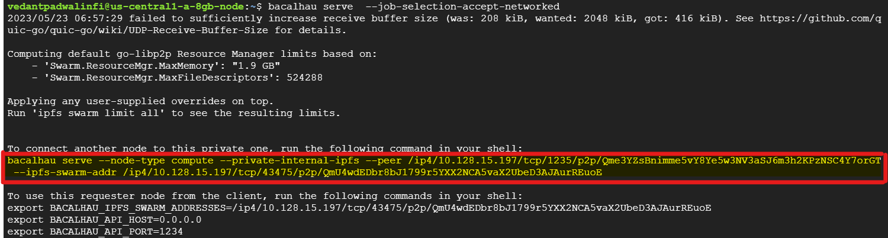

# The Bacalhau Job

## Setting Up Bacalhau On the Provisioned Nodes

Run this command on the requestor node in our case it’s the

```bash
bacalhau serve  --job-selection-accept-networked
```

Copy the command from the requestor node and add the path to the logs directory and the networked flag to the end then paste it into compute node terminals:



alternatively you could also ssh into into the nodes using gcloud and run the command to start bacalhau requestor node node

```bash
gcloud compute ssh \
  --zone "us-central1-a" \
  "us-central1-a-8gb-node" \
  --project "bacalhau-development" \
  --command="bacalhau serve  --job-selection-accept-networked"
```

copy the highlighted command and add these flags to the end of the copied command:
 `--allow-listed-local-paths "/logrotate/logs/**" --job-selection-accept-networked`

## Setting Up the Compute Nodes

you can either paste this command into the terminals of your compute nodes

```bash
sudo bacalhau serve \
    --node-type compute \
    --private-internal-ipfs \
    --peer /ip4/10.128.15.197/tcp/1235/p2p/Qme3YZsBnimme5vY8Ye5w3NV3aSJ6m3h2KPzNSC4Y7orGT \
    --ipfs-swarm-addr /ip4/10.128.15.197/tcp/43475/p2p/QmU4wdEDbr8bJ1799r5YXX2NCA5vaX2UbeD3AJAurREuoE \
    --allow-listed-local-paths '/logrotate/logs/**' \
    --job-selection-accept-networked
```

OR

SSH into the nodes using gcloud CLI and run the command

```bash
gcloud compute ssh \
  --zone "us-central1-a" \
  "us-central1-a-node" \
  --project "bacalhau-development" \
  --command="sudo bacalhau serve \
    --node-type compute \
    --private-internal-ipfs \
    --peer /ip4/10.128.15.197/tcp/1235/p2p/Qme3YZsBnimme5vY8Ye5w3NV3aSJ6m3h2KPzNSC4Y7orGT \
    --ipfs-swarm-addr /ip4/10.128.15.197/tcp/43475/p2p/QmU4wdEDbr8bJ1799r5YXX2NCA5vaX2UbeD3AJAurREuoE \
    --allow-listed-local-paths '/logrotate/logs/**' \
    --job-selection-accept-networked"
```

## Running the Log Processing Job on the nodes using bacalhau

### Create the **Log Processing** Script

The log processing script which uses duckdb and saves the outputs to Archival Storage

```python
import json
import os
from datetime import datetime
import duckdb
import tempfile
import argparse
import requests
import pandas as pd
from google.cloud import storage

def get_metadata(metadata_name):
    metadata_server_token_url = "http://metadata/computeMetadata/v1/instance/service-accounts/default/token"
    token_request_headers = {'Metadata-Flavor': 'Google'}
    token_response = requests.get(metadata_server_token_url, headers=token_request_headers)
    jwt = token_response.json()['access_token']

    metadata_server_url = f"http://metadata.google.internal/computeMetadata/v1/instance/{metadata_name}"
    metadata_request_headers = {'Metadata-Flavor': 'Google', 'Authorization': f'Bearer {jwt}'}

    return requests.get(metadata_server_url, headers=metadata_request_headers).text

def main(input_file, query):
    # Create an in-memory DuckDB database
    con = duckdb.connect(database=':memory:', read_only=False)

    # Create a table from the JSON data
    con.execute(f"CREATE TABLE log_data AS SELECT * FROM read_json('{input_file}', "
                f"auto_detect=false, "
                f"columns={json.dumps({'id': 'varchar', '@timestamp': 'varchar', '@version': 'varchar', 'message': 'varchar'})})")

    # Execute the DuckDB query on the log data
    result = con.execute(query).fetchdf()

    # Convert the result to JSON
    result_json = result.to_json(orient='records')

    # Generate the output file name
    output_file_name = f"{get_metadata('name')}-Security-{datetime.now().strftime('%Y%m%d%H%M')}.json"

    # Get the region from the metadata server
    region = get_metadata("zone").split("/")[3]

    # Generate the bucket name
    bucket_name = f"{region}-node-archive-bucket"

    # Write the result to a temporary file
    with tempfile.NamedTemporaryFile(mode='w', delete=False, suffix='.json') as temp:
        temp.write(result_json)
        temp.close()

        # Upload the file to GCP bucket
        storage_client = storage.Client()
        bucket = storage_client.get_bucket(bucket_name)
        blob = bucket.blob(output_file_name)
        blob.upload_from_filename(temp.name)

        # Remove the temporary file
        os.remove(temp.name)

if __name__ == "__main__":
    # Set up the argument parser
    parser = argparse.ArgumentParser(description="Process log data")
    parser.add_argument("input_file", help="Path to the input log file")
    parser.add_argument("--query", default="SELECT * FROM log_data WHERE message LIKE '%[SECURITY]%' ORDER BY \"@timestamp\"", 
                        help="SQL query to execute on the log data")

    # Parse the command-line arguments
    args = parser.parse_args()

    # Call the main function
    main(args.input_file, args.query)
```

Testing the script locally

```bash
# downloading a fake log file
wget https://gist.githubusercontent.com/js-ts/93ab7bf161c4908952a17758e38c11d6/raw/6ccafd337b5f3c3b1aa4e54a55ea36be8c6ac30c/fake_logs.log
#testing the script
python3 process.py fake_logs.log
```

Building the container to run the script on bacalhau

Dockerfile

```bash
FROM davidgasquez/duckdb:latest

RUN apt-get update && apt-get install -y python3 python3-pip curl wget lsb-release gnupg

# Install Google Cloud SDK and gsutil
RUN echo "deb [signed-by=/usr/share/keyrings/cloud.google.gpg] https://packages.cloud.google.com/apt cloud-sdk main" | tee -a /etc/apt/sources.list.d/google-cloud-sdk.list && \
    curl https://packages.cloud.google.com/apt/doc/apt-key.gpg | apt-key --keyring /usr/share/keyrings/cloud.google.gpg add - && \
    apt-get update -y && apt-get install google-cloud-sdk -y

RUN pip3 install duckdb requests google-cloud-storage pandas

RUN apt-get update -y && apt-get install curl wget -y

WORKDIR /
# You can copy the script instead of downlaoding it
# COPY ./process.py /process.py
RUN wget https://gist.githubusercontent.com/js-ts/cd0f5816aacbc50b2dc692e1c7f4bc90/raw/07e0ceffe72031b5dfb76a53df4a81e533b495b3/process.py
```

Building the container

```bash
docker build -t <your-docker-user>/<image-name> .
```

Replace your-dockerhub-username with your actual DockerHub username. This command will build the Docker image and tag it with your DockerHub username and the image name

Push the Docker Image to DockerHub Once the build process is complete, Next, push the Docker image to DockerHub using the following command:

Again, replace your-dockerhub-username with your actual DockerHub username. This command will push the Docker image to your DockerHub repository.

```bash
docker push <your-docker-user>/<image-name>
```

After that copy these envs from the requestor node and paste it into your terminal

```bash
export BACALHAU_IPFS_SWARM_ADDRESSES=/ip4/10.128.15.197/tcp/44111/p2p/QmVKciUngasyoPmgJrpGkdrUjSu6n9Tx3gDv3Th62UeUwi
export BACALHAU_API_HOST=35.224.115.23 #Replace this with the Static IP of the requestor node
export BACALHAU_API_PORT=1234
```

You can then run the job

```bash
bacalhau docker run  \
--concurrency 3 \
 --network=full \
 -w /inputs \
 -i file:///logrotate/logs \
jsacex/duckdb-logs-archive-query \
-- /bin/bash -c "python3 /process.py --query \"SELECT * FROM log_data WHERE message LIKE '%[SECURITY]%' ORDER BY '@timestamp'\" /inputs/fake_logs.log"
```

Viewing the Processed Log Output of a Single Node

```bash
gsutil cat gs://us-east1-b-node-archive-bucket/us-east1-b-node-Security-202305220729.json | head -n 10
```
