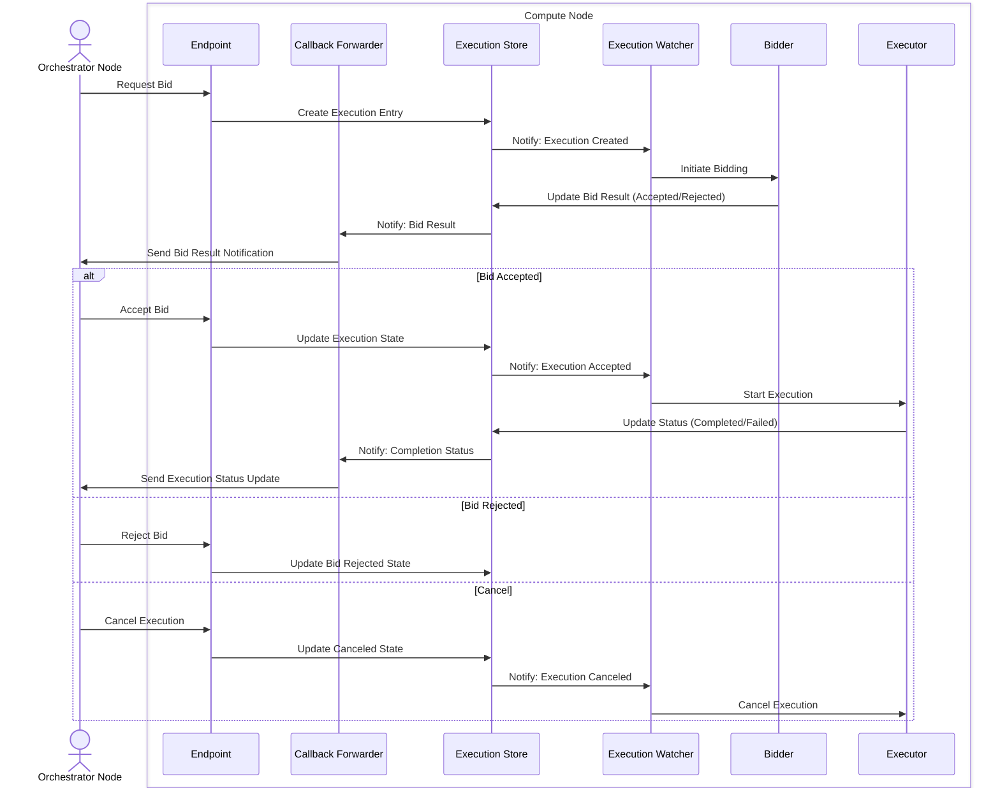

# Compute Node Execution Flow

This document describes the sequence of operations that occur within a compute node when handling execution requests, from initial bid to completion or cancellation.

## Overview

The compute node handles distributed execution requests through a multi-stage process:
1. Bid evaluation and response
2. Execution initialization and monitoring
3. Result reporting and status updates

## Component Responsibilities

### External Components
- **Orchestrator Node**
    - Initiates execution requests
    - Evaluates bid responses
    - Makes final execution decisions
    - Receives status updates

### Internal Components
- **Endpoint**
    - Handles incoming NATS messages/requests from orchestrator
    - Validates incoming requests
    - Initiates internal workflows

- **Callback Forwarder**
    - Manages asynchronous communication back to orchestrator
    - Ensures reliable delivery of status updates
    - Handles retry logic for failed notifications

- **Execution Store**
    - Maintains execution state and history
    - Provides atomic state transitions
    - Stores execution metadata and results
    - Integrates with `/pkg/lib/watcher` library to eventing state changes

- **Execution Watcher**
    - Monitors execution state changes
    - Triggers appropriate actions based on state transitions
    - Manages execution lifecycle

- **Bidder**
    - Evaluates resource availability and constraints
    - Determines bid acceptance criteria

- **Executor**
    - Performs the actual execution work
    - Manages resource allocation
    - Handles execution cleanup

## Sequence Diagram

The following diagram illustrates the complete flow of an execution request through the compute node system:

