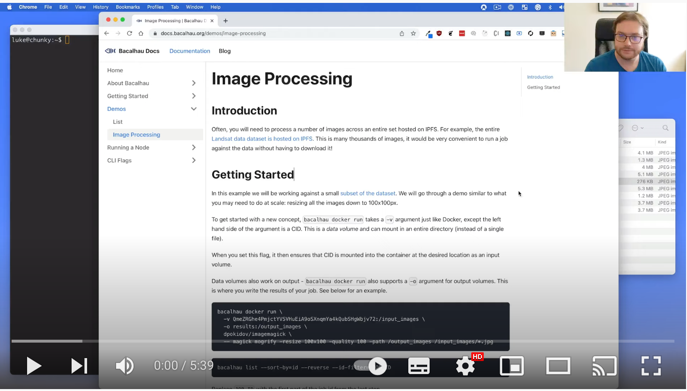

import ReactPlayer from 'react-player'

# Image Processing


## Introduction

Often, you will need to process a number of images across an entire data set hosted on IPFS. For example, the entire [Landsat data dataset is hosted on IPFS ](https://ipfs.io/ipfs/QmeZRGhe4PmjctYVSVHuEiA9oSXnqmYa4kQubSHgWbjv72). This is many thousands of images, it would be very convenient to run a job against the data without having to download it!

This page is a demo of a data intensive image processing workload run on Bacalhau that transforms very high resolution imagery into thumbnail-size pictures.
It is an example of a highly parellizable compute task where a resize function is applied over a large number of files.
For a live walk through of this demo please watch the first part of the video below, otherwise feel free to run the demo yourself by following the steps below.

[](https://www.youtube.com/watch?v=wkOh05J5qgA)


<!-- Here is an example of running a job live on the Bacalhau network: [Youtube: Bacalhau Intro Video](https://www.youtube.com/watch?v=wkOh05J5qgA)
<ReactPlayer playing controls url='https://www.youtube.com/watch?v=wkOh05J5qgA' playing='false'/> -->

## Prerequistes

Make sure you have the latest `bacalhau` client installed by following the [getting started instructions](../../getting-started/installation).

## Submit the workload

In this example we will be working against a small [subset of the dataset](https://ipfs.io/ipfs/QmeZRGhe4PmjctYVSVHuEiA9oSXnqmYa4kQubSHgWbjv72). We will go through a demo similar to what you may need to do at scale: resizing all the images down to 100x100px.

To get started with a new concept, `bacalhau docker run` allows you to pass input data volume with a `-v CID:path` argument just like Docker, except the left hand side of the argument is a [content identifier (CID)](https://github.com/multiformats/cid).
This results in a *data volume* and can mount in an entire directory (instead of a single file).

When you set this flag, it then ensures that CID is mounted into the container at the `path` location as an input volume.

Data volumes also work on output - by default `bacalhau docker run` always creates an output data volume mounted at `/outputs`.
This is a convenient location to store the results of your job. See below for an example.

```
❯ bacalhau docker run \
  -v QmeZRGhe4PmjctYVSVHuEiA9oSXnqmYa4kQubSHgWbjv72:/input_images \
  dpokidov/imagemagick:7.1.0-47-ubuntu \
  -- magick mogrify -resize 100x100 -quality 100 -path /outputs '/input_images/*.jpg'
f8558cf9-be1c-4f80-89e7-ccc98f6aa0a2
```

The job has been submitted and Bacalhau has printed out the related job id.
We store that in an environment variable so that we can reuse it later on.

```
❯ export JOB_ID=f8558cf9 # make sure to use the right job id from the `docker run` command above

❯ bacalhau list --id-filter=${JOB_ID}
 CREATED   ID        JOB                      STATE      VERIFIED  PUBLISHED
 09:21:03  f8558cf9  Docker dpokidov/imag...  Published            /ipfs/bafybeidtitnyf...
```


Since the job state is published/complete, the job result can be downloaded locally.
We achieve that in the next section.

## Get results

First, let us create and move into a directory that will store our job outputs.
Second, use the `get` verb to download the job outputs into the current directory.
_This command prints out a number of verbose logs, although these meant for Bacalhau developers you may want to ignore them (this will soon: [issue #614](https://github.com/filecoin-project/bacalhau/issues/614))._

```
❯ mkdir -p /tmp/img-demo
❯ cd /tmp/img-demo

❯ bacalhau get ${JOB_ID}
13:00:18.719 | INF bacalhau/get.go:67 > Fetching results of job 'f8558cf9'...
13:00:23.219 | INF ipfs/downloader.go:115 > Found 1 result shards, downloading to temporary folder.
13:00:29.594 | INF ipfs/downloader.go:195 > Combining shard from output volume 'outputs' to final location: '/tmp/img-demo'
```

Now, the docker run command above used the `outputs` volume as a results folder so when we download them they will be stored in a homonymous folder within `volumes/`.

```
❯ ls -l ./volumes/outputs/
total 384
-rw-r--r--  1 enricorotundo  staff  14536 Sep 14 13:00 cafires_vir_2021231_lrg.jpg
-rw-r--r--  1 enricorotundo  staff  34594 Sep 14 13:00 greatsaltlake_oli_2017210_lrg.jpg
-rw-r--r--  1 enricorotundo  staff  12928 Sep 14 13:00 greecefires_oli_2021222_lrg.jpg
-rw-r--r--  1 enricorotundo  staff  16705 Sep 14 13:00 haitiearthquake_oli_20212_lrg.jpg
-rw-r--r--  1 enricorotundo  staff  42427 Sep 14 13:00 iwojima_tmo_2021225_lrg.jpg
-rw-r--r--  1 enricorotundo  staff  10419 Sep 14 13:00 lakemead_etm_2000220_lrg.jpg
-rw-r--r--  1 enricorotundo  staff  13467 Sep 14 13:00 lapalma_oli_2021141_lrg.jpg
-rw-r--r--  1 enricorotundo  staff  13687 Sep 14 13:00 spainfire_oli_2021227_lrg.jpg
-rw-r--r--  1 enricorotundo  staff  15476 Sep 14 13:00 sulphursprings_oli_2019254_lrg.jpg
```


## Where to go next?

* [How to run an existing workload on Bacalhau](../../../getting-started/workload-onboarding).
* [Check out the Bacalhau CLI Reference page](../../../all-flags).
## Support

Please reach out to the [Bacalhau team via Slack](https://filecoinproject.slack.com/archives/C02RLM3JHUY) to seek help or in case of any issues.