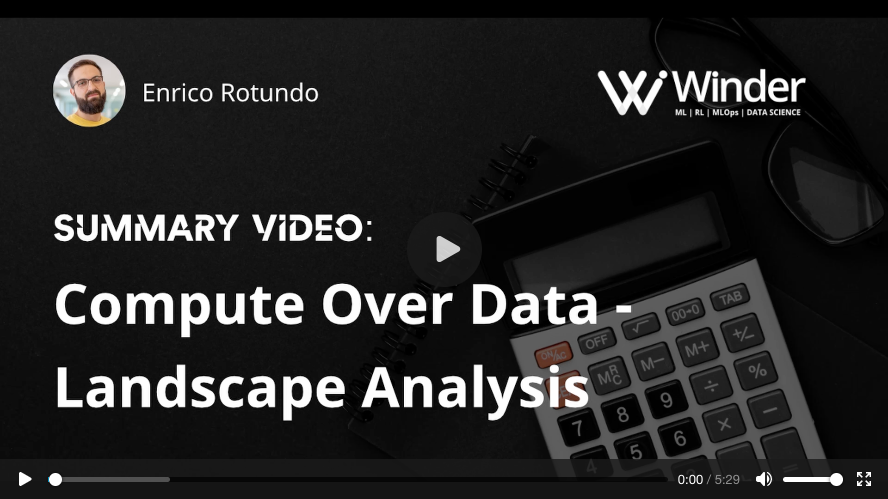

# Compute Over Data - Landscape Analysis

This page is an introduction to a landscape analysis of general-purpose compute frameworks.
Its purpose is to map the roughness of existing technologies and serve as an introduction to key concepts for those who are new to the Bacalhau community.

Watch the video below for a short walkthrough and continue to the sections below to learn more about landscape analysis within the compute ecosystem.
More content is available on the [full slide deck](https://docs.google.com/presentation/d/1wOh-ASGshgc1Ivkoyaz9zGpVGTxX9LDMZQB4-eXOBP4/edit?usp=sharing) and in the [code repository](https://github.com/winderai/bacalhau-landscape-analysis-benchmarks), where you'll find:

* A description of each technology and how they're positioned in the compute space
* A collection of code samples to showcase and compare APIs
* A performance benchmark to compare how they behave in processing a large dataset

> The past can hurt. But the way I see it, you can either run from it, or learn from it. - *Walt Disney*

Ultimately, Bacalhau aims to offer efficient distributed computation -- to achieve that, we're learning from the past.

## Compute Landscape

The traditional compute landscape counts dozens of frameworks capable of processing generic workloads.
Some are specifically designed to take advantage of data locality, by bringing the computation close to where data lives. The landscape analysis provided here reviewed a selection of these tools in order to summarize their pros and cons.

> The [full slide deck](https://docs.google.com/presentation/d/1wOh-ASGshgc1Ivkoyaz9zGpVGTxX9LDMZQB4-eXOBP4/edit?usp=sharing) contains a detailed overview of the compute frameworks and include sample code snippets.

- The **Python data stack** includes tools like Pandas and Dask, which offers a very convenient data structure, [Dataframe](https://en.wikipedia.org/wiki/Dataframe), which is particularly suitable for handling tabular data.

- The **database ecosystem** offers a variety of choices optimized for various use cases (including tabular data, real-time time series, etc.). This research looked at Postgres and Snowflake, a couple of widely used tools in this space.

- **Big data tools** like Apache Spark and Hadoop were also considered in this analysis. Tools like these are capable of processing structured and unstructured data in very large clusters. This category introduced first the concept of data-locality, to avoid data transfers over the cluster network.

- **web3 tools** are also part of this analysis. Tools in this category aim at supporting distributed storage and computation. Note, at the time of writing most tools in this category are under heavy development. In many cases, it's still unclear how they work and what direction they'll take in the future.

Unfortunately, many of these systems are far from being easy to operate on your localhost, or at scale. Traditional frameworks are plagued by significant operational overhead resulting in inefficient resource usage. Moreover, there's often a significant setup burden even to running a getting started guide, setting a relatively high barrier to entry.

The table below summarizes their score in terms of different requirements. The rating presented is based on the experience of setting up and running the code as described in the next section. To learn more, check out the [slides presented here](https://docs.google.com/presentation/d/1wOh-ASGshgc1Ivkoyaz9zGpVGTxX9LDMZQB4-eXOBP4/edit#slide=id.g11f8b483676_0_87).

**Why is Bacalhau not on this list?** This analysis is not a direct comparison between Bacalhau and existing frameworks. Instead, this research aims to help the Bacalhau community to learn more about the benefits and drawbacks of traditional systems.

## Code repository

### Sample code

A good starting point to begin a compute journey is to take a look at the [code repository](https://github.com/winderai/bacalhau-landscape-analysis-benchmarks), where you'll find working examples of parallel workloads (e.g. [word count](https://en.wikipedia.org/wiki/Word_count), dataset aggregation, etc.).Take a look at the dedicated folder for viewing the demos in a notebook format, with no installation needed. Alternatively, you can find the collection of examples on the [slides](https://docs.google.com/presentation/d/1wOh-ASGshgc1Ivkoyaz9zGpVGTxX9LDMZQB4-eXOBP4/edit#slide=id.g122e31b6546_0_0).

When researching a path to compute, its helpful to compare the verbosity and complexity between APIs.
For example, implementing a simple [word count](https://en.wikipedia.org/wiki/Word_count) job [in Pandas](https://github.com/winderai/bacalhau-landscape-analysis-benchmarks/blob/main/sample-code/word-count/pandas.ipynb) is concise and can be achieved just by chaining methods, while [the Hadoop implementation](https://github.com/winderai/bacalhau-landscape-analysis-benchmarks/blob/main/sample-code/word-count/hadoop.ipynb) is far less intuitive, mainly because it's bound to use [the Map-Reduce paradigm](https://en.wikipedia.org/wiki/MapReduce).

[Setup instructions](https://github.com/winderai/bacalhau-landscape-analysis-benchmarks#sample-code) guide you through the installation process if you'd like to run the examples yourself -- give it a try to get an idea of how a simple single-node setup work.

### Benchmarks

The [code repository](https://github.com/winderai/bacalhau-landscape-analysis-benchmarks) here shares benchmark scripts that run a parallel workload on a large dataset, its time its execution, and log resource usage. Explore the related section to familiarize yourself with the rough edges of [the installation process](https://github.com/winderai/bacalhau-landscape-analysis-benchmarks#benchmarks).

You can choose to spawn either a [single-node](https://github.com/winderai/bacalhau-landscape-analysis-benchmarks/blob/main/installation/SINGLE-NODE.md) or [multi-node](https://github.com/winderai/bacalhau-landscape-analysis-benchmarks/blob/main/installation/MULTI-NODE.md) cluster. Trying out *both* options gives a firsthand experience with the local-to-cluster hurdles, as well as a look at the complexities around installing a framework like Hadoop.

The benchmarked task is a [word count](https://en.wikipedia.org/wiki/Word_count) job processing a dataset containing +1.7B words. The plot below reports the benchmark running time for each framework. In the chart, a missing bar implies that the tool doesn't support a fully-fledged multi-node set-up (i.e can only scale vertically).

Performance across the landscape can vary 10x, and that behavior is expected, because Pandas is not a big-data tool and Hadoop was not really designed to perform well on a single-node setup. Its surprising to learn that only Spark and Snowflake provide an efficient setup combined with quick processing and very low resource usage.

Check out [the slides for a complete report on the benchmark results](https://docs.google.com/presentation/d/1wOh-ASGshgc1Ivkoyaz9zGpVGTxX9LDMZQB4-eXOBP4/edit#slide=id.g11c07429d0d_0_1091) or dive into the [code repository](https://github.com/winderai/bacalhau-landscape-analysis-benchmarks) to spin up a cluster and run the benchmarks yourself.

## Key findings

**General**

* Modern frameworks must be intuitive, and shouldn't impose a byzantine approach like [MapReduce](https://en.wikipedia.org/wiki/MapReduce) (see Hadoop). High-level API is a must.
* Installation is often a hurdle that should be simplified to allow for an easier onboarding experience.
* Declarative pipelines aren't yet established in these technologies.
* Support for repeatable containerized jobs is needed. None of the frameworks reviewed provide an effective way to package dependencies ([see Spark/Hadoop](https://docs.google.com/presentation/d/1wOh-ASGshgc1Ivkoyaz9zGpVGTxX9LDMZQB4-eXOBP4/edit#slide=id.g13641fb0d49_8_0)).
* The [local to multi-node cluster journey](https://docs.google.com/presentation/d/1wOh-ASGshgc1Ivkoyaz9zGpVGTxX9LDMZQB4-eXOBP4/edit#slide=id.g11c07429d0d_0_1178) is quite bumpy, and requires additional installations, configurations, and even a different approach to writing code. This should be simplified going forward.

**Benchmark**

* In Multi-node setups, you may need to [optimize the cluster size](https://docs.google.com/presentation/d/1wOh-ASGshgc1Ivkoyaz9zGpVGTxX9LDMZQB4-eXOBP4/edit#slide=id.g13641fb0d49_8_6). (see Dask, Hadoop)
* Tested vanilla configurations: tweaking knobs improves performance but adds complexity. Modern tools must provide an out-of-the-box experience ([see Snowflake setup](https://docs.google.com/presentation/d/1wOh-ASGshgc1Ivkoyaz9zGpVGTxX9LDMZQB4-eXOBP4/edit#slide=id.g11cf604b99b_0_236)).
* Except for Spark, these tools have poor performance with unsharded large files (i.e. strive to parallelize) -- a real use case will require additional data preparation upstream.
* These tools are optimized to tackle different use cases, so a different task may vary results. Other tools strive to be as generic as possible (see Spark, Dask).
