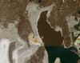
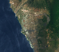
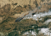
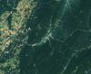

# Simple Image Processing


[](https://github.com/bacalhau-project/bacalhau)

In this example tutorial, we will show you how to use Bacalhau to process images on a [Landsat dataset](https://ipfs.io/ipfs/QmeZRGhe4PmjctYVSVHuEiA9oSXnqmYa4kQubSHgWbjv72/).

Bacalhau has the unique capability of operating at a massive scale in a distributed environment. This is made possible because data is naturally sharded across the IPFS network amongst many providers. We can take advantage of this to process images in parallel.

## TD;LR
Processing of images from a dataset using Bacalhau

## Prerequisite

To get started, you need to install the Bacalhau client, see more information [here](https://docs.bacalhau.org/getting-started/installation)


```python
!command -v bacalhau >/dev/null 2>&1 || (export BACALHAU_INSTALL_DIR=.; curl -sL https://get.bacalhau.org/install.sh | bash)
path=!echo $PATH
%env PATH=./:{path[0]}
```

## Running a Bacalhau Job

To submit a workload to Bacalhau, we will use the `bacalhau docker run` command.


```bash
%%bash --out job_id
bacalhau docker run \
  --wait \
  --wait-timeout-secs 100 \
  --id-only \
  -i ipfs://QmeZRGhe4PmjctYVSVHuEiA9oSXnqmYa4kQubSHgWbjv72:/input_images \
  dpokidov/imagemagick:7.1.0-47-ubuntu \
  -- magick mogrify -resize 100x100 -quality 100 -path /outputs '/input_images/*.jpg'
```

The job has been submitted and Bacalhau has printed out the related job id. We store that in an environment variable so that we can reuse it later on.


```python
%env JOB_ID={job_id}
```

    env: JOB_ID=bf785b4d-dcac-4f4a-9c63-cf9906aa2941


The `bacalhau docker run` command allows to pass input data volume with a `-i ipfs://CID:path` argument just like Docker, except the left-hand side of the argument is a [content identifier (CID)](https://github.com/multiformats/cid). This results in Bacalhau mounting a *data volume* inside the container. By default, Bacalhau mounts the input volume at the path `/inputs` inside the container.

Bacalhau also mounts a data volume to store output data. The `bacalhau docker run` command creates an output data volume mounted at `/outputs`. This is a convenient location to store the results of your job.

## Checking the State of your Jobs

- **Job status**: You can check the status of the job using `bacalhau list`.


```bash
%%bash
bacalhau list --id-filter=${JOB_ID} --no-style
```

     CREATED   ID        JOB                       STATE      VERIFIED  PUBLISHED
     00:26:44  bf785b4d  Docker dpokidov/image...  Completed            ipfs://QmQnern37ueHr...


When it says `Published` or `Completed`, that means the job is done, and we can get the results.

- **Job information**: You can find out more information about your job by using `bacalhau describe`.


```bash
%%bash
bacalhau describe ${JOB_ID}
```

- **Job download**: You can download your job results directly by using `bacalhau get`. Alternatively, you can choose to create a directory to store your results. In the command below, we created a directory and downloaded our job output to be stored in that directory.


```bash
%%bash
rm -rf results && mkdir results # Temporary directory to store the results
bacalhau get ${JOB_ID} --output-dir results # Download the results
```

After the download has finished you should see the following contents in results directory.

## Viewing your Job Output

To view the file, run the following command:


```bash
%%bash
ls -lah results/outputs
```

### Display the image

To view the images, we will use **glob** to return all file paths that match a specific pattern.


```python
import glob
from IPython.display import Image, display
for imageName in glob.glob('results/outputs/*.jpg'):
    display(Image(filename=imageName))
```














## Need Support?

For questions, feedback, please reach out in our [forum](https://github.com/filecoin-project/bacalhau/discussions)
