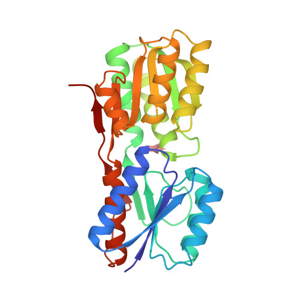

# Molecular Simulation with OpenMM and Bacalhau


[](https://github.com/bacalhau-project/bacalhau)

In this tutorial example, we will showcase how to containerize an OpenMM workload so that it can be executed on the Bacalhau network and take advantage of the distributed storage & compute resources. [OpenMM](https://github.com/openmm/openmm) is a toolkit for molecular simulation. It is a physic-based library that is useful for refining the structure and exploring functional interactions with other molecules. It provides a combination of extreme flexibility (through custom forces and integrators), openness, and high performance (especially on recent GPUs) that make it truly unique among simulation codes.

## TD;LR
Running OpenMM m molecular simulation with Bacalhau

## Prerequisite

To get started, you need to install the Bacalhau client, see more information [here](https://docs.bacalhau.org/getting-started/installation)

## Protein data

We use a processed 2DRI dataset that represents the ribose binding protein in bacterial transport and chemotaxis. The source organism is the [Escherichia coli](https://en.wikipedia.org/wiki/Escherichia_coli) bacteria.
You can find more details on this protein at the related [RCSB Protein Data Bank page](https://www.rcsb.org/structure/2dri).



Protein data can be stored in a `.pdb` file, this is a human-readable format. It provides for the description and annotation of protein and nucleic acid structures including atomic coordinates, secondary structure assignments, as well as atomic connectivity.
See more information about PDB format [here](https://www.cgl.ucsf.edu/chimera/docs/UsersGuide/tutorials/pdbintro.html).

## Write the script
To run the script above all we need is a Python environment with the [OpenMM library](http://docs.openmm.org/latest/userguide/application/01_getting_started.html) installed.


```python
%%writefile run_openmm_simulation.py
import os
from openmm import *
from openmm.app import *
from openmm.unit import *

# Input Files
input_path = '/inputs/2dri-processed.pdb'
os.path.exists(input_path) # check if input file exists
pdb = PDBFile(input_path)
forcefield = ForceField('amber14-all.xml', 'amber14/tip3pfb.xml')

# Output
output_path = '/outputs/final_state.pdbx'
if not os.path.exists(os.path.dirname(output_path)): # check if output dir exists
    os.makedirs(os.path.dirname(output_path))

# System Configuration

nonbondedMethod = PME
nonbondedCutoff = 1.0*nanometers
ewaldErrorTolerance = 0.0005
constraints = HBonds
rigidWater = True
constraintTolerance = 0.000001
hydrogenMass = 1.5*amu

# Integration Options

dt = 0.002*picoseconds
temperature = 310*kelvin
friction = 1.0/picosecond
pressure = 1.0*atmospheres
barostatInterval = 25

# Simulation Options

steps = 10
equilibrationSteps = 0
#platform = Platform.getPlatformByName('CUDA')
platform = Platform.getPlatformByName('CPU')
#platformProperties = {'Precision': 'single'}
platformProperties = {}
dcdReporter = DCDReporter('trajectory.dcd', 1000)
dataReporter = StateDataReporter('log.txt', 1000, totalSteps=steps,
    step=True, time=True, speed=True, progress=True, elapsedTime=True, remainingTime=True, potentialEnergy=True, kineticEnergy=True, totalEnergy=True, temperature=True, volume=True, density=True, separator='\t')
checkpointReporter = CheckpointReporter('checkpoint.chk', 1000)

# Prepare the Simulation

print('Building system...')
topology = pdb.topology
positions = pdb.positions
system = forcefield.createSystem(topology, nonbondedMethod=nonbondedMethod, nonbondedCutoff=nonbondedCutoff,
    constraints=constraints, rigidWater=rigidWater, ewaldErrorTolerance=ewaldErrorTolerance, hydrogenMass=hydrogenMass)
system.addForce(MonteCarloBarostat(pressure, temperature, barostatInterval))
integrator = LangevinMiddleIntegrator(temperature, friction, dt)
integrator.setConstraintTolerance(constraintTolerance)
simulation = Simulation(topology, system, integrator, platform, platformProperties)
simulation.context.setPositions(positions)

# Minimize and Equilibrate

print('Performing energy minimization...')
simulation.minimizeEnergy()
print('Equilibrating...')
simulation.context.setVelocitiesToTemperature(temperature)
simulation.step(equilibrationSteps)

# Simulate

print('Simulating...')
simulation.reporters.append(dcdReporter)
simulation.reporters.append(dataReporter)
simulation.reporters.append(checkpointReporter)
simulation.currentStep = 0
simulation.step(steps)

# Write a file with the final simulation state

state = simulation.context.getState(getPositions=True, enforcePeriodicBox=system.usesPeriodicBoundaryConditions())
with open(output_path, mode="w+") as file:
    PDBxFile.writeFile(simulation.topology, state.getPositions(), file)
print('Simulation complete, file written to disk at: {}'.format(output_path))
```

We are printing the first 10 lines of the file. The output contains a number of ATOM records. These describe the coordinates of the atoms that are part of the protein.


```bash
%%bash
head ./dataset/2dri-processed.pdb
```

    REMARK   1 CREATED WITH OPENMM 7.6, 2022-07-12
    CRYST1   81.309   81.309   81.309  90.00  90.00  90.00 P 1           1
    ATOM      1  N   LYS A   1      64.731   9.461  59.430  1.00  0.00           N
    ATOM      2  CA  LYS A   1      63.588  10.286  58.927  1.00  0.00           C
    ATOM      3  HA  LYS A   1      62.707   9.486  59.038  1.00  0.00           H
    ATOM      4  C   LYS A   1      63.790  10.671  57.468  1.00  0.00           C
    ATOM      5  O   LYS A   1      64.887  11.089  57.078  1.00  0.00           O
    ATOM      6  CB  LYS A   1      63.458  11.567  59.749  1.00  0.00           C
    ATOM      7  HB2 LYS A   1      63.333  12.366  58.879  1.00  0.00           H
    ATOM      8  HB3 LYS A   1      64.435  11.867  60.372  1.00  0.00           H


## Upload the Data to IPFS

The simplest way to upload the data to IPFS is to use a third-party service to "pin" data to the IPFS network, to ensure that the data exists and is available. To do this you need an account with a pinning service like [web3.storage](https://web3.storage/) or [Pinata](https://pinata.cloud/) or nft.storage . Once registered you can use their UI or API or SDKs to upload files.

## Containerize Script using Docker

To build your own docker container, create a `Dockerfile`, which contains instructions to build your image.

:::tip
For more information about working with custom containers, see the [custom containers example](https://docs.bacalhau.org/getting-started/docker-workload-onboarding).
:::


```python
%%writefile Dockerfile
FROM conda/miniconda3

RUN conda install -y -c conda-forge openmm

WORKDIR /project

COPY ./run_openmm_simulation.py /project

LABEL org.opencontainers.image.source https://github.com/bacalhau-project/examples

CMD ["python","run_openmm_simulation.py"]
```


### Build the container

We will run `docker build` command to build the container;

```
docker build -t <hub-user>/<repo-name>:<tag> .
```

Before running the command replace;

- **hub-user** with your docker hub username, If you don’t have a docker hub account [follow these instructions to create docker account](https://docs.docker.com/docker-id/), and use the username of the account you created

- **repo-name** with the name of the container, you can name it anything you want

- **tag** this is not required but you can use the latest tag

In our case, this will be:

```bash
docker buildx build --platform linux/amd64 --push -t ghcr.io/bacalhau-project/examples/openmm:0.3 .
```

### Push the container

Next, upload the image to the registry. This can be done by using the Docker hub username, repo name, or tag.

```
docker push <hub-user>/<repo-name>:<tag>
```

## Run a Bacalhau Job

Now that we have the data in IPFS and the docker image pushed, we can run a job on the Bacalhau network.


```bash
%%bash --out job_id
bacalhau docker run \
--input ipfs://bafybeig63whfqyuvwqqrp5456fl4anceju24ttyycexef3k5eurg5uvrq4 \
--wait \
--id-only \
ghcr.io/bacalhau-project/examples/openmm:0.3 -- python run_openmm_simulation.py
```

When a job is submitted, Bacalhau prints out the related `job_id`. We store that in an environment variable so that we can reuse it later on.


```python
%env JOB_ID={job_id}
```

## Checking the State of your Jobs

- **Job status**: You can check the status of the job using `bacalhau list`.


```bash
%%bash
bacalhau list --id-filter=${JOB_ID} --no-style
```

When it says `Completed`, that means the job is done, and we can get the results.

- **Job information**: You can find out more information about your job by using `bacalhau describe`.


```bash
%%bash
bacalhau describe ${JOB_ID}
```

- **Job download**: You can download your job results directly by using `bacalhau get`. Alternatively, you can choose to create a directory to store your results. In the command below, we created a directory and downloaded our job output to be stored in that directory.


```bash
%%bash
rm -rf results && mkdir -p results
bacalhau get ${JOB_ID} # Download the results
```

After the download has finished you should see the following contents in the results directory

## Viewing your Job Output

To view the file, run the following command:


```bash
%%bash
ls -l results/stdout/
```
