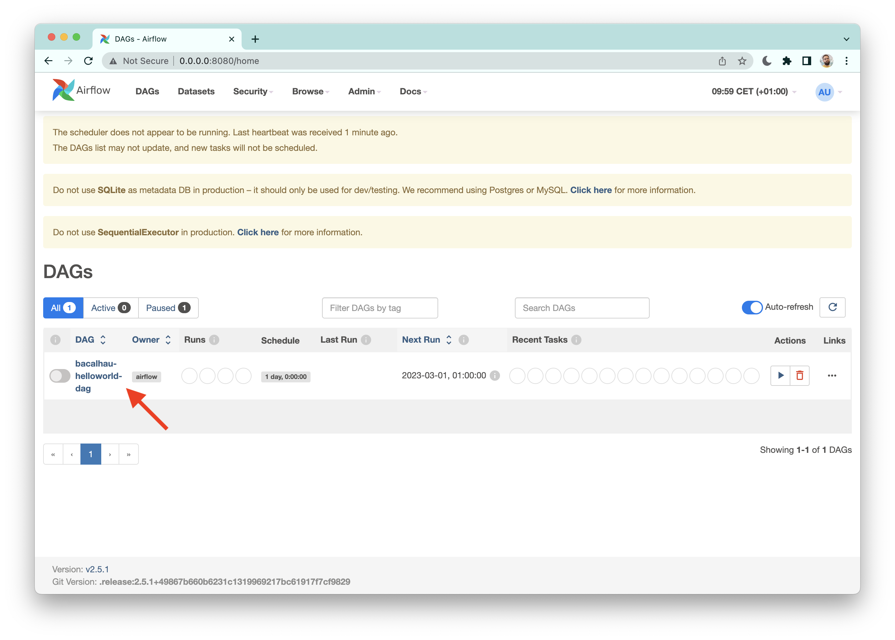
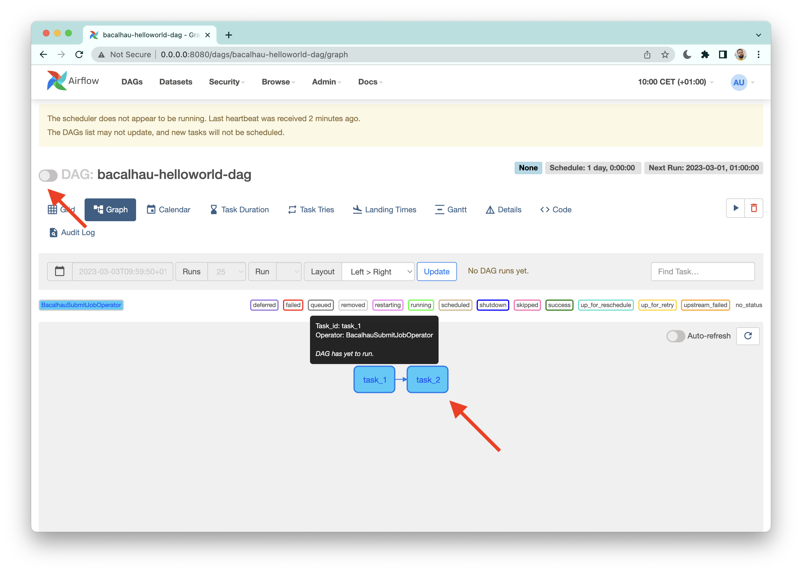
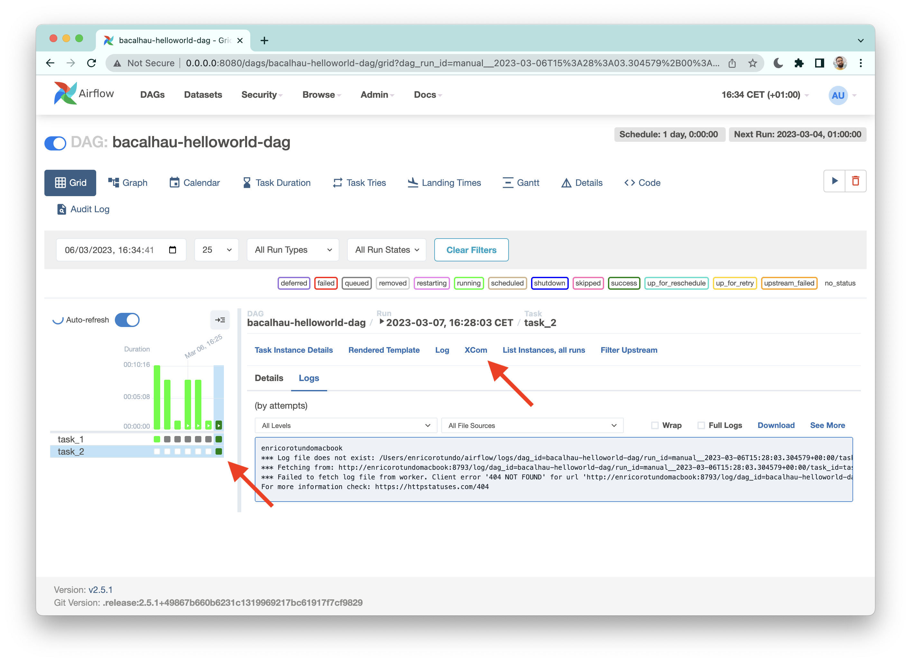
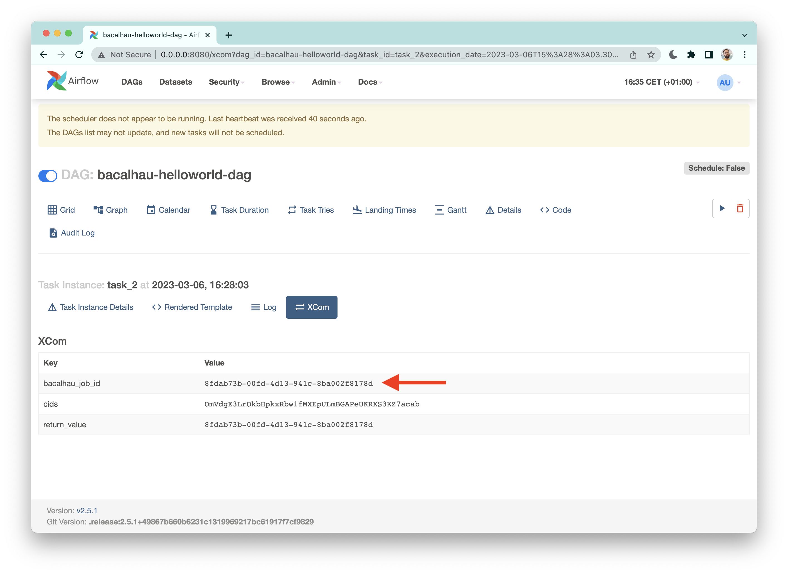

# Apache Airflow Provider for Bacalhau

This is `bacalhau-airflow`, a Python package that integrates [Bacalhau](https://github.com/bacalhau-project/bacalhau) with [Apache Airflow](https://github.com/apache/airflow).
The benefit is twofold.
First, thanks to this package you can now write complex pipelines for Bacalhau.
For instance, jobs can communicate their output's CIDs to downstream jobs, that can use those as inputs.
Second, Apache Airflow provides a solid solution to reliably orchestrate your DAGs.

> :warning: You may try this out using a local devstack until https://github.com/bacalhau-project/bacalhau/issues/2038 has been fixed. Please set the following environment variables `AIRFLOW_VAR_BACALHAU_API_HOST`, `AIRFLOW_VAR_BACALHAU_API_PORT`.

## Features

- Create Airflow tasks that run on Bacalhau (via custom operator!)
- Support for sharded jobs: output shards can be passed downstream (via [XComs](https://airflow.apache.org/docs/apache-airflow/stable/core-concepts/xcoms.html))
- Coming soon...
  - Lineage (see [OpenLineage proof-of-concept integration here](https://github.com/enricorotundo/bacalhau-airflow-provider))
  - Various working code examples
  - Hosting instructions

## Requirements

- Python 3.8+
- [`bacalhau-sdk` 0.3.25+](https://pypi.org/project/bacalhau-sdk/)
- `apache-airflow` 2.3+

## Installation

The integration automatically registers itself for Airflow 2.3+ if it's installed on the Airflow worker's Python.

## From pypi

```console
pip install bacalhau-airflow
```

## From source

Clone the public repository:

```shell
git clone https://github.com/bacalhau-project/bacalhau/
```

Once you have a copy of the source, you can install it with:

```shell
cd integration/airflow/
pip install .
```

## Worked example

### Setup


> In a production environment you may want to follow the [official Airflow's instructions](https://airflow.apache.org/docs/apache-airflow/stable/administration-and-deployment/production-deployment.html) or pick one of the suggested [hosted solutions](https://airflow.apache.org/ecosystem/#airflow-as-a-service).

If you're just curious and want to give it a try on your *local machine*, please follow the steps below.

First, install and initialize Airflow:

```shell
$ pip install apache-airflow
export AIRFLOW_HOME=~/airflow
$ airflow db init
```

Then, we need to point Airflow to the absolute path of the folder where your pipelines live.
To do that we edit the `dags_folder` field in `${AIRFLOW_HOME}/airflow.cfg` file.
In this example I'm going to use [the `hello_world.py` DAG shipped with this repository](https://github.com/bacalhau-project/bacalhau/tree/main/integration/airflow/example_dags);
for the sake of completeness, the next section will walk you through the actual code.

My config file looks like what follows:

```
[core]
dags_folder = /Users/enricorotundo/bacalhau/integration/airflow/example_dags
...
```

Optionally, to reduce clutter in the Airflow UI, you could disable the loading of the default example DAGs by setting `load_examples` to `False`.

Finally, we can launch Airflow locally:

```shell
airflow standalone
```

### Example DAG: chaining jobs

While Airflow's pinwheel is warming up in the background, let's take a look at the `hello_world.py` breakdown below.

> In brief, the first task of this DAG prints out "Hello World" to stdout, then automatically pipe its output into the subsequent task as an input file. The second task will simply print out the content of its input file.

All you need to import from this package is the `BacalhauSubmitJobOperator`.
It allows you to submit a job spec comprised of the usual fields such as engine, image, etc.

```python
from datetime import datetime
from airflow import DAG
from bacalhau_airflow.operators import BacalhauSubmitJobOperator
```

This operator supports chaining multiple jobs without the need to manually pass any CID along, in this regards a special note goes to the `input_volumes` parameter (see `task_2` below).
Every time the operator runs a task, it stores a comma-separated string with the output shard-CIDs in an internal key-value store under the `cids` key.
Thus, downstream tasks can read in those CIDs via the `input_volumes` parameter.

All you need to do is (1) use the [XComs syntax](https://airflow.apache.org/docs/apache-airflow/stable/core-concepts/xcoms.html) (in curly brackets) to specify the "sender" task ids and the `cids` key (e.g. `{{ task_instance.xcom_pull(task_ids='task_1', key='cids') }}`), (2) define a target mount point separated by a colon (e.g. `:/task_1_output`).

Lastly, we define task dependencies simply with `task_1 >> task_2`.
To learn more about [Airflow's DAG syntax please check out this page](https://airflow.apache.org/docs/apache-airflow/stable/core-concepts/dags.html#task-dependencies).

```python
with DAG("bacalhau-helloworld-dag", start_date=datetime(2023, 3, 1)) as dag:
    task_1 = BacalhauSubmitJobOperator(
        task_id="task_1",
        api_version="V1beta1",
        job_spec=dict(
            engine="Docker",
            verifier="Noop",
            publisher="IPFS",
            docker=dict(
                image="ubuntu",
                entrypoint=["echo", "Hello World"],
            ),
            deal=dict(concurrency=1, confidence=0, min_bids=0),
        ),
    )

    task_2 = BacalhauSubmitJobOperator(
        task_id="task_2",
        api_version="V1beta1",
        input_volumes=[
            "{{ task_instance.xcom_pull(task_ids='task_1', key='cids') }}:/task_1_output",
        ],
        job_spec=dict(
            engine="Docker",
            verifier="Noop",
            publisher="IPFS",
            docker=dict(
                image="ubuntu",
                entrypoint=["cat", "/task_1_output/stdout"],
            ),
            deal=dict(concurrency=1, confidence=0, min_bids=0),
        ),
    )

    task_1 >> task_2
```

### Run it

Now that we understand what the example DAG is supposed to do, let's just run it!
Head over to http://0.0.0.0:8080, where Airflow UI is being served.
The screenshot below shows our hello world has been loaded correctly.



When you inspect a DAG, Airflow will render a graph depicting a color-coded topology (see image below).
For active (i.e. running) pipelines, this will be useful to oversee the status of each task.

To trigger a DAG please enable the toggle shown below.



When all tasks have been completed, we want to fetch the output of our pipeline.
To do so we need to retrieve the job-id of the last task.
Click on a green box in the `task_2` line and then open the XCom tab.



Here we find the `bacalhau_job_id`.
Select that value and copy it into your clipboard.



Lastly, we can use the bacalhau cli `get` command to fetch the output data as follows:

```console
$ bacalhau get 8fdab73b-00fd-4d13-941c-8ba002f8178d
Fetching results of job '8fdab73b-00fd-4d13-941c-8ba002f8178d'...
...
Results for job '8fdab73b-00fd-4d13-941c-8ba002f8178d' have been written to...
/tmp/dag-example/job-8fdab73b

$ cat /tmp/dag-example/job-8fdab73b/combined_results/stdout
Hello World
```

That's all folks :rainbow:.

## Development


```console
pip install -r dev-requirements.txt
```

### Unit tests


```shell
tox
```

You can also skip using `tox` and run `pytest` on your own dev environment.
