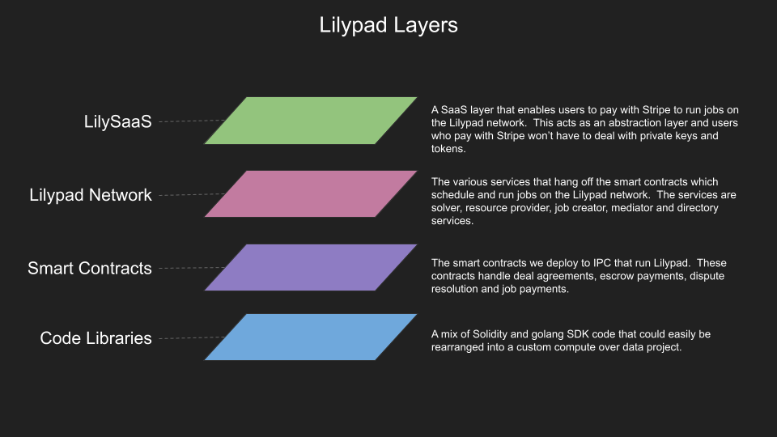
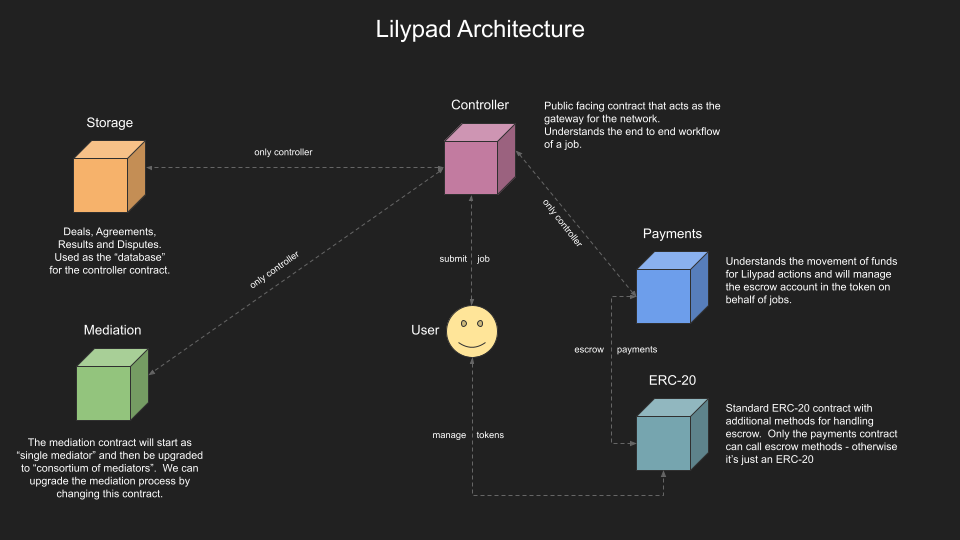
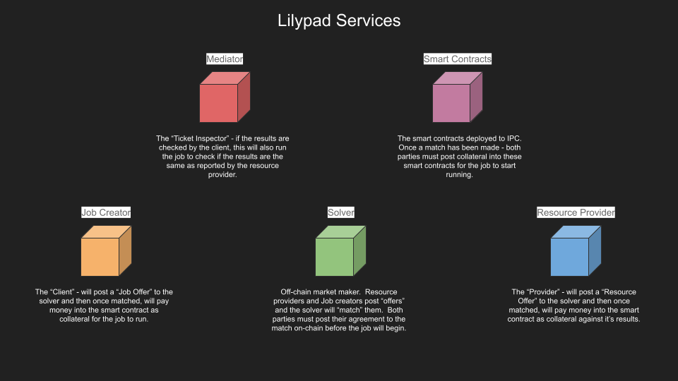

# Lilypad

## Vision

[Lilypad](https://blog.lilypadnetwork.org/) is aiming to build an internet-scale trustless distributed compute network for web3. Creating the infrastructure for use cases like AI inference, ML training, DeSci and more.

<iframe src="https://platform.twitter.com/embed/Tweet.html?dnt=true&embedId=twitter-widget-0&features=eyJ0ZndfdGltZWxpbmVfbGlzdCI6eyJidWNrZXQiOltdLCJ2ZXJzaW9uIjpudWxsfSwidGZ3X2ZvbGxvd2VyX2NvdW50X3N1bnNldCI6eyJidWNrZXQiOnRydWUsInZlcnNpb24iOm51bGx9LCJ0ZndfdHdlZXRfZWRpdF9iYWNrZW5kIjp7ImJ1Y2tldCI6Im9uIiwidmVyc2lvbiI6bnVsbH0sInRmd19yZWZzcmNfc2Vzc2lvbiI6eyJidWNrZXQiOiJvbiIsInZlcnNpb24iOm51bGx9LCJ0ZndfZm9zbnJfc29mdF9pbnRlcnZlbnRpb25zX2VuYWJsZWQiOnsiYnVja2V0Ijoib24iLCJ2ZXJzaW9uIjpudWxsfSwidGZ3X21peGVkX21lZGlhXzE1ODk3Ijp7ImJ1Y2tldCI6InRyZWF0bWVudCIsInZlcnNpb24iOm51bGx9LCJ0ZndfZXhwZXJpbWVudHNfY29va2llX2V4cGlyYXRpb24iOnsiYnVja2V0IjoxMjA5NjAwLCJ2ZXJzaW9uIjpudWxsfSwidGZ3X3Nob3dfYmlyZHdhdGNoX3Bpdm90c19lbmFibGVkIjp7ImJ1Y2tldCI6Im9uIiwidmVyc2lvbiI6bnVsbH0sInRmd19kdXBsaWNhdGVfc2NyaWJlc190b19zZXR0aW5ncyI6eyJidWNrZXQiOiJvbiIsInZlcnNpb24iOm51bGx9LCJ0ZndfdXNlX3Byb2ZpbGVfaW1hZ2Vfc2hhcGVfZW5hYmxlZCI6eyJidWNrZXQiOiJvbiIsInZlcnNpb24iOm51bGx9LCJ0ZndfdmlkZW9faGxzX2R5bmFtaWNfbWFuaWZlc3RzXzE1MDgyIjp7ImJ1Y2tldCI6InRydWVfYml0cmF0ZSIsInZlcnNpb24iOm51bGx9LCJ0ZndfbGVnYWN5X3RpbWVsaW5lX3N1bnNldCI6eyJidWNrZXQiOnRydWUsInZlcnNpb24iOm51bGx9LCJ0ZndfdHdlZXRfZWRpdF9mcm9udGVuZCI6eyJidWNrZXQiOiJvbiIsInZlcnNpb24iOm51bGx9fQ%3D%3D&frame=false&hideCard=false&hideThread=false&id=1667164746599002114&lang=en&origin=https%3A%2F%2Fcdn.iframe.ly%2F6kNS5bO%3Fapp%3D1&sessionId=a65b4df788ce5d41bbb126f645b7d4046f3c62bb&theme=light&widgetsVersion=aaf4084522e3a%3A1674595607486&width=850px" style={{width: '100%', height: '500px'}}></iframe>

## Overview

Lilypad serves as a verifiable, trustless, and decentralized computational network engineered to facilitate mainstream adoption of web3 applications. By extending unrestricted, global access to computational power, Lilypad strategically collaborates with decentralized infrastructure networks, such as Filecoin, to formulate a transparent, efficient, and accessible computational ecosystem. While Lilypad does not specifically resolve issues related to the accessibility of AI models, it significantly alleviates challenges associated with procuring high-performance AI hardware. In this context, Lilypad provides decentralized AI computational services. The network recently unveiled its second version, dubbed Lilypad V2 (Aurora), and is actively laying groundwork for multi-chain integration and the deployment of an incentivized test net.

<iframe width="560" height="315" src="https://www.youtube.com/embed/yQnB2Yxia4Y?si=PjKgyfunDQeqt-qn" title="YouTube video player" frameborder="0" allow="accelerometer; autoplay; clipboard-write; encrypted-media; gyroscope; picture-in-picture; web-share" referrerpolicy="strict-origin-when-cross-origin" allowfullscreen></iframe>

### Key features
Some of the key features of Lilypad include:

1. **Verifiable Trustless Decentralized Compute Network**: Lilypad is a decentralized compute network that aims to provide global, permissionless access to compute power. It leverages decentralized physical infrastructure networks like Filecoin to ensure trustlessness and verifiability.

1. **Mainstream Web3 Application Support**: Lilypad is designed to enable mainstream web3 applications to use its compute network. It aims to make decentralized AI more accessible, efficient, and transparent for developers and users.

1. **Open Compute Network**: Lilypad creates an open compute network that allows users to access and run AI models and jobs. It separates module creators from users and curates a set of deterministic modules for users to run, ensuring determinism in verification systems.

1. **Multichain Support**: Lilypad plans to go multichain, which means it will support multiple blockchain networks. This will increase the scalability and interoperability of the network, allowing users to choose the blockchain that best suits their needs.

1. **Incentivized Test Net**: Lilypad has plans to launch an incentivized test net, which will provide users with incentives to participate in testing and improving the network. This will help identify and address any issues or challenges before the mainnet launch.

1. **Decentralization of Mediators**: The team also aims to decentralize the mediators in the network. This means that the decision-making process and governance of the network will be distributed among multiple participants, ensuring a more decentralized and resilient system.


## Lilypad Roadmap

1. v0: **September 2022** - Lilypad Bridge POC for triggering and returning Bacalhau compute jobs from a smart contract
1. v1: **July 2023** - A modicum-based minimal testnet (EVM-based). See github
1. v2: **September 2023** - A more robust trustless distributed testnet
1. v3 **November 2023** - Lilypad AI Studio, Calibration Net for compute providers
1. v4: **Q1 2024** - Lilypad Incentivized Testnet deployment
1. v5: **tbd** - Lilypad Mainnet


## Lilypad v2 Reference

### Architecture Overview


The architecture of Lilypad is inspired by the research paper titled "Mechanisms for Outsourcing Computation via a Decentralized Market." The paper introduces MODiCuM, a decentralized system that allows for computational outsourcing in an open market. Just like MODiCuM, Lilypad aims to create an open market of computational resources by introducing various decentralized services like solver, resource provider, job creator, mediator, and directory services. MODiCuM's unique approach to deterring misbehavior in a decentralized environment through dedicated mediators and enforceable fines has influenced Lilypad's own design, particularly in the areas of dispute resolution and system integrity.


Lilypad is a proof of concept bridge which runs off the demo (free to use) Bacalhau compute network. As such, the reliability of jobs on this network are not guaranteed.

:::tip
If you have a need for reliable compute based on this infrastructure - get in touch with us.
:::
Components of the Lilypad Ecosystem - From SaaS to Smart Contracts:


Main architecture of the Lilypad Ecosystem:


Services in the Lilypad Ecosystem:



See more about how Bacalhau & Lilypad are related below:

- [Bacalhau Notion page](https://www.notion.so/7-Introduction-to-Bacalhau-Decentralised-Compute-over-Data-AI-ML-DeSci-fbef1ef73b4e479a9b209be8d29cb58f)

- FVM Hackerbase Video
<iframe width="560" height="315" src="https://www.youtube.com/embed/drwcj2kk6bA" title="YouTube video player" frameborder="0" allow="accelerometer; autoplay; clipboard-write; encrypted-media; gyroscope; picture-in-picture; web-share" allowfullscreen></iframe>

## Lilypad v2 Quick Start

### Video Guide

:::info
Note: Since this video was released some changes have been made to the underlying code, but the process and general architecture remains the same.
:::

<iframe width="560" height="315" src="https://www.youtube.com/embed/B0l0gFYxADY" title="YouTube video player" frameborder="0" allow="accelerometer; autoplay; clipboard-write; encrypted-media; gyroscope; picture-in-picture; web-share" allowfullscreen></iframe>

### Setting up metamask
1. Install [metamask Extension](https://metamask.io/)
1. Add the Lilypad Testnet chain to metamask:
```bash
Network name: Lilypad v2 Aurora testnet
New RPC URL: http://testnet.lilypad.tech:8545
Chain ID: 1337
Currency symbol: ETH
Block explorer URL: (leave blank)
```
To do this, open metamask then click on the `Network` button > `Add Network` > `Add a network manually`
See the [Lilypad documentation](https://docs.lilypad.tech/lilypad/lilypad-aurora-testnet/quick-start/setting-up-metamask) for more details
### Funding your wallet

To obtain funds, connect to the lilypad v2 Aurora testnet network on your wallet and head to the faucet at `http://faucet.lilypad.tech:8080` to get ETH and LP. Copy your metamask wallet address into the bar and click request.

### Install requirements
:::info
Only `x86_64 Linux` platform is supported
:::
There are two ways to install CLI:
1.  With GO toolchain
```bash
go install github.com/bacalhau-project/lilypad@latest
```
You may then need to set:
```bash
NO export SERVICE_SOLVER="0xd4646ef9f7336b06841db3019b617ceadf435316"
export SERVICE_MEDIATORS="0x2d83ced7562e406151bd49c749654429907543b4"
export WEB3_PRIVATE_KEY=<your private key>
```
2. Via officially released binaries
```bash
# Detect your machine's architecture and set it as $OSARCH
OSARCH=$(uname -m | awk '{if ($0 ~ /arm64|aarch64/) print "arm64"; else if ($0 ~ /x86_64|amd64/) print "amd64"; else print "unsupported_arch"}') && export OSARCH;
# Detect your operating system and set it as $OSNAME
OSNAME=$(uname -s | awk '{if ($1 == "Darwin") print "darwin"; else if ($1 == "Linux") print "linux"; else print "unsupported_os"}') && export OSNAME;
# Download the latest production build
curl -sSL -o lilypad https://github.com/bacalhau-project/lilypad/releases/download/v2.0.0-701b8cb/lilypad-$OSNAME-$OSARCH
# Make Lilypad executable and install it
chmod +x lilypad
sudo mv lilypad /usr/local/bin/lilypad
```
You may then need to set:

```bash
export SERVICE_SOLVER="0xd4646ef9f7336b06841db3019b617ceadf435316"
export SERVICE_MEDIATORS="0x2d83ced7562e406151bd49c749654429907543b4"
export WEB3_PRIVATE_KEY=<your private key>
```

Verifying if the install is successful. Execute `lilypad` on your terminal and it should produce the following response.

```bash
Lilypad

Usage:
  lilypad [command]

Available Commands:
  completion        Generate the autocompletion script for the specified shell
  help              Help about any command
  mediator          Start the lilypad mediator service.
  resource-provider Start the lilypad resource-provider service.
  run               Run a job on the Lilypad network.
  solver            Start the lilypad solver service.

Flags:
  -h, --help   help for lilypad

Use "lilypad [command] --help" for more information about a command.
```
### Run Hello World with Cowsay

1. Run the command below
```bash
lilypad run cowsay:v0.0.1 -i Message="moo"
```
2. Wait for the compute to take place and for the results to be published
3. View your results by executing
```bash
cat /tmp/lilypad/data/downloaded-files/Qma2Ds9uGmtDd3GkerqqKLJe9TjcZC4yxuGRUaFBsQi7yr/stdout

 _____
< moo >
 -----
        \   ^__^
         \  (oo)\_______
            (__)\       )\/\
                ||----w |
                ||     ||
```

## Full Documentation

Check out the latest version of the official [Lilypad documentation](https://docs.lilypad.tech/lilypad)