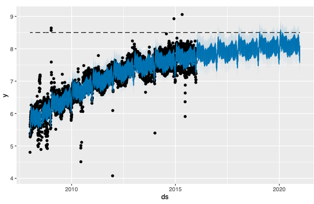
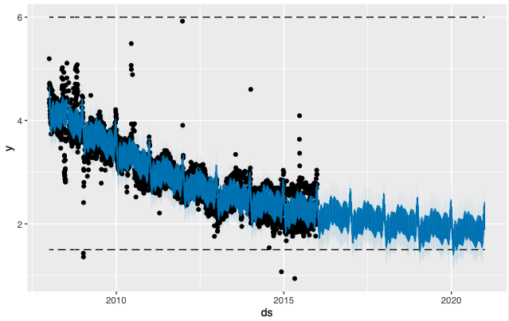

# Building and Running your Custom R Containers on Bacalhau


[](https://github.com/bacalhau-project/bacalhau)

## Introduction

This example will walk you through building Time Series Forecasting using [Prophet](https://github.com/facebook/prophet). Prophet is a forecasting procedure implemented in R and Python. It is fast and provides completely automated forecasts that can be tuned by hand by data scientists and analysts.

:::info
Quick script to run custom R container on Bacalhau:

```bash
bacalhau docker run \
    -i ipfs://QmY8BAftd48wWRYDf5XnZGkhwqgjpzjyUG3hN1se6SYaFt:/example_wp_log_R.csv \
    ghcr.io/bacalhau-project/examples/r-prophet:0.0.2 \
    -- Rscript Saturating-Forecasts.R "/example_wp_log_R.csv" "/outputs/output0.pdf" "/outputs/output1.pdf"
```
:::

## Prerequisites

To get started, you need to install the Bacalhau client, see more information [here](../../../getting-started/installation.md)

## 1. Running Prophet in R Locally

Open R studio or R-supported IDE. If you want to run this on a notebook server, then make sure you use an R kernel. Prophet is a CRAN package, so you can use install.packages to install the prophet package:


```bash
%%bash
R -e "install.packages('prophet',dependencies=TRUE, repos='http://cran.rstudio.com/')"
```


After installation is finished, you can download the example data that is stored in IPFS:


```bash
%%bash
wget https://w3s.link/ipfs/QmZiwZz7fXAvQANKYnt7ya838VPpj4agJt5EDvRYp3Deeo/example_wp_log_R.csv
```

The code below instantiates the library and fits a model to the data.


```bash
%%bash
mkdir -p outputs
mkdir -p R
```

Create a new file called `Saturating-Forecasts.R` and in it paste the following script:

```python
%%writefile Saturating-Forecasts.R

# Library Inclusion
library('prophet')


# Command Line Arguments:
args = commandArgs(trailingOnly=TRUE)
args

input = args[1]
output = args[2]
output1 = args[3]


# File Path Processing:
I <- paste("", input, sep ="")

O <- paste("", output, sep ="")

O1 <- paste("", output1 ,sep ="")


# Read CSV Data:
df <- read.csv(I)


# Forecasting 1:
df$cap <- 8.5
m <- prophet(df, growth = 'logistic')

future <- make_future_dataframe(m, periods = 1826)
future$cap <- 8.5
fcst <- predict(m, future)
pdf(O)
plot(m, fcst)
dev.off()

# Forecasting 2:
df$y <- 10 - df$y
df$cap <- 6
df$floor <- 1.5
future$cap <- 6
future$floor <- 1.5
m <- prophet(df, growth = 'logistic')
fcst <- predict(m, future)
pdf(O1)
plot(m, fcst)
dev.off()
```
This script performs time series forecasting using the Prophet library in R, taking input data from a CSV file, applying the forecasting model, and generating plots for analysis.


Let's have a look at the command below:
```bash
%%bash
Rscript Saturating-Forecasts.R "example_wp_log_R.csv" "outputs/output0.pdf" "outputs/output1.pdf"
```
This command uses Rscript to execute the script that was created and written to the `Saturating-Forecasts.R` file.

The input parameters provided in this case are the names of input and output files:

`example_wp_log_R.csv` - the example data that was previously downloaded.

`outputs/output0.pdf` - the name of the file to save the first forecast plot.

`outputs/output1.pdf` - the name of the file to save the second forecast plot.


## 2. Running R Prophet on Bacalhau

To use Bacalhau, you need to package your code in an appropriate format. The developers have already pushed a container for you to use, but if you want to build your own, you can follow the steps below. You can view a [dedicated container example](../custom-containers/index.md) in the documentation.

## 3. Containerize Script with Docker

To build your own docker container, create a `Dockerfile`, which contains instructions to build your image.

```
%%writefile Dockerfile
FROM r-base
RUN R -e "install.packages('prophet',dependencies=TRUE, repos='http://cran.rstudio.com/')"
RUN mkdir /R
RUN mkdir /outputs
COPY Saturating-Forecasts.R R
WORKDIR /R
```

These commands specify how the image will be built, and what extra requirements will be included. We use `r-base` as the base image and then install the `prophet` package. We then copy the `Saturating-Forecasts.R` script into the container and set the working directory to the `R` folder.


### Build the container

We will run `docker build` command to build the container:

```
docker build -t <hub-user>/<repo-name>:<tag> .
```

Before running the command replace:

**`hub-user`** with your docker hub username. If you don’t have a docker hub account [follow these instructions to create docker account](https://docs.docker.com/docker-id/), and use the username of the account you created

**`repo-name`** with the name of the container, you can name it anything you want

**`tag`** this is not required but you can use the `latest` tag

In our case:

```bash
docker buildx build --platform linux/amd64 -t ghcr.io/bacalhau-project/examples/r-prophet:0.0.1 .
```

### Push the container

Next, upload the image to the registry. This can be done by using the Docker hub username, repo name, or tag.

```
docker push <hub-user>/<repo-name>:<tag>
```

In our case:

```bash
docker push ghcr.io/bacalhau-project/examples/r-prophet:0.0.1
```

## 4. Running a Job on Bacalhau

The following command passes a prompt to the model and generates the results in the outputs directory. It takes approximately 2 minutes to run.


```bash
%%bash --out job_id
bacalhau docker run \
    --wait \
    --id-only \
    -i ipfs://QmY8BAftd48wWRYDf5XnZGkhwqgjpzjyUG3hN1se6SYaFt:/example_wp_log_R.csv \
    ghcr.io/bacalhau-project/examples/r-prophet:0.0.2 \
    -- Rscript Saturating-Forecasts.R "/example_wp_log_R.csv" "/outputs/output0.pdf" "/outputs/output1.pdf"
```

### Structure of the command

`bacalhau docker run`: call to Bacalhau

`-i ipfs://QmY8BAftd48wWRYDf5XnZGkhwqgjpzjyUG3hN1se6SYaFt:/example_wp_log_R.csv`: Mounting the uploaded dataset at `/inputs` in the execution. It takes two arguments, the first is the IPFS CID (`QmY8BAftd48wWRYDf5XnZGkhwqgjpzjyUG3hN1se6SYaFtz`) and the second is file path within IPFS (`/example_wp_log_R.csv`)

`ghcr.io/bacalhau-project/examples/r-prophet:0.0.2`: the name and the tag of the docker image we are using

`/example_wp_log_R.csv `: path to the input dataset

`/outputs/output0.pdf`, `/outputs/output1.pdf`: paths to the output

`Rscript Saturating-Forecasts.R`: execute the R script

When a job is submitted, Bacalhau prints out the related `job_id`. We store that in an environment variable so that we can reuse it later on:

```python
%env JOB_ID={job_id}
```

## 5. Checking the State of your Jobs

**Job status**: You can check the status of the job using `bacalhau list`.


```bash
%%bash
bacalhau list --id-filter ${JOB_ID}
```

When it says `Published` or `Completed`, that means the job is done, and we can get the results.

**Job information**: You can find out more information about your job by using `bacalhau describe`.


```bash
%%bash
bacalhau describe ${JOB_ID}
```

**Job download**: You can download your job results directly by using `bacalhau get`. Alternatively, you can choose to create a directory to store your results. In the command below, we created a directory (`results`) and downloaded our job output to be stored in that directory.


```bash
%%bash
rm -rf results && mkdir -p results
bacalhau get ${JOB_ID} --output-dir results
```

## 6. Viewing your Job Output

To view the file, run the following command:


```bash
%%bash
ls results/outputs
```

You can't natively display PDFs in notebooks, so here are some static images of the PDFs:

**output0.pdf**




**output1.pdf**




## Support
If you have questions or need support or guidance, please reach out to the [Bacalhau team via Slack](https://bacalhauproject.slack.com/ssb/redirect) (**#general** channel).
