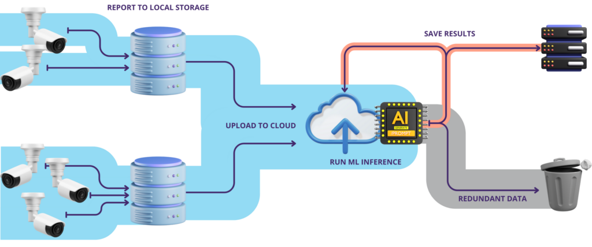
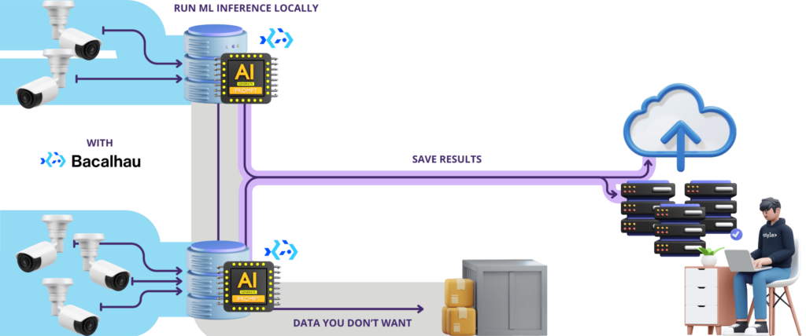
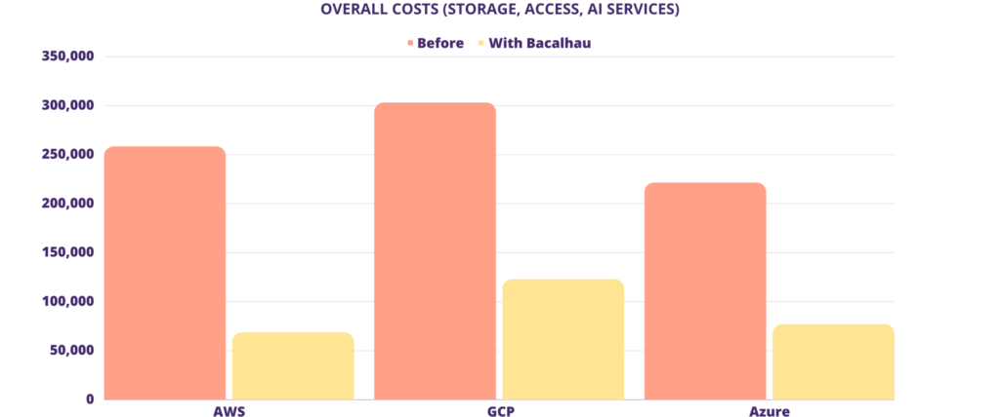
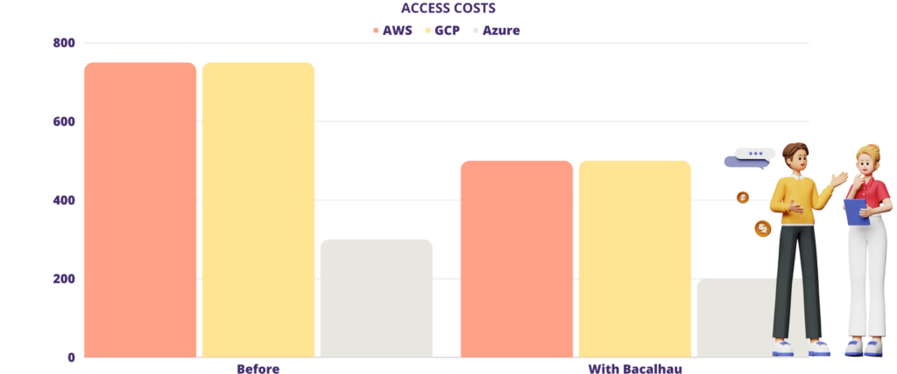
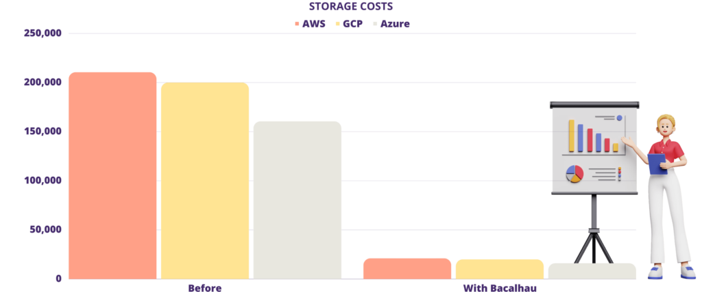

# Edge-Based Machine Learning Inference


## Introduction

The rapid digitization of today’s world has led to an exponential increase in data generation, particularly at the edge—far from centralized data centers. This data, ranging from application logs for troubleshooting software issues to extensive CCTV footage for maintaining security, is a treasure trove of insights waiting to be unlocked through Machine Learning (ML). However, the disparity between data generation locations and where ML models are hosted for interpretation presents a unique set of challenges, especially when it comes to data transit.

## Challenges in centralized ML
Machine learning models present unique challenges in production environments versus typical binary deployments:

1. **Data Size And Transfer Cost**: Imagine having terabytes or even petabytes of data that you need to move to another location for training or inference. Not only is this expensive, but it is also time-consuming. In the machine learning world, the time it takes to move data means that, on top of expenses, your models may be out of date before you even get to use them.

1. **The Compliance Labyrinth**: Compliance is no child’s play. Moving data for training, especially personal or sensitive information, across different regions or systems means navigating a complex web of regulatory requirements. Depending on your industry, you could be faced with tens or hundreds of different regulations. Ensuring compliance while moving data can be a daunting task – and these are often triggered the moment data is moved.

1. **Security: The Moving Target**: Static data, or data at rest, benefits from a controlled environment, making it easier to secure. However, data in transit is like a moving target, vulnerable to interception, tampering, and unauthorized access. The challenge extends beyond securing the endpoints to ensuring the data’s safety as it travels between points.

1. **Volume Vs. Value: The Data Dilemma**: Although a vast amount of data is collected at the edge, only a small subset may be valuable. Sifting through application logs might reveal a few anomalies or a few frames of interest amid hours of video footage. Storing all this data, when only a fraction is valuable, is not just unnecessary but also costly. The goal is to segregate and retain the essential data while letting go of the rest.

1. **Under-Used Compute Power**: Historically, ML inference required heavy-duty, centralized computational resources – often involving expensive GPUs. But times are changing. Innovations like Google’s Coral Edge ML, Nvidia’s Jetson, and Intel’s Neural Compute Stick are revolutionizing the field. They’re not only driving down the costs of ML inference but also demonstrating robust performance on edge devices, making ML more accessible and decentralized.

## Traditional Setup using Centralized ML Inference.
The diagram below offers a top level view of a typical surveillance system utilizing ML Inference to detect noteworthy events.



Here’s how the process unfolds:

1. **Video Capture**: Each camera captures video, buffering it locally on the device.
1. **Local Storage**: Video data from the camera’s buffer is saved locally or to nearby storage locations.
1. **Cloud Upload**: The data is then uploaded to the cloud for further analysis.
1. **Inference and Storage**: Cloud systems perform ML inference to identify significant events. Relevant events are stored, while the rest are either discarded or moved to cold storage.
 

This design, however, has several drawbacks:

1. **Latency & Bandwidth**: There’s a delay between recording the video and analyzing it in the cloud. This means real-time detection or immediate action might not be possible. Additionally, uploading large video files to the cloud can consume significant bandwidth, potentially slowing down other network activities.
1. **Storage Costs**: Even though only “interesting” events might be stored long-term, the initial storage of all video footage, even temporarily, might lead to substantial storage costs.
1. **Internet Dependency**: If the internet connection is lost, videos can’t be uploaded to the cloud for analysis, leading to potential blind spots in surveillance, and significant data processing backlogs.
1. **Data Transfer Costs**: Many cloud providers charge for the amount of data transferred into or out of their services. Frequent uploads of video data can lead to substantial costs.
1. **Compliance Challenges**: Surveillance footage must adhere to data protection regulations, ensuring transparent communication, secure storage, controlled retention, and upholding individual rights. Additionally, transferring data across borders may encounter regulatory challenges due to data protection standards.

## Solution: Edge based ML

The previous section highlighted the challenges of handling large data volumes. The solution might seem simple at first glance: **only move essential data**. However, is it that straightforward?

Imagine a scenario where data remains at its source. Running ML inference on the data in place can offer organizations several advantages:

1. **Enhanced Data Security**: Static data naturally provides a more secure environment, protecting it from the vulnerabilities tied to data in transit. The less frequently data is transferred, the lower the risk of potential breaches.

1. **Cost and Time Efficiency**: Transferring data goes beyond merely moving files from one folder to another. It involves network bandwidth, storage costs, potential egress fees, and, crucially, time. Tasks like compression, encryption, and transfers, while necessary, slow things down, especially when networking is slow or unreliable. Employing ML at the edge cultivates a more efficient and responsive network.

1. **Simplified Compliance Management**: By reducing the volume of data transferred, we narrow down the scope of data subject to various compliance regulations. This simplifies ensuring adherence, lowering the risk of potential violations.

1. **Streamlined System Design**: A system with fewer moving parts is often less prone to failures. Keeping data static and processing it at its source eliminates complex data transfer protocols, enhancing system reliability.

## Edge ML Inference With Bacalhau
The essence of using Edge ML with Bacalhau is combining distributed execution, with scheduling to where the data is. At its core, you use the same binaries and architecture you always have, but, via Bacalhau, you’re able to schedule them to run where your data is – without having to move them to a centralized data lake.

In the tide of digital transformation, data is paramount. However, the surge of data creation, especially at the edge, is pushing the traditional centralized model to its limits, leading to inefficiencies and escalating costs.

By shifting ML inference away from central hubs, it significantly cuts costs and boosts efficiency while delivering real-time insights. This enhances system reliability and quickens response times. In the world of data, success hinges on not just gathering information but making smart, swift decisions with it exactly when and where it’s needed.

To show you how this works, we’ll begin by illustrating how organizations might approach this problem today.

## Distributed Setup With Bacalhau On The Edge

With Bacalhau, we can revamp the initial design to conduct inference at the edge, as pictured below:


Cost breakdown of executing ML inference over video across three platforms:



Navigating the expense maze associated with cloud operations can be daunting. These operations often lack transparency regarding the final costs, especially when various services are intertwined. Take cloud storage for instance: you pay per GB, and there are additional charges for access requests. Delve into platforms like AWS Rekognition, GCP Vision, or Azure Cognitive Service, and you’ll find that you are billed for


1. Storing your data in their data center.
1. Accessing your data from their data center.
1. Utilizing their specialized AI services.

| **Costs**                 | **Before**   | **With Bacalhau** | **Savings** |
|---------------------------|--------------|---------------|---------|
| **AWS**                   |              |               |         |
| Storage (AWS)             | $210,500.00  | $21,050.00    |         |
| Access (AWS)              | $750.00      | $500.00       |         |
| AI services (AWS)         | $47,200.00   | $47,200.00    |         |
| **Sum**                   | **$258,450.00**  | **$68,750.00**    |         |
| Savings                   |              |               | **73.40%**  |
| **GCP**                   |              |               |         |
| Storage (Google Cloud)    | $200,000.00  | $20,000.00    |         |
| Access (Google Cloud)     | $750.00      | $500.00       |         |
| AI services (Google Cloud)| $102,498.50  | $102,498.50   |         |
| **Sum**                       | **$303,248.50**  | **$122,998.50**   |         |
| Savings                   |              |               | **59.44%**  |
| **Azure**                 |              |               |         |
| Storage (Azure)           | $160,500.00  | $16,050.00    |         |
| Access (Azure)            | $300.00      | $200.00       |         |
| AI services (Azure)       | $60,850.00   | $60,850.00    |         |
| **Sum**                       | **$221,650.00**  | **$77,100.00**    |         |
| Savings                   |              |               | **65.22%**  |

This is an example from our cloud cost calculator, which you can try [here](https://docs.google.com/spreadsheets/d/1VO_wF4ow846EeE4Lmy8GhL06PEIJTMmduIQ5CGckAzU/edit#gid=0). 



To estimate the storage costs for your ML inference workloads with cloud providers, we’ll need to calculate the data generated and then compare it with each provider’s pricing structure.

Example Data:

1. **Resolution**: 4K (Ultra HD)
1. **Frame Rate**: 60 FPS
1. **Number of Cameras**: 10
1. **Recording Time**: Continuous
1. **Hourly Data**: 110GB
1. **Weekly Data**: 18T
1. **Annual Data**: Approximately 1PB (Petabyte)



Again, let’s use the formulas above to determine the cost to perform ML Inference centrally across the data we’ve collected. Notice that AI inference costs are significantly larger than storage costs. In our guide, we used two [e2-standard-8 (GCP)](https://cloud.google.com/compute/docs/general-purpose-machines#e2-standard) spot instances from Google Cloud, each processing at a rate of 10 frames per second using the YOLOv5 model, at an hourly cost of $0.11 per instance. Deploying Bacalhau on both instances, we processed an hour’s worth of 4K video (recorded at 60FPS) within 3 hours at a total cost of $1.

## Cost Analysis Conclusion
Bacalhau’s on-the-edge ML inference **significantly** boosts cost efficiency by optimizing bandwidth and reducing storage costs through selective cloud uploads. Local nodes ensure uninterrupted data processing during network disruptions. This not only represents a technological shift but also a cost-effective, reliable approach to data management, promoting trust and privacy. Exploring supporting hardware will further advance edge-based innovations as we transition from traditional cloud-centric methods.

### Bacalhau Deployment

Here’s the modified workflow:

1. **Bacalhau Agent Installation:**
	Every local node connected to a camera now hosts a Bacalhau Agent.
		1. The ML Inference, previously cloud-based, now operates at these local nodes.
		1. Through Bacalhau’s control plane (not illustrated), each compute node is directed to oversee the video storage location. Each agent is tasked with executing the ML inference on-site.
1. **Selective Cloud Upload**: Only significant events pinpointed by ML Inference get uploaded.
1. **Event-based Persistence**: Only relevant events are sent to the cloud. Optionally, non-significant events might be stored off-site, on much cheaper storage.
```bash
bacalhau docker run --target=all \
--input file:///video_dir:/videos \
docker.io/bacalhauproject/yolov5-7.0:v1.0
```

Please note: This can be quite large! When running this, you will need to have a server configured with `allow-listed-local-paths` (like in the following command):

```bash
bacalhau serve \
--node-type requester,compute \
--job-selection-data-locality anywhere \
--allow-listed-local-paths '/video_dir/**' \ 
--job-selection-accept-networked
```

You can also execute this command with a `job.yaml` file:

```job.yaml
Job:
APIVersion: V1beta2
Spec:
EngineSpec:
Params:
Entrypoint: null
EnvironmentVariables: []
Image: docker.io/bacalhauproject/yolov5-7.0:v1.0 WorkingDirectory: ""
Type: docker
Inputs:
- Name: /video_dir
Path: /videos
StorageSource: localDirectory
SourcePath: /video_dir
Outputs:
- Name: outputs
Path: /outputs
```

Then to run this command, you can execute:
```bash
cat job.yaml | bacalhau create
```

### Benefits

1. **Minimized Latency & Bandwidth Use**: Local inference facilitates real-time detection. Uploading only key footage significantly reduces bandwidth use.
1. **Cost-Efficient Storage**: Only storing 'significant' footage sidesteps the costs associated with transient cloud storage.
1. **Network Outage Resilience**: During internet outages, local nodes can still process the data, ensuring continuous surveillance and reducing data processing backlog.
1. **Curbed Data Transfer Costs**: You're billed only for the data that matters, making this a cost-effective approach.
1. **Streamlined Regulatory Compliance**: Local data processing means Personal Identifiable Information (PII) can be excluded before cloud uploads, aligning with data protection mandates.
1. **Enhanced Consumer Trust**: Keeping data local during inference ensures that only the essential data is transferred, leaving sensitive and irrelevant data untouched. This promotes trust as customers are assured that their private information remains in situ and only necessary data points are moved for further processing.

Having explored the advantages of shifting ML inference to the edge with Bacalhau, a natural follow-up inquiry arises: what about the hardware? As we transition from cloud-based solutions, it’s crucial to understand the hardware implications and how they support this edge-based revolution.

## Implementation Example: Inference on Video With Yolov5

Having explored the fundamental concepts and strategic advantages, we now transition from theory to practice. This section will provide you with a step-by-step walkthrough of the implementation process, starting from hardware provisioning and software installation to running ML inference with Bacalhau. Whether you’re a seasoned developer or a beginner in edge computing, this practical guide is designed to help you navigate the process with ease.

### Loading Videos onto Compute Nodes for Inference
Collect the video files earmarked for inference and distribute them across your compute nodes, placing at least 1 video into the `/videos` directory. For a dynamic use case, consider using distinct videos on each node. Remember, this procedure emulates real-time video capture from a camera. The choice of videos, however, remains at your discretion.

You can find the sample videos we’ll use for this demo [here](https://orange-elderly-carp-967.mypinata.cloud/ipfs/QmSw1vJGmYZu2KeNr9nrEFCWARFq6EJHbscXFHNuEhDf4i/). There are a total of 12 videos. We will place 6 videos on one compute node and 6 videos on another. We’ll harness the power of [YOLOv5](https://github.com/ultralytics/yolov5) as our preferred inference model:

> YOLOv5, the fifth iteration of the revolutionary "You Only Look Once" object detection model, is designed to deliver high-speed, high-accuracy results in real-time.
>Source: https://docs.ultralytics.com/yolov5/

While YOLOv5 is our model of choice for this exercise, Bacalhau’s modular architecture ensures flexibility. This means you can easily substitute another model that aligns more closely with your objectives. Bacalhau is crafted to be adaptable, positioning you with a foundational template to streamline subsequent deployments tailored to your use cases.

:::info
💡 For this guide we will use 2 compute instances, but feel free to use as many as you’d like.
:::

## Code Implementation
### Step 1: Provisioning hardware
Before we embark on our journey, let’s ensure we have the right tools:

1. Control Plane Node: Your central command center. Through this, you’ll orchestrate tasks across the Bacalhau cluster.
	1. Recommended Requirements:
		1. Number of Instances: 1
		1. Disk: 25-100GB
		1. CPU: 4-8vCPU
		1. Memory: 8-16GB
	1. Tip: You could even use the device you’re on right now, provided it’s not a mobile device.
1. Compute Node(s): Think of these as your workers. They’ll be doing the heavy lifting on behalf of the control plane.
	1. Recommended Requirements:
		1. Number of Instances: 1-N
		1. For our use case it will be best to have at least 3
		1. Disk: 32-500GB
		1. CPU: 1-32vCPU
		1. Memory: 8-64GB
		1. GPU/TPU: 1 (Optional for performance of ML Inference)

Note: Ensure the Control Plane can communicate with these nodes. [Tailscale](https://tailscale.com/) offers a handy solution for this.

Hardware check done? Let’s proceed to software installation

### Step 2: Install Bacalhau

With the hardware set, it’s Bacalhau time. While there’s an in-depth [installation guide](../getting-started/installation.md), here’s the essence:

1. Access each node (ssh, putty, caress its keyboard)
1. Issue the installation command:
```bash
curl -sL <https://get.bacalhau.org/install.sh> | bash
```
That’s it for installation. Simple, right?

### Step 3: Configure Control Plane Instance

Time to get the Bacalhau control plane running (also known as the Requester). For those craving details, here’s the comprehensive guide. For a swift setup: Launch the Bacalhau Control Plane Process: 
```bash
bacalhau serve –node-type=requester
```
You should see an output similar to: 

```bash
To use this requester node from the client, run the following commands in your shell:
export BACALHAU_NODE_IPFS_SWARMADDRESSES=/ip4/127.0.0.1/tcp/55561/p2p/QmSX2UunnZ4ethswdzLjCD6VpHwrfrTSLHS3MVQKf1DUNe
export BACALHAU_NODE_CLIENTAPI_HOST=0.0.0.0
export BACALHAU_NODE_CLIENTAPI_PORT=1234
export BACALHAU_NODE_LIBP2P_PEERCONNECT=/ip4/100.99.22.51/tcp/1235/p2p/QmYKJnwBJDn77RUrXw3cVj8oAtYQLuHncTybkpS94aC8i1
```

To interact with this network:

1. Locally: Export the commands as provided.
1. Remotely: Adjust accordingly, e.g:
 
```bash
export BACALHAU_NODE_CLIENTAPI_HOST=<public_ip_of_requester_instance>
```
### Step 4: Configure compute instances

Next we’ll get the Bacalhau compute nodes running. Again, for details here’s the comprehensive guide. For a quick setup: Install docker on each compute node. Ensuring the docker process is accessible by the user running Bacalhau in the commands to follow. Optional: fetch the docker image `ultralytics/yolov5:v7.0` for faster subsequent steps. We will be using this model for our inference. To fetch the image run: 
```bash
docker pull ultralytics/yolov5:v7.0M
```
Create a directory on each compute node for video files. Files within this directory will simulate captured videos from security cameras; we will be performing ML inference over their contents. In this example we will use the the directory `/videos`. Launch the Bacalhau Compute Node Process:
```bash
bacalhau serve —node-type=compute --allow-listed-local-paths=/videos --peer=<multiaddress_of_requester_node>
```
Here is a brief explanation of each of these flags. Comprehensive descriptions may be found by running `bacalhau serve –help`:
1. `—node-type=compute` instructs Bacalhau to run as a compute node
1. `–allow-listed-local-paths=/videos` allows the node to access the contents of /videos when executing workloads
1. `–peer=<multiaddress_of_requester_node>` instructs the compute node to connect to the requester node we setup in the previous step. As an example, borrowing from the previous step, this would be `–peer=/ip4/100.99.22.51/tcp/1235` but you will need to provide a value here specific to your deployment.

### Step 5: Running Inference on Videos With Yolov5

To process videos with ML inference, we’ll guide the Control Plane (or the Requester) to instruct each compute node to work on video files in their local directories. Bacalhau ML Inference Command:
```bash
bacalhau docker run --target=all \
--input file:///video_dir:/videos \
docker.io/bacalhauproject/yolov5-7.0:v1.0
```

Diving deep into the command, here’s a comprehensive breakdown of each component:

**Bacalhau Arguments**:
1. `bacalhau docker run –target=all`: This orders Bacalhau to execute a Docker job, targeting all nodes the Control Plane has established a connection with.
1. `–input file:///video_dir:/videos`: This synchronizes the compute node’s URI value to the container’s `/video` path.
	1. Refresher: We earmarked this directory in our earlier segment on “Configure Compute Instances”.

**Yolov5 Arguments**:

Inside the Dockerfile, we pass a set of default arguments to the YOLOv5 detection script, you can view the Dockerfile we are using at this [link](https://github.com/bacalhau-project/examples/blob/main/model-inference/object-detection-yolo5/Dockerfile). As an example, if you would prefer to use the XL model from YOLO you can modify the above command as shown below, overriding the default model used in the Dockerfile:

```bash
bacalhau docker run --target=all \
--input file:///video_dir:/videos \
--input https://github.com/ultralytics/yolov5/releases/download/v6.2/yolov5x.pt:/model \
docker.io/bacalhauproject/yolov5-7.0:v1.1 \
--env=WEIGHTS_PATH=/model/yolov5x.pt
```
Once this command is executed, each compute node will start processing its local videos.

### Step 6: Interpreting the Results

Upon issuing the above command your Bacalhau network will begin processing the ML Inference Job. You will be presented with a terminal prompt like the below (although your JobID will be different):
```bash
Job successfully submitted. Job ID: 4b1422ff-7fc3-4518-8925-c2e5d4902a04
Checking job status... (Enter Ctrl+C to exit at any time, your job will continue running):

	Communicating with the network  ................  done   0.2s
	   Creating job for submission  ................           3.2s
```

Your prompt will stay active until the job finishes. The completion time varies based on the video size relative to the resources of your compute nodes.

After your job is done, fetch the inference results using the `bacalhau get` command. Remember to replace it with your unique jobID. The command seamlessly fetches results from all nodes, organizing them into individual directories for each compute node that took part in the ML inference.

```bash
bacalhau get --raw 4b1422ff-7fc3-4518-8925-c2e5d4902a04
Fetching results of job '4b1422ff-7fc3-4518-8925-c2e5d4902a04'...
19:26:06.521 | INF pkg/downloader/download.go:76 > Downloading 2 results to: /Users/bacalhau/data.
Results for job '4b1422ff-7fc3-4518-8925-c2e5d4902a04' have been written to...
/Users/bacalhau/data/job-4b1422ff
```

Here’s a glimpse of the downloaded job’s structure:


Our Bacalhau deployment for this task utilized 2 compute nodes, resulting in two distinct directories for each node’s outputs. These directories are labeled with a Content Identifier (CID) – a unique hash of their content. To view the ML Inference results showcased in this example, visit this [link](https://orange-elderly-carp-967.mypinata.cloud/ipfs/QmNZozjpvKtAZmFpQD6yavVuw4nBXqknydnHwdHZJ9sHZj/).

### Step 7: Wrapping up Our Hands-On Dive

Congratulations on successfully navigating the intricacies of Bacalhau to execute ML Inference using YOLOv5! Here’s a snapshot of your journey:

1. **Hardware Provisioning**: You set the stage with the Control Plane Node and Compute Node(s), ensuring that they were suitably equipped and communicative.
1. **Software Installation**: You geared up the hardware with Bacalhau, bringing it to life and priming it for the tasks ahead.
1. **Configuration**: A meticulous orchestration saw the Control Plane and Compute Nodes being configured, intertwined, and readied for the main event.
1. **Data Preparation**: Through a thoughtful selection and placement of videos, you simulated real-world data scenarios, bringing a touch of realism to the exercise.
1. **ML Inference**: You unleashed the power of YOLOv5 on the Bacalhau network, showcasing the platform’s versatility and capability.

**Result Interpretation**: Finally, you took the reins back, analyzing and understanding the outcomes of your hard work.

## 
Conclusion
In this era of digital transformation, data reigns supreme. Yet, the surge of data, especially at the edge, challenges the old ways of centralized processing with inefficiencies, security risks, and soaring costs.

The heart of the matter is not just the sheer amount of data but its processing locus and method. Our journey highlights a crucial transition: from a cloud-centric model to a distributed, edge-focused strategy. This shift tackles the hurdles of data transit, security, and compliance and ushers in a new era where ML models engage with data instantly at its source.

Bacalhau presents an innovative method for leveraging edge computing’s potential. By decentralizing ML inference, we’re enhancing cost-effectiveness and operational efficiency, leading to real-time, actionable insights, and improved system dependability. This strategic shift, combining clever software with rethought hardware deployment, offers a comprehensive answer to contemporary data dilemmas.

As the demand for instant data insights grows, the fusion of edge computing and machine learning presents exciting opportunities. Our guide aims to demystify these complexities, empowering organizations to stride into the future with confidence. In the data landscape, it’s about more than collection — it’s about making smart, timely decisions based on that data, where it counts.