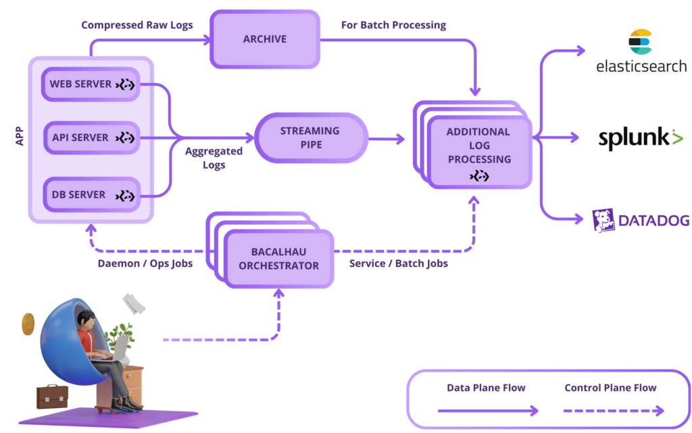
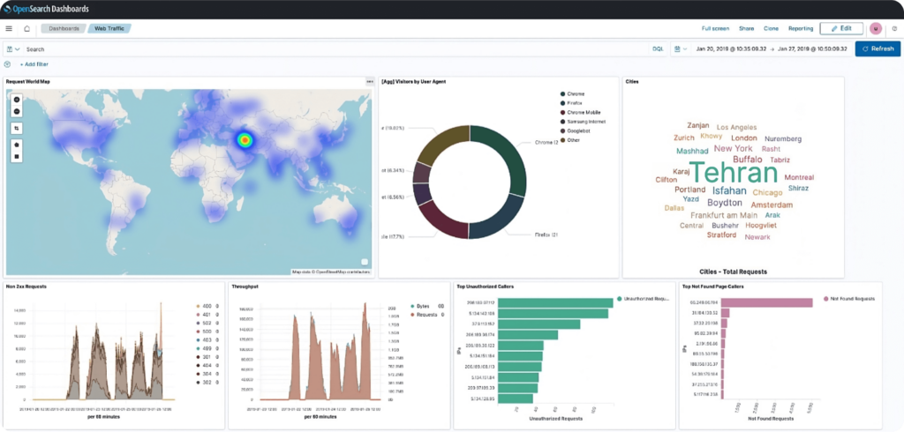
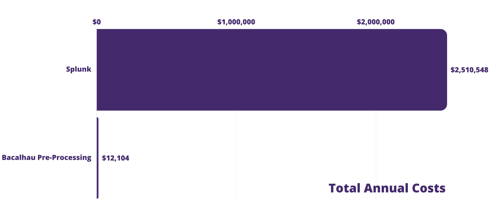

# Log Vending

## Introduction

AWS is one of the largest deployments of compute services in the world. Like anyone of significant size, in order to maintain quality of service and reliability, they have to take as much signal from their services, often in the form of logs. In order to deliver high reliability services, they had to handle petabytes of logs generated every hour across Amazon’s massive global infrastructure supporting millions of customers. 

Their users had diverse needs – real-time access to logs, long-term storage for compliance and efficient storage for large-scale batch processing – all without burning a hole in their pocket. The traditional approach, a centralized data lake, would have been prohibitively expensive, less efficient and a nightmare to operate. So, they went distributed. They would process logs where they were generated and orchestrated multiple delivery streams tailored to specific needs, whether that be real-time access or optimized storage for batch processing or long-term retention.

Thinking of achieving this level of efficiency and cost-saving outside of AWS? Our open-source product Bacalhau is the solution.


## Challenges In Traditional Log Vending

Organizations today juggle the need for detailed logs with the challenges of managing massive data volumes. Platforms like Splunk, Data Dog, and others offer rich features, but costs spike with increased data intake. Key log management challenges across industries include the following.

1. **Volume Vs. Value**: Most log ingestion involves write-intensive operations, but only a minor fraction of these logs are accessed or deemed valuable.
1. **Real-Time Needs**: Critical applications like threat detection and system health checks rely on specific metrics. Real-time metric solutions tend to be costlier and harder to oversee. Hence, early aggregation and filtering of these metrics are essential for both cost savings and operational scalability.
1. **Operational Insights**: At times, operators require access to application and server logs for immediate troubleshooting. This access should be facilitated without connecting directly to the numerous production servers producing these logs.
1. **Archival Needs**: Preserving raw logs is crucial for compliance, audits, and various analytical and operational improvement processes.

To address these varied needs, especially in real-time scenarios, many organizations resort to streaming all logs to a centralized platform or data warehouse. While this method can work, it often leads to spiraling costs and slower insights.

## Solution: Distributed Log Orchestration

Bacalhau is a distributed compute framework that offers efficient log processing solutions, enhancing current platforms. Its strength lies in its adaptable job orchestration. Let’s explore its multi-job approach:



1. **Daemon Jobs**:
    1. Purpose: Bacalhau agents run continuously on selected nodes, auto-deployed by the orchestrator.
    1. Function: These jobs handle logs at the source, aggregate, and compress them. They then send aggregated logs periodically to platforms like Kafka or Kinesis, or suitable logging services. Every hour, raw logs intended for archiving or batch processing move to places like S3.
1. **Service Jobs**:
    1. Purpose: Handle continuous intermediate processing like log aggregation, basic statistics, deduplication, and issue detection. They run on specific nodes, with Bacalhau ensuring their optimal performance.
    1. Function: Continuous log processing and integration with logging services for instant insights, e.g., Splunk.
1. **Batch Jobs**:
    1. Purpose: Run on-demand on chosen nodes, with Bacalhau managing node choice and task monitoring.
    1. Function: Operates intermittently on data in S3, focusing on in-depth investigations without moving the data, turning nodes into a distributed data warehouse.
1. **Ops Jobs**:
    1. Purpose: Similar to batch jobs but spanning all fitting nodes.
    1. Function: Executes ad-hoc queries across all jobs in a network, allowing end-users limited log access on host machines, avoiding any S3 transfer delays and ensuring rapid insights.

Bacalhau ensures log management is not only efficient but also responsive to changing business needs.



## Bacalhau's Global Edge

Bacalhau is designed for global reach and reliability. Here’s a snapshot of its worldwide log solution:

1. **Local Log Transfers**: Daemon jobs swiftly send logs to close-by storages like regional S3 or MinIO. They stay active, even without Bacalhau connection, safeguarding data during outages.
1. **Regional Log Handling**: Autonomous service jobs in each region channel logs to either local or global platforms, preserving metrics when the network’s down.
1. **Smart Batch Operations**: Bacalhau guides batch jobs to nearby data sources, cutting network costs and streamlining global tasks.
1. **Ops Jobs Flexibility**: Based on permissions, operators can target specific hosts, regions, or the entire network for queries.

With Bacalhau, global log management is both efficient and user-friendly, marrying the perks of decentralization with centralized clarity.

## Benchmarking



In the following we have calculated the cost for a case where one uploads the data directly to Splunk and processes the data there. In the second scenario data is preprocessed on-device, uploaded both to an archive server and a S3 bucket with a EC2 unit in AWS. The savings are higher than 99%.


| **Environment** |||
|--------------------------------------------|----------|------|
| **Fleet**|||
| TPS Per Host           | 10,000            | r/s             |
| Number of Hosts        | 30                |                 |
|                                     |     |   |
| **Raw Logs** |||
| Average Nginx Access Log Size             | 325      | Bytes |
| Per Host Hourly Logs                      | 11       | GB    |
| Per Host Hourly Compressed Logs (zstd)    | 0.8      | GB    |
| Fleet Wide Daily Raw Logs                 | 7,845    | GB    |
| Fleet Wide Daily Compressed Raw Logs      | 541      | GB    |
||||
| **Aggregated Logs** |||
| Average Aggregated Event Size       | 170     | Bytes   |
| Aggregation Window                  | 10      | seconds |
| Metrics Per Aggregation Window      | 100     |         |
| Per Host Hourly Aggregated Logs     | 0.006   | GB      |
| Fleet Wide Daily Aggregated Logs    | 4       | GB      |
| Fleet Wide TPS                      | 300     | Events  |


|Splunk Cloud Ingestion Prices ([Ref](https://aws.amazon.com/marketplace/pp/prodview-jlaunompo5wbw))|||
|------------------------------|--------------|--------|
| Splunk annual 5GB/Day       | $8,100       | $4.4   |
| Splunk annual 10GB/Day      | $13,800      | $3.8   |
| Splunk annual 20GB/Day      | $24,000      | $3.3   |
| Splunk annual 50GB/Day      | $50,000      | $2.7   |
| Splunk annual 100GB/Day     | $80,000      | $2.2   |
| Assuming 60% Discount       | $32,000      | $0.9   |

|   | Direct to Splunk          | Bacalhau Pre-Processing |
|--------------------------------------------------|---------------|------------------|
| Splunk Daily Ingestion (GB)                     | 7,845         | 4                |
| **Splunk Annual Cost**                              | **$2,510,548**    | **$6,648**           |
| S3 Monthly New Storage (GB)                     |               | 16,232           |
| S3 Monthly PUTs                                 |               | 21,600           |
| S3 Monthly GETs                                 |               | 64,800           |
| S3 Annual Standard Storage (first month)        |               | $373             |
| S3 Annual Infrequent Access (next 2 months)     |               | $406             |
| S3 Annual Glacier Instant Retrieval (next 9 months) |           | $584             |
| S3 Annual PUTs Cost                             |               | $1.30            |
| S3 Annual GETs Cost                             |               | $0.31            |
|**S3 Annual Cost**                                  |               | **$1,365**           |
| EC2 Monthly Orchestrator m7g.medium Instances (x3) |             | $90              |
| EC2 Monthly Compute m7g.large Instances (x3)    |               | $251             |
| **EC2 Annual Cost**                                 |               | **$4,091**           |
| Kinesis Monthly Shard Cost (x3 Shards)          |               | $33              |
| Kinesis Monthly PUT Units Cost                  |               | $11              |
| **Kinesis Annual Cost**                             |               | **$527**             |
| **Total Annual Cost**                               | **$2,510,548**    | **$12,104**          |
| **Cost Saving**                                     | **99.52%**        |                  |


**Log Context**: We benchmarked using web server access logs, common tools to monitor server health, user activity, and security. Our goal was to mirror real-world situations for wide applicability.

**Setup and Capacity**: We simulated 30 web servers across multiple zones, each handling about 10k TPS (Transactions Per Second) of web requests. This provides a solid foundation for gauging Bacalhau's log processing prowess.

**Platform Considerations**: Our tests were on AWS, but Bacalhau's flexibility means similar results on Google Cloud, Azure, or on-premises systems.

## Main Takeaways
#### Bandwidth Efficiency
Bacalhau cut the bandwidth for log transfers from 11GB to 800MB per host hourly – a ~93% reduction, maintaining data integrity and real-time metrics.

#### Cost Savings
Direct logs to a service like Splunk would cost roughly $2.5 million annually. Bacalhau’s approach? A mere $12k per year, marking a cost slash of over 99%.

#### Real-Time Insights
Using aggregated data, we crafted detailed dashboards for monitoring web services, tracking traffic shifts, and spotting suspicious users.

#### Added Perks
With Bacalhau, benefits span faster threat detection using Kinesis, intricate batch tasks with raw logs in S3, and long-term storage in Glacier. Plus, you can keep using your go-to log visualization and alert tools.

## Implementation

### Step 0: Prerequisites

1. Bacalhau CLI installed. If you haven’t yet, follow this guide.
1. AWS CDK CLI. You can find more info here.
1. An active AWS account (any other cloud provider works too, but the commands will be different).

In this example, your cluster will include:

1. A Bacalhau orchestrator EC2 instance
1. Three EC2 instances as web servers running Bacalhau agents
1. An S3 bucket for raw log storage
1. An OpenSearch cluster with a pre-configured dashboard and visualizations

### Step 1: Cluster deployment with CDK

First, clone the GitHub repository:

```bash
git clone <https://github.com/bacalhau-project/examples.git>
cd log-orchestration/cdk
```
Now, install the required Node.js packages:

```bash
npm install
```
Bootstrap your AWS account if you haven’t used AWS CDK on your account already:

```bash
cdk bootstrap
```
To deploy your stack without SSH access, run:

```bash
cdk deploy
```

Need SSH access to your hosts? Use this instead:

```bash
cdk deploy --context keyName=<Your_SSH_key_pair_name>
```
Note: If you don’t have an SSH key pair, follow [these steps](https://docs.aws.amazon.com/AWSEC2/latest/UserGuide/create-key-pairs.html). Deployment will take a few minutes. Perfect time for a quick coffee break!

### Step 2: CDK Outputs

Once the stack is deployed, you’ll receive these outputs:

1. `OrchestratorPublicIp`: Connect Bacalhau CLI to this IP.
1. `OpenSearchEndpoint`: The endpoint for aggregated logs.
1. `BucketName`: The S3 bucket for raw logs.
1. `OpenSearchDashboard`: Access your OpenSearch dashboard here.
1. `OpenSearchPasswordRetriever`: Retrieve OpenSearch master password with this command.


### Step 3: Access Bacalhau network

To configure your Bacalhau CLI, execute:

```bash
export BACALHAU_NODE_CLIENTAPI_HOST=<OrchestratorPublicIp>
```
Verify your setup with:

```bash
bacalhau node list
```
You should see three compute nodes labeled service=web-server along with the orchestrator node.
```bash
ID        TYPE       LABELS                                              CPU     MEMORY      DISK         GPU
QmUWYeTV  Compute    Architecture=amd64 Operating-System=linux           1.6 /   1.5 GB /    78.3 GB /    0 /
                     git-lfs=False name=web-server-1 service=web-server  1.6     1.5 GB      78.3 GB      0
QmVBdXFW  Compute    Architecture=amd64 Operating-System=linux           1.6 /   1.5 GB /    78.3 GB /    0 /
                     git-lfs=False name=web-server-3 service=web-server  1.6     1.5 GB      78.3 GB      0
QmWaRH4X  Requester  Architecture=amd64 Operating-System=linux
                     git-lfs=False
QmXVWfVT  Compute    Architecture=amd64 Operating-System=linux           1.6 /   1.5 GB /    78.3 GB /    0 /
                     git-lfs=False name=web-server-2 service=web-server  1.6     1.5 GB      78.3 GB      0
```

### Step 4: Accessing OpenSearch dashboard

After your CDK stack is up and running, the OpenSearch dashboard URL will pop up in your console, courtesy of the CDK outputs. You’ll hit a login page the first time you try to access the dashboard. No sweat, just use admin as the username.

To get your password, you don’t have to hunt; CDK outputs include a handy command tailored for this. Just fire up your terminal and run:

```bash
aws secretsmanager get-secret-value --secret-id "<Secret ARN>" --query 'SecretString' --output text
```

Swap `<Secret ARN>` with the actual ARN displayed in your CDK outputs.

Logged in successfully? Fantastic, let’s proceed!

### Step 5: Deploy log generator
We’ve prepared a [log-generator.yaml](https://github.com/bacalhau-project/examples/blob/main/log-orchestration/jobs/log-generator.yaml) file for deploying a daemon job to simulate web access logs.

```log-generator.yaml
Name: LogGenerator
Type: daemon
Namespace: logging
Constraints:
  - Key: service
    Operator: ==
    Values:
      - web-server
Tasks:
  - Name: main
    Engine:
      Type: docker
      Params:
        Image: expanso/nginx-access-log-generator:1.0.0
        Parameters:
          - --rate
          - "10"
          - --output-log-file
          - /app/output/application.log
    Resources:
      CPU: 0.1
      Memory: 512MB
    InputSources:
      - Target: /app/output
        Source:
          Type: localDirectory
          Params:
            SourcePath: /data/log-orchestration/logs
            ReadWrite: true
```

What’s Happening: The daemon job is deployed on all nodes with the label `service=web-server`. The job employs a Docker image that mimics Nginx access logs and stores them locally. Deploy it like so:
```bash
bacalhau job run log-generator.yaml
```
Check the job’s status:

```bash
bacalhau job executions <job_id>
```
You should see three executions in your three web servers in Running state:

```bash
CREATED   MODIFIED  ID          NODE ID   REV.  COMPUTE     DESIRED  COMMENT
                                                STATE       STATE
12:43:31  12:43:31  e-d5433aec  QmUWYeTV  2     BidAccepte  Running
                                                d
12:43:31  12:43:31  e-a7410744  QmVBdXFW  2     BidAccepte  Running
                                                d
12:43:31  12:43:31  e-d6868bd2  QmXVWfVT  2     BidAccepte  Running
                                                d
```
### Step 6: Deploy logging agent

Bacalhau’s versatility means that you can deploy any type of job, use any existing logging agent or implement your own. We’ll use Logstash for this example. Take a look at [logstash.yaml](https://github.com/bacalhau-project/examples/blob/main/log-orchestration/jobs/logstash.yaml).

```logstash.yaml
Name: Logstash
Type: daemon
Namespace: logging
Constraints:
  - Key: service
    Operator: ==
    Values:
      - web-server
Tasks:
  - Name: main
    Engine:
      Type: docker
      Params:
        Image: expanso/nginx-access-log-agent:1.0.0
        EnvironmentVariables:
          - OPENSEARCH_ENDPOINT=<OpenSearchEndpoint>
          - S3_BUCKET=<S3BucketName>
          - AWS_REGION=<AWSRegion>
          - AGGREGATE_DURATION=10
    Resources:
      CPU: 0.5
      Memory: 1Gi
    Network:
      Type: Full
    InputSources:
      - Target: /app/logs
        Source:
          Type: localDirectory
          Params:
            SourcePath: /data/log-orchestration/logs
      - Target: /app/state
        Source:
          Type: localDirectory
          Params:
            SourcePath: /data/log-orchestration/state
            ReadWrite: true
```
Don’t Forget: Update `<OpenSearchEndpoint>`, `<S3BucketName>`, and `<AWSRegion>` according to your CDK outputs. Deploy your logging agent:

```bash
bacalhau job run logstash.yaml
```
Logstash might need a few moments to get up and running. To keep tabs on its start-up progress, you can use:
```bash
bacalhau logs --follow <job_id>
```
### Step 7: How the logging agent works
In our setup, we’re using the `expanso/nginx-access-log-agent` Docker image. Here’s a quick rundown of what you get out of the box with this choice:
1. Raw Logs to S3: Every hour, compressed raw logs are sent to your specified S3 bucket. This is great for archival and deep-dive analysis.
1. Real-time Metrics to OpenSearch: The agent pushes aggregated metrics to OpenSearch every `AGGREGATE_DURATION` seconds (e.g., every 10 seconds).

You can learn more about our Logstash pipeline configuration and aggregation implementation [here](https://github.com/bacalhau-project/examples/tree/main/log-orchestration). These are a subset of the aggregated metrics published to OpenSearch:
1. **Request Counts**: Grouped by HTTP status codes.
1. **Top IPs**: Top 10 source IPs by request count.
1. **Geo Sources**: Top 10 geographic locations by request count.
1. **User Agents**: Top 10 user agents by request count.
1. **Popular APIs & Pages**: Top 10 most-hit APIs and pages.
1. **Gone Pages**: Top 10 requested but non-existent pages.
1. **Unauthorized IPs**: Top 10 IPs failing authentication.
1. **Throttled IPs**: Top 10 IPs getting rate-limited.
1. **Data Volume**: Total data transmitted in bytes.

This gives you real-time insights into traffic patterns, performance issues, and potential security risks. All of this is visible through your OpenSearch dashboards. After a while, your OpenSearch dashboard will be bursting with insights. Metrics on user behavior, traffic hotspots, error rates, you name it!

## Further Information

#### Caveat
Your mileage may vary depending on the specific types of logs, the volume, and your existing infrastructure. You can use this [calculator](https://docs.google.com/spreadsheets/d/1rGJy6bCvVRcZsEcar2GeWIB4MkymZBEDyjiRoYWlngI/edit#gid=0) to get an estimate of your cost saving. Compression and decompression have CPU costs. But given that we’re saving significantly on data transfer and storage, it’s often a cost well worth incurring.

So there you have it. With Bacalhau, setting up a robust log management system is pretty much a walk in the park. But hey, we’re just scratching the surface here. The framework’s adaptability and resilience make it a must-have tool for any enterprise aiming to keep their log data in check.

## Conclusion
With Bacalhau, setting up a robust log management system is pretty much a walk in the park. But, we’re just scratching the surface here. The framework’s adaptability and resilience make it a must-have tool for any enterprise aiming to keep their log data in check.

By decentralizing the log processing system, Bacalhau not only vastly reduces operational costs – as evidenced by our benchmarking results – but also ensures real-time data processing and compliance with archival needs. Its seamless integration across various cloud platforms, including AWS, Azure, and Google Cloud, demonstrates our commitment to versatile, cross-platform solutions.

While Bacalhau is [open source software](https://en.wikipedia.org/wiki/Open-source_software), the Bacalhau binaries go through the security, verification, and signing build process lovingly crafted by [Expanso](https://expanso.io/). You can read more about the difference between open source Bacalhau and commercially supported Bacalhau in our [FAQ](https://expanso.io/faq/). If you would like to use our pre-built binaries and receive commercial support, please [contact us](https://expanso.io/contact/).