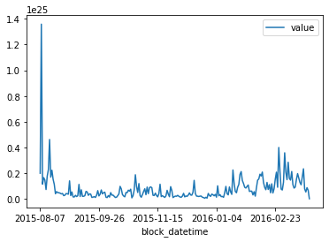

# Ethereum Blockchain Analysis with Ethereum-ETL and Bacalhau

[](https://colab.research.google.com/github/bacalhau-project/examples/blob/main/data-engineering/blockchain-etl/index.ipynb)
[](https://mybinder.org/v2/gh/bacalhau-project/examples/HEAD?labpath=data-engineering/blockchain-etl/index.ipynb)

# Introduction

Mature blockchains are difficult to analyze because of their size. Ethereum-ETL is a tool that makes it easy to extract information from an Ethereum node, but it's not easy to get working in a batch manner. It takes approximately 1 week for an ethereum node to download the entire chain and importing and exporting data from the ethereum node is slow.

For this example we ran an ethereum node for a week and allowed it to synchronise. We then ran ethereum-etl to extract the information and pinned it on Filecoin. This means that we can both now access the data without having to run another ethereum node.

### Prerequisites

* Python 3 
* The Bacalhau client - [Installation instructions](https://docs.bacalhau.org/getting-started/installation)

## 1. Analysing Ethereum Data Locally

First let's download one of the IPFS files and inspect it locally. You can see the full list of IPFS CIDs in the appendix.


```bash
wget -q -O file.tar.gz https://w3s.link/ipfs/bafybeihvmcrs5voz2pzpdkb3b7kt4bbb6kpi5ohspgrrs7bqkalpwmfdpq
tar -xvf file.tar.gz
```

    x output_1100000/
    x output_1100000/token_transfers/
    x output_1100000/token_transfers/start_block=01100000/
    x output_1100000/token_transfers/start_block=01100000/end_block=01199999/
    x output_1100000/token_transfers/start_block=01100000/end_block=01199999/token_transfers_01100000_01199999.csv
    x output_1100000/contracts/
    x output_1100000/contracts/start_block=01100000/
    x output_1100000/contracts/start_block=01100000/end_block=01199999/
    x output_1100000/contracts/start_block=01100000/end_block=01199999/contracts_01100000_01199999.csv
    x output_1100000/transactions/
    x output_1100000/transactions/start_block=01100000/
    x output_1100000/transactions/start_block=01100000/end_block=01199999/
    x output_1100000/transactions/start_block=01100000/end_block=01199999/transactions_01100000_01199999.csv
    x output_1100000/receipts/
    x output_1100000/receipts/start_block=01100000/
    x output_1100000/receipts/start_block=01100000/end_block=01199999/
    x output_1100000/receipts/start_block=01100000/end_block=01199999/receipts_01100000_01199999.csv
    x output_1100000/tokens/
    x output_1100000/tokens/start_block=01100000/
    x output_1100000/tokens/start_block=01100000/end_block=01199999/
    x output_1100000/tokens/start_block=01100000/end_block=01199999/tokens_01100000_01199999.csv
    x output_1100000/blocks/
    x output_1100000/blocks/start_block=01100000/
    x output_1100000/blocks/start_block=01100000/end_block=01199999/
    x output_1100000/blocks/start_block=01100000/end_block=01199999/blocks_01100000_01199999.csv
    x output_1100000/.tmp/
    x output_1100000/logs/
    x output_1100000/logs/start_block=01100000/
    x output_1100000/logs/start_block=01100000/end_block=01199999/
    x output_1100000/logs/start_block=01100000/end_block=01199999/logs_01100000_01199999.csv


```bash
pip install pandas
```

    Requirement already satisfied: ethereum-etl in /Users/phil/.pyenv/versions/3.9.7/lib/python3.9/site-packages (2.0.6)
    Requirement already satisfied: pandas in /Users/phil/.pyenv/versions/3.9.7/lib/python3.9/site-packages (1.4.3)
    Requirement already satisfied: web3<6,>=5.29 in /Users/phil/.pyenv/versions/3.9.7/lib/python3.9/site-packages (from ethereum-etl) (5.31.0)
    Requirement already satisfied: eth-utils==1.10 in /Users/phil/.pyenv/versions/3.9.7/lib/python3.9/site-packages (from ethereum-etl) (1.10.0)
    Requirement already satisfied: eth-abi==2.1.1 in /Users/phil/.pyenv/versions/3.9.7/lib/python3.9/site-packages (from ethereum-etl) (2.1.1)
    Requirement already satisfied: python-dateutil<3,>=2.8.0 in /Users/phil/.local/lib/python3.9/site-packages (from ethereum-etl) (2.8.2)
    Requirement already satisfied: click==8.0.4 in /Users/phil/.pyenv/versions/3.9.7/lib/python3.9/site-packages (from ethereum-etl) (8.0.4)
    Requirement already satisfied: ethereum-dasm==0.1.4 in /Users/phil/.pyenv/versions/3.9.7/lib/python3.9/site-packages (from ethereum-etl) (0.1.4)
    Requirement already satisfied: base58 in /Users/phil/.pyenv/versions/3.9.7/lib/python3.9/site-packages (from ethereum-etl) (2.1.1)
    Requirement already satisfied: requests in /Users/phil/.pyenv/versions/3.9.7/lib/python3.9/site-packages (from ethereum-etl) (2.26.0)
    Requirement already satisfied: eth-typing<3.0.0,>=2.0.0 in /Users/phil/.pyenv/versions/3.9.7/lib/python3.9/site-packages (from eth-abi==2.1.1->ethereum-etl) (2.3.0)
    Requirement already satisfied: parsimonious<0.9.0,>=0.8.0 in /Users/phil/.pyenv/versions/3.9.7/lib/python3.9/site-packages (from eth-abi==2.1.1->ethereum-etl) (0.8.1)
    Requirement already satisfied: eth-hash<0.4.0,>=0.3.1 in /Users/phil/.pyenv/versions/3.9.7/lib/python3.9/site-packages (from eth-utils==1.10->ethereum-etl) (0.3.3)
    Requirement already satisfied: cytoolz<1.0.0,>=0.10.1 in /Users/phil/.pyenv/versions/3.9.7/lib/python3.9/site-packages (from eth-utils==1.10->ethereum-etl) (0.12.0)
    Requirement already satisfied: tabulate in /Users/phil/.local/lib/python3.9/site-packages (from ethereum-dasm==0.1.4->ethereum-etl) (0.8.9)
    Requirement already satisfied: colorama in /Users/phil/.pyenv/versions/3.9.7/lib/python3.9/site-packages (from ethereum-dasm==0.1.4->ethereum-etl) (0.4.5)
    Requirement already satisfied: evmdasm in /Users/phil/.pyenv/versions/3.9.7/lib/python3.9/site-packages (from ethereum-dasm==0.1.4->ethereum-etl) (0.1.10)
    Requirement already satisfied: numpy>=1.20.0 in /Users/phil/.pyenv/versions/3.9.7/lib/python3.9/site-packages (from pandas) (1.23.0)
    Requirement already satisfied: pytz>=2020.1 in /Users/phil/.local/lib/python3.9/site-packages (from pandas) (2021.1)
    Requirement already satisfied: six>=1.5 in /Users/phil/.pyenv/versions/3.9.7/lib/python3.9/site-packages (from python-dateutil<3,>=2.8.0->ethereum-etl) (1.16.0)
    Requirement already satisfied: ipfshttpclient==0.8.0a2 in /Users/phil/.pyenv/versions/3.9.7/lib/python3.9/site-packages (from web3<6,>=5.29->ethereum-etl) (0.8.0a2)
    Requirement already satisfied: lru-dict<2.0.0,>=1.1.6 in /Users/phil/.pyenv/versions/3.9.7/lib/python3.9/site-packages (from web3<6,>=5.29->ethereum-etl) (1.1.8)
    Requirement already satisfied: eth-account<0.6.0,>=0.5.9 in /Users/phil/.pyenv/versions/3.9.7/lib/python3.9/site-packages (from web3<6,>=5.29->ethereum-etl) (0.5.9)
    Requirement already satisfied: hexbytes<1.0.0,>=0.1.0 in /Users/phil/.pyenv/versions/3.9.7/lib/python3.9/site-packages (from web3<6,>=5.29->ethereum-etl) (0.3.0)
    Requirement already satisfied: aiohttp<4,>=3.7.4.post0 in /Users/phil/.pyenv/versions/3.9.7/lib/python3.9/site-packages (from web3<6,>=5.29->ethereum-etl) (3.8.1)
    Requirement already satisfied: eth-rlp<0.3 in /Users/phil/.pyenv/versions/3.9.7/lib/python3.9/site-packages (from web3<6,>=5.29->ethereum-etl) (0.2.1)
    Requirement already satisfied: jsonschema<5,>=3.2.0 in /Users/phil/.pyenv/versions/3.9.7/lib/python3.9/site-packages (from web3<6,>=5.29->ethereum-etl) (4.16.0)
    Requirement already satisfied: websockets<10,>=9.1 in /Users/phil/.pyenv/versions/3.9.7/lib/python3.9/site-packages (from web3<6,>=5.29->ethereum-etl) (9.1)
    Requirement already satisfied: protobuf<4,>=3.10.0 in /Users/phil/.local/lib/python3.9/site-packages (from web3<6,>=5.29->ethereum-etl) (3.15.7)
    Requirement already satisfied: multiaddr>=0.0.7 in /Users/phil/.pyenv/versions/3.9.7/lib/python3.9/site-packages (from ipfshttpclient==0.8.0a2->web3<6,>=5.29->ethereum-etl) (0.0.9)
    Requirement already satisfied: charset-normalizer~=2.0.0 in /Users/phil/.pyenv/versions/3.9.7/lib/python3.9/site-packages (from requests->ethereum-etl) (2.0.7)
    Requirement already satisfied: certifi>=2017.4.17 in /Users/phil/.pyenv/versions/3.9.7/lib/python3.9/site-packages (from requests->ethereum-etl) (2021.10.8)
    Requirement already satisfied: urllib3<1.27,>=1.21.1 in /Users/phil/.pyenv/versions/3.9.7/lib/python3.9/site-packages (from requests->ethereum-etl) (1.26.7)
    Requirement already satisfied: idna<4,>=2.5 in /Users/phil/.pyenv/versions/3.9.7/lib/python3.9/site-packages (from requests->ethereum-etl) (3.3)
    Requirement already satisfied: async-timeout<5.0,>=4.0.0a3 in /Users/phil/.pyenv/versions/3.9.7/lib/python3.9/site-packages (from aiohttp<4,>=3.7.4.post0->web3<6,>=5.29->ethereum-etl) (4.0.2)
    Requirement already satisfied: multidict<7.0,>=4.5 in /Users/phil/.pyenv/versions/3.9.7/lib/python3.9/site-packages (from aiohttp<4,>=3.7.4.post0->web3<6,>=5.29->ethereum-etl) (6.0.2)
    Requirement already satisfied: yarl<2.0,>=1.0 in /Users/phil/.pyenv/versions/3.9.7/lib/python3.9/site-packages (from aiohttp<4,>=3.7.4.post0->web3<6,>=5.29->ethereum-etl) (1.8.1)
    Requirement already satisfied: aiosignal>=1.1.2 in /Users/phil/.pyenv/versions/3.9.7/lib/python3.9/site-packages (from aiohttp<4,>=3.7.4.post0->web3<6,>=5.29->ethereum-etl) (1.2.0)
    Requirement already satisfied: attrs>=17.3.0 in /Users/phil/.pyenv/versions/3.9.7/lib/python3.9/site-packages (from aiohttp<4,>=3.7.4.post0->web3<6,>=5.29->ethereum-etl) (22.1.0)
    Requirement already satisfied: frozenlist>=1.1.1 in /Users/phil/.pyenv/versions/3.9.7/lib/python3.9/site-packages (from aiohttp<4,>=3.7.4.post0->web3<6,>=5.29->ethereum-etl) (1.3.1)
    Requirement already satisfied: toolz>=0.8.0 in /Users/phil/.pyenv/versions/3.9.7/lib/python3.9/site-packages (from cytoolz<1.0.0,>=0.10.1->eth-utils==1.10->ethereum-etl) (0.12.0)
    Requirement already satisfied: eth-keys<0.4.0,>=0.3.4 in /Users/phil/.pyenv/versions/3.9.7/lib/python3.9/site-packages (from eth-account<0.6.0,>=0.5.9->web3<6,>=5.29->ethereum-etl) (0.3.4)
    Requirement already satisfied: bitarray<3,>=1.2.1 in /Users/phil/.pyenv/versions/3.9.7/lib/python3.9/site-packages (from eth-account<0.6.0,>=0.5.9->web3<6,>=5.29->ethereum-etl) (2.6.0)
    Requirement already satisfied: eth-keyfile<0.6.0,>=0.5.0 in /Users/phil/.pyenv/versions/3.9.7/lib/python3.9/site-packages (from eth-account<0.6.0,>=0.5.9->web3<6,>=5.29->ethereum-etl) (0.5.1)
    Requirement already satisfied: rlp<3,>=1.0.0 in /Users/phil/.pyenv/versions/3.9.7/lib/python3.9/site-packages (from eth-account<0.6.0,>=0.5.9->web3<6,>=5.29->ethereum-etl) (2.0.1)
    Requirement already satisfied: pycryptodome<4,>=3.6.6 in /Users/phil/.pyenv/versions/3.9.7/lib/python3.9/site-packages (from eth-hash<0.4.0,>=0.3.1->eth-utils==1.10->ethereum-etl) (3.15.0)
    Requirement already satisfied: pyrsistent!=0.17.0,!=0.17.1,!=0.17.2,>=0.14.0 in /Users/phil/.pyenv/versions/3.9.7/lib/python3.9/site-packages (from jsonschema<5,>=3.2.0->web3<6,>=5.29->ethereum-etl) (0.18.1)
    Requirement already satisfied: varint in /Users/phil/.pyenv/versions/3.9.7/lib/python3.9/site-packages (from multiaddr>=0.0.7->ipfshttpclient==0.8.0a2->web3<6,>=5.29->ethereum-etl) (1.0.2)
    Requirement already satisfied: netaddr in /Users/phil/.pyenv/versions/3.9.7/lib/python3.9/site-packages (from multiaddr>=0.0.7->ipfshttpclient==0.8.0a2->web3<6,>=5.29->ethereum-etl) (0.8.0)
    
    [notice] A new release of pip available: 22.1.2 -> 22.3.1
    [notice] To update, run: pip install --upgrade pip


```python
# Use pandas to read in transation data and clean up the columns
import pandas as pd
df = pd.read_csv('output_1100000/transactions/start_block=01100000/end_block=01199999/transactions_01100000_01199999.csv')
df['value'] = df['value'].astype('float')
df['from_address'] = df['from_address'].astype('string')
df['to_address'] = df['to_address'].astype('string')
df['hash'] = df['hash'].astype('string')
df['block_hash'] = df['block_hash'].astype('string')
df['block_datetime'] = pd.to_datetime(df['block_timestamp'], unit='s')
df.info()
```

    <class 'pandas.core.frame.DataFrame'>
    RangeIndex: 520716 entries, 0 to 520715
    Data columns (total 16 columns):
     #   Column                    Non-Null Count   Dtype         
    ---  ------                    --------------   -----         
     0   hash                      520716 non-null  string        
     1   nonce                     520716 non-null  int64         
     2   block_hash                520716 non-null  string        
     3   block_number              520716 non-null  int64         
     4   transaction_index         520716 non-null  int64         
     5   from_address              520716 non-null  string        
     6   to_address                518546 non-null  string        
     7   value                     520716 non-null  float64       
     8   gas                       520716 non-null  int64         
     9   gas_price                 520716 non-null  int64         
     10  input                     520716 non-null  object        
     11  block_timestamp           520716 non-null  int64         
     12  max_fee_per_gas           0 non-null       float64       
     13  max_priority_fee_per_gas  0 non-null       float64       
     14  transaction_type          520716 non-null  int64         
     15  block_datetime            520716 non-null  datetime64[ns]
    dtypes: datetime64[ns](1), float64(3), int64(7), object(1), string(4)
    memory usage: 63.6+ MB


The following code inspects the daily trading volume of Ethereum for a single chunk (100,000 blocks) of data.

This is all good, but we can do better. We can use the Bacalhau client to download the data from IPFS and then run the analysis on the data in the cloud. This means that we can analyse the entire Ethereum blockchain without having to download it locally.


```python
# Total volume per day
df[['block_datetime', 'value']].groupby(pd.Grouper(key='block_datetime', freq='1D')).sum().plot()

```


    <AxesSubplot:xlabel='block_datetime'>


    

    


## 2. Analysing Ethereum Data With Bacalhau

To run jobs on the Bacalhau network you need to package your code. In this example I will package the code as a Docker image.

But before we do that, we need to develop the code that will perform the analysis. The code below is a simple script to parse the incoming data and produce a CSV file with the daily trading volume of Ethereum.


```python
%%writefile main.py
import glob, os, sys, shutil, tempfile
import pandas as pd

def main(input_dir, output_dir):
    search_path = os.path.join(input_dir, "output*", "transactions", "start_block*", "end_block*", "transactions_*.csv")
    csv_files = glob.glob(search_path)
    if len(csv_files) == 0:
        print("No CSV files found in %s" % search_path)
        sys.exit(1)
    for transactions_file in csv_files:
        print("Loading %s" % transactions_file)
        df = pd.read_csv(transactions_file)
        df['value'] = df['value'].astype('float')
        df['block_datetime'] = pd.to_datetime(df['block_timestamp'], unit='s')
        
        print("Processing %d blocks" % (df.shape[0]))
        results = df[['block_datetime', 'value']].groupby(pd.Grouper(key='block_datetime', freq='1D')).sum()
        print("Finished processing %d days worth of records" % (results.shape[0]))

        save_path = os.path.join(output_dir, os.path.basename(transactions_file))
        os.makedirs(os.path.dirname(save_path), exist_ok=True)
        print("Saving to %s" % (save_path))
        results.to_csv(save_path)

def extractData(input_dir, output_dir):
    search_path = os.path.join(input_dir, "*.tar.gz")
    gz_files = glob.glob(search_path)
    if len(gz_files) == 0:
        print("No tar.z files found in %s" % search_path)
        sys.exit(1)
    for f in gz_files:
        shutil.unpack_archive(filename=f, extract_dir=output_dir)

if __name__ == "__main__":
    if len(sys.argv) != 3:
        print('Must pass arguments. Format: [command] input_dir output_dir')
        sys.exit()
    with tempfile.TemporaryDirectory() as tmp_dir:
        extractData(sys.argv[1], tmp_dir)
        main(tmp_dir, sys.argv[2])
```

    Overwriting main.py


Next, let's make sure the file works as expected...


```bash
python main.py . outputs/
```

    Loading /var/folders/kr/pl4p96k11b55hp5_p9l_t8kr0000gn/T/tmpv1gvkg2v/output_1100000/transactions/start_block=01100000/end_block=01199999/transactions_01100000_01199999.csv
    Processing 520716 blocks
    Finished processing 20 days worth of records
    Saving to outputs/transactions_01100000_01199999.csv


And finally, package the code inside a Docker image to make the process reproducible. Here I'm passing the Bacalhau default `/inputs` and `/outputs` directories. The `/inputs` directory is where the data will be read from and the `/outputs` directory is where the results will be saved to.


```python
%%writefile Dockerfile
FROM python:3.11-slim-bullseye
WORKDIR /src
RUN pip install pandas==1.5.1
ADD main.py .
CMD ["python", "main.py", "/inputs", "/outputs"]
```

    Overwriting Dockerfile


We've already pushed the container, but for posterity, the following command pushes this container to GHCR.

```bash
docker buildx build --platform linux/amd64 --push -t ghcr.io/bacalhau-project/examples/blockchain-etl:0.0.1 .
```


### Analysing Ethereum Data On Bacalhau

[Bacalhau](https://www.bacalhau.org/) is a distributed computing platform that allows you to run jobs on a network of computers. It is designed to be easy to use and to run on a variety of hardware. In this example, we will use it to run our analysis on the Ethereum blockchain.

To submit a job, you can use the Bacalhau CLI. The following command will run the container above on the IPFS data -- the long hash -- shown at the start of this notebook. Let's confirm that the results are as expected.


```bash
bacalhau docker run \
    --id-only \
    --input-volumes bafybeihvmcrs5voz2pzpdkb3b7kt4bbb6kpi5ohspgrrs7bqkalpwmfdpq:/inputs/data.tar.gz \
    ghcr.io/bacalhau-project/examples/blockchain-etl:0.0.6
```


Running the commands will output a UUID that represents the job that was created. You can check the status of the job with the following command:


```bash
bacalhau list --id-filter ${JOB_ID}
```

     CREATED   ID        JOB                      STATE      VERIFIED  PUBLISHED               
     11:48:46  15673ac4  Docker ghcr.io/bacal...  Completed            /ipfs/QmP5z2CPPybiVf... 


Wait until it says `Completed` and then get the results.

To find out more information about your job, run the following command:


```bash
bacalhau describe ${JOB_ID}
```

    APIVersion: V1beta1
    ClientID: 77cf46c04f88ffb1c3e0e4b6e443724e8d2d87074d088ef1a6294a448fa85d2e
    CreatedAt: "2022-11-18T11:48:46.303661585Z"
    Deal:
      Concurrency: 1
    ExecutionPlan:
      ShardsTotal: 1
    ID: 15673ac4-848f-4c7f-81a0-7e018fe9ba78
    JobState:
      Nodes:
        QmVAb7r2pKWCuyLpYWoZr9syhhFnTWeFaByHdb8PkkhLQG:
          Shards:
            "0":
              NodeId: QmVAb7r2pKWCuyLpYWoZr9syhhFnTWeFaByHdb8PkkhLQG
              PublishedResults:
                CID: QmP5z2CPPybiVfGxyfEBjVqGF4S8VRFx59ucKShLDsBLWk
                Name: job-15673ac4-848f-4c7f-81a0-7e018fe9ba78-shard-0-host-QmVAb7r2pKWCuyLpYWoZr9syhhFnTWeFaByHdb8PkkhLQG
                StorageSource: IPFS
              RunOutput:
                exitCode: 0
                runnerError: ""
                stderr: ""
                stderrtruncated: false
                stdout: |
                  Loading /tmp/tmpyw253u9x/output_1100000/transactions/start_block=01100000/end_block=01199999/transactions_01100000_01199999.csv
                  Processing 520716 blocks
                  Finished processing 20 days worth of records
                  Saving to /outputs/transactions_01100000_01199999.csv
                stdouttruncated: false
              State: Completed
              Status: 'Got results proposal of length: 0'
              VerificationResult:
                Complete: true
                Result: true
        QmXaXu9N5GNetatsvwnTfQqNtSeKAD6uCmarbh3LMRYAcF:
          Shards:
            "0":
              NodeId: QmXaXu9N5GNetatsvwnTfQqNtSeKAD6uCmarbh3LMRYAcF
              PublishedResults: {}
              State: Cancelled
              VerificationResult: {}
        QmdZQ7ZbhnvWY1J12XYKGHApJ6aufKyLNSvf8jZBrBaAVL:
          Shards:
            "0":
              NodeId: QmdZQ7ZbhnvWY1J12XYKGHApJ6aufKyLNSvf8jZBrBaAVL
              PublishedResults: {}
              State: Cancelled
              VerificationResult: {}
    RequesterNodeID: QmXaXu9N5GNetatsvwnTfQqNtSeKAD6uCmarbh3LMRYAcF
    RequesterPublicKey: CAASpgIwggEiMA0GCSqGSIb3DQEBAQUAA4IBDwAwggEKAoIBAQCehDIWl72XKJi1tsrYM9JjAWt3n6hNzrCA+IVRXixK1sJVTLMpsxEP8UKJI+koAWkAUuY8yi6DMzot0owK4VpM3PYp34HdKi2hTjzM8pjCVb70XVXt6k9bzj4KmbiQTuEkQfvwIRmgxb2jrkRdTpZmhMb1Q7StR/nrGa/bx75Vpupx1EYH6+LixYnnV5WbCUK/kjpBW8SF5v+f9ZO61KHd9DMpdhJnzocTGq17tAjHh3birke0xlP98JjxlMkzzvIAuFsnH0zBIgjmHDA1Yi5DcOPWgE0jUfGlSDC1t2xITVoofHQcXDjkHZE6OhxswNYPd7cnTf9OppLddFdQnga5AgMBAAE=
    Spec:
      Docker:
        Image: ghcr.io/bacalhau-project/examples/blockchain-etl:0.0.6
      Engine: Docker
      Language:
        JobContext: {}
      Publisher: Estuary
      Resources:
        GPU: ""
      Sharding:
        BatchSize: 1
        GlobPatternBasePath: /inputs
      Timeout: 1800
      Verifier: Noop
      Wasm: {}
      inputs:
      - CID: bafybeihvmcrs5voz2pzpdkb3b7kt4bbb6kpi5ohspgrrs7bqkalpwmfdpq
        StorageSource: IPFS
        path: /inputs/data.tar.gz
      outputs:
      - Name: outputs
        StorageSource: IPFS
        path: /outputs


And let's inspect the results.


```bash
mkdir -p ./results # Temporary directory to store the results
bacalhau get --output-dir ./results ${JOB_ID} # Download the results
```

    Fetching results of job '15673ac4-848f-4c7f-81a0-7e018fe9ba78'...
    Results for job '15673ac4-848f-4c7f-81a0-7e018fe9ba78' have been written to...
    ./results


The docker run command above used the `outputs` volume as a results folder so when we download them they will be stored in a  folder within `volumes/outputs`.


```bash
ls -lah results/combined_results/outputs
```

    total 4.0K
    drwxr-xr-x 3 phil staff  96 Nov 18 11:49 .
    drwxr-xr-x 5 phil staff 160 Nov 18 11:49 ..
    -rw-r--r-- 3 phil staff 692 Nov 18 11:49 transactions_01100000_01199999.csv


```python
import pandas as pd

df = pd.read_csv('results/combined_results/outputs/transactions_01100000_01199999.csv', index_col='block_datetime')
df.plot()
```


    <AxesSubplot:xlabel='block_datetime'>


    

    


### Massive Scale Ethereum Analysis

Ok so that works. Let's scale this up! We can run the same analysis on the entire Ethereum blockchain (up to the point where I have uploaded the Ethereum data). To do this, we need to run the analysis on each of the chunks of data that we have stored on IPFS. We can do this by running the same job on each of the chunks.


```bash
printf "" > job_ids.txt
for h in $(cat hashes.txt); do \
    bacalhau docker run \
    --id-only \
    --wait=false \
    --input-volumes=$h:/inputs/data.tar.gz \
    ghcr.io/bacalhau-project/examples/blockchain-etl:0.0.6 >> job_ids.txt 
done
```


```bash
cat job_ids.txt
```

    da73f5b0-89c5-4f6f-a6e9-ff4ae186e8a4
    250285e8-0dec-4d89-b627-ea950420c504
    4d7f30ef-e409-43ce-9bba-1a4a6a4d337a
    e36516f3-5252-4a63-871b-b624366c7e22
    f6e12bac-0bf4-48c3-828d-2c2f62d0f97f
    c004d954-32eb-4a90-a5e3-c266678a5607
    46459ab2-5430-40c8-bf3c-4b2a799a500c
    ccd6fae5-70fb-46ef-a256-d7a484335d79
    d63c4e08-fa76-44b8-b94e-681a5b342fe6
    19462995-324a-4872-9800-6c0a95fdf0e7
    8fa72856-c1da-455b-b56d-d60c6b10b655
    3aa1f9bd-ce60-43d5-9b49-ec2f5beb4c6c


```bash
rm -rf ./combined_results && mkdir -p ./combined_results
for id in $(cat job_ids.txt); do \
    rm -rf results && mkdir results
    bacalhau get --output-dir ./results $id
    cp results/combined_results/outputs/* ./combined_results
done
```

    Fetching results of job 'da73f5b0-89c5-4f6f-a6e9-ff4ae186e8a4'...
    Results for job 'da73f5b0-89c5-4f6f-a6e9-ff4ae186e8a4' have been written to...
    ./results
    Fetching results of job '250285e8-0dec-4d89-b627-ea950420c504'...
    Results for job '250285e8-0dec-4d89-b627-ea950420c504' have been written to...
    ./results
    Fetching results of job '4d7f30ef-e409-43ce-9bba-1a4a6a4d337a'...
    Results for job '4d7f30ef-e409-43ce-9bba-1a4a6a4d337a' have been written to...
    ./results
    Fetching results of job 'e36516f3-5252-4a63-871b-b624366c7e22'...
    Results for job 'e36516f3-5252-4a63-871b-b624366c7e22' have been written to...
    ./results
    Fetching results of job 'f6e12bac-0bf4-48c3-828d-2c2f62d0f97f'...
    Results for job 'f6e12bac-0bf4-48c3-828d-2c2f62d0f97f' have been written to...
    ./results
    Fetching results of job 'c004d954-32eb-4a90-a5e3-c266678a5607'...
    Results for job 'c004d954-32eb-4a90-a5e3-c266678a5607' have been written to...
    ./results
    Fetching results of job '46459ab2-5430-40c8-bf3c-4b2a799a500c'...
    Results for job '46459ab2-5430-40c8-bf3c-4b2a799a500c' have been written to...
    ./results
    Fetching results of job 'ccd6fae5-70fb-46ef-a256-d7a484335d79'...
    Results for job 'ccd6fae5-70fb-46ef-a256-d7a484335d79' have been written to...
    ./results
    Fetching results of job 'd63c4e08-fa76-44b8-b94e-681a5b342fe6'...
    Results for job 'd63c4e08-fa76-44b8-b94e-681a5b342fe6' have been written to...
    ./results
    Fetching results of job '19462995-324a-4872-9800-6c0a95fdf0e7'...
    Results for job '19462995-324a-4872-9800-6c0a95fdf0e7' have been written to...
    ./results
    Fetching results of job '8fa72856-c1da-455b-b56d-d60c6b10b655'...
    Results for job '8fa72856-c1da-455b-b56d-d60c6b10b655' have been written to...
    ./results
    Fetching results of job '3aa1f9bd-ce60-43d5-9b49-ec2f5beb4c6c'...
    Results for job '3aa1f9bd-ce60-43d5-9b49-ec2f5beb4c6c' have been written to...
    ./results


    2022/11/18 12:13:42 CleanupManager.fnsMutex violation CRITICAL section took 21.65ms 21650000 (threshold 10ms)
    2022/11/18 12:13:46 CleanupManager.fnsMutex violation CRITICAL section took 10.564ms 10564000 (threshold 10ms)
    2022/11/18 12:14:03 CleanupManager.fnsMutex violation CRITICAL section took 20.862ms 20862000 (threshold 10ms)
    2022/11/18 12:14:07 CleanupManager.fnsMutex violation CRITICAL section took 18.909ms 18909000 (threshold 10ms)
    2022/11/18 12:14:19 CleanupManager.fnsMutex violation CRITICAL section took 19.754ms 19754000 (threshold 10ms)
    2022/11/18 12:15:26 CleanupManager.fnsMutex violation CRITICAL section took 21.134ms 21134000 (threshold 10ms)


```python
import os, glob
import pandas as pd

# Get CSV files list from a folder
path = os.path.join("combined_results", "*.csv")
csv_files = glob.glob(path)

# Read each CSV file into a list of DataFrames
df_list = (pd.read_csv(file, index_col='block_datetime') for file in csv_files)

# Concatenate all DataFrames
df_unsorted = pd.concat(df_list, ignore_index=False)

# Some files will cross days, so group by day and sum the values
df = df_unsorted.groupby(level=0).sum()

# Plot
df.plot()
```


    <AxesSubplot:xlabel='block_datetime'>


    

    


That's it! There is several years of Ethereum transaction volume data.

## Appendix 1: List Ethereum Data CIDs 

The following list is a list of IPFS CID's for the Ethereum data that we used in this tutorial. You can use these CID's to download the rest of the chain if you so desire. The CIDs are ordered by block number and they increase 100,000 blocks at a time. Here's a list of ordered CIDs:


```bash
cat hashes.txt
```

    bafybeihzxaqjpvlb7rzu4ttipma7sths42eolrv7fq6bsdrbb7hckb3oo4
    bafybeihsz6omseh27ayglbcebshk6crgbnj2jalt524ihgfqkshcwgmdhq
    bafybeicxuum3qerxe5v22fcmyryfmumbxskqdkst56zpaofjsgjff5qrom
    bafybeiggm7nhwf5roouchk7lir6vcxoe2luojdlcyukqlqj5q7mibd2i5e
    bafybeiflcauohsv4uz3m7e2z5ybcoxn7gvj2rko5pl25xulw22g4qnygpe
    bafybeidefyiltnd3gpuhy3sicygnsafnocnzxlcoexxsxeobearat2wzym
    bafybeigcyteztp5pdjr3imx55rl2tdg3maigt4w6fpse6dctf2fodusxdm
    bafybeiffn7wlhjwajkhhk7cvuxbwuwaodd4h3qfzhhyp33jh3kp6u3usui
    bafybeievtkkhkrj2eydcjklp532hvleww4i4gvfblvwvinwnu3646sprqu
    bafybeieia52c7t6t35zt2lkcshiwtehsyxojs3hhpvcu367y5em6d7tpna
    bafybeicsfa5x4ns46kmvqgauwwskjl6bl3nrkxgo5i33ijj4mjlfh2vvfy
    bafybeihvmcrs5voz2pzpdkb3b7kt4bbb6kpi5ohspgrrs7bqkalpwmfdpq

## Appendix 2: Setting up an Ethereum Node

In the course of writing this example I had to setup an Ethereum node. It was a slow and painful process so I thought I would share the steps I took to make it easier for others.

### Geth setup and sync

Geth supports Ubuntu by default, so use that when creating a VM. Use Ubuntu 22.04 LTS.

```bash
gcloud compute instances create phil-ethereum-node \
    --project=bacalhau-development --zone=europe-west2-c \
    --machine-type=c2-standard-4 --tags=geth \
    --create-disk=auto-delete=yes,boot=yes,device-name=phil-ethereum-node,image=projects/ubuntu-os-cloud/global/images/ubuntu-2204-jammy-v20221101a,mode=rw,size=50,type=projects/bacalhau-development/zones/europe-west2-c/diskTypes/pd-balanced \
    --create-disk=auto-delete=yes,device-name=phil-ethereum-disk,mode=rw,name=phil-ethereum-disk,size=3000,type=projects/bacalhau-development/zones/europe-west2-c/diskTypes/pd-standard
```

Mount the disk:

```bash
sudo mkfs.ext4 -m 0 -E lazy_itable_init=0,lazy_journal_init=0,discard /dev/sdb
sudo mkdir -p /mnt/disks/ethereum
sudo mount -o discard,defaults /dev/sdb /mnt/disks/ethereum
sudo chmod a+w /mnt/disks/ethereum
```

```bash
sudo add-apt-repository -y ppa:ethereum/ethereum
sudo apt-get update
sudo apt-get install -y ethereum
sudo mkdir /prysm && cd /prysm
sudo curl https://raw.githubusercontent.com/prysmaticlabs/prysm/master/prysm.sh --output prysm.sh && sudo chmod +x prysm.sh
```

Run as a new user:

```bash
sudo useradd -d /home/ethuser -m --uid 10000 ethuser
sudo chown -R ethuser /prysm
```

```
sudo tee "/etc/systemd/system/geth.service" > /dev/null <<'EOF'
[Unit]
Description=Geth

[Service]
Type=simple
User=ethuser
Restart=always
RestartSec=12
ExecStart=/bin/geth --syncmode "full" --datadir /mnt/disks/ethereum

[Install]
WantedBy=default.target
EOF

sudo tee "/etc/systemd/system/prysm.service" > /dev/null <<'EOF'
[Unit]
Description=Prysm

[Service]
Type=simple
User=ethuser
Restart=always
RestartSec=12
ExecStart=/prysm/prysm.sh beacon-chain --execution-endpoint=/mnt/disks/ethereum/geth.ipc --suggested-fee-recipient=0x7f68cb1cdE000AF82291A0D0c21E0f88FD7dB440 --checkpoint-sync-url=https://beaconstate.info
--genesis-beacon-api-url=https://beaconstate.info --accept-terms-of-use --datadir /mnt/disks/ethereum/prysm

[Install]
WantedBy=default.target
EOF

sudo systemctl daemon-reload
sudo systemctl enable prysm.service
sudo systemctl enable geth.service
sudo systemctl daemon-reload
sudo service prysm start 
sudo service geth start 
```

Check they are running:

```bash
service prysm status
service geth status
```

Watch the logs:

```bash
journalctl -u prysm -f
```

Prysm will need to finish synchronising before geth will start syncronising.

In Prysm you will see lots of log messages saying: `Synced new block`, and in Geth you will see: `Syncing beacon headers    downloaded=11,920,384 left=4,054,753  eta=2m25.903s`. This tells you how long it will take to sync the beacons. Once that's done, get will start synchronising the blocks.

Bring up the ethereum javascript console with:

```
sudo geth --datadir /mnt/disks/ethereum/ attach
```

Once the block sync has started, `eth.syncing` will return values. Before it starts, this value will be `false`.

Note that by default, geth will perform a fast sync, without downloading the full blocks. The `syncmode=flull` flag forces geth to do a full sync. If we didn't do this, then we wouldn't be able to backup the data properly.

### Extracting the Data

```bash
# Install pip and ethereum-etl
sudo apt-get install -y python3-pip
sudo pip3 install ethereum-etl
cd
mkdir ethereum-etl
cd ethereum-etl

# Export data with one 100000-item batch in a directory, up to 2499999 for now
# The full chain is about 15m blocks
for i in $(seq 0 100000 2499999); do sudo ethereumetl export_all --partition-batch-size 100000 --start $i --end $(expr $i + 100000 - 1)  --provider-uri file:///mnt/disks/ethereum/geth.ipc -o output_$i; done
```

### Upload the data

Tar and compress the directories to make them easier to upload:

```bash
sudo apt-get install -y jq # Install jq to parse the cid
cd
cd ethereum-etl
for i in $(seq 0 100000 2499999); do tar cfz output_$i.tar.gz output_$i; done
```

Export your Web3.storage JWT API key as an environment variable called `TOKEN`:

```bash
printf "" > hashes.txt
for i in $(seq 0 100000 2499999); do curl -X POST https://api.web3.storage/upload -H "Authorization: Bearer ${TOKEN}" -H 'accept: application/json' -H 'Content-Type: text/plain' -H "X-NAME: ethereum-etl-block-$i" --data-binary "@output_$i.tar.gz" | jq --raw-output '.cid' >> hashes.txt; done
```

