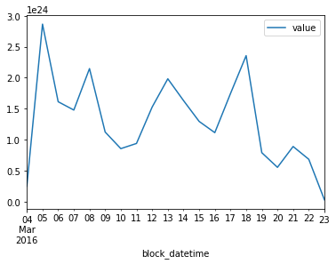
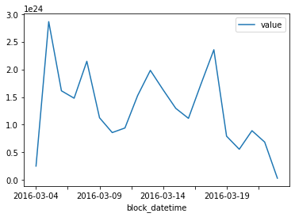

# Ethereum Blockchain Analysis with Ethereum-ETL and Bacalhau

[](https://colab.research.google.com/github/bacalhau-project/examples/blob/main/data-engineering/blockchain-etl/index.ipynb)
[](https://mybinder.org/v2/gh/bacalhau-project/examples/HEAD?labpath=data-engineering/blockchain-etl/index.ipynb)

# Introduction

Mature blockchains are difficult to analyze because of their size. Ethereum-ETL is a tool that makes it easy to extract information from an Ethereum node, but it's not easy to get working in a batch manner. It takes approximately 1 week for an Ethereum node to download the entire chain (event more in my experience) and importing and exporting data from the Ethereum node is slow.

For this example, we ran an Ethereum node for a week and allowed it to synchronise. We then ran ethereum-etl to extract the information and pinned it on Filecoin. This means that we can both now access the data without having to run another ethereum node.

But there's still a lot of data and these types of analyses typically need repeating or refining. So it makes absolute sense to use a decentralised network like Bacalhau to process the data in a scalable way.

### Prerequisites

* Python 3 
* The Bacalhau client - [Installation instructions](https://docs.bacalhau.org/getting-started/installation)

## 1. Analysing Ethereum Data Locally

First let's download one of the IPFS files and inspect it locally. You can see the full list of IPFS CIDs in the appendix.


```bash
wget -q -O file.tar.gz https://w3s.link/ipfs/bafybeifgqjvmzbtz427bne7af5tbndmvniabaex77us6l637gqtb2iwlwq
tar -xvf file.tar.gz
```

    x output_850000/
    x output_850000/token_transfers/
    x output_850000/token_transfers/start_block=00850000/
    x output_850000/token_transfers/start_block=00850000/end_block=00899999/
    x output_850000/token_transfers/start_block=00850000/end_block=00899999/token_transfers_00850000_00899999.csv
    x output_850000/contracts/
    x output_850000/contracts/start_block=00850000/
    x output_850000/contracts/start_block=00850000/end_block=00899999/
    x output_850000/contracts/start_block=00850000/end_block=00899999/contracts_00850000_00899999.csv
    x output_850000/transactions/
    x output_850000/transactions/start_block=00850000/
    x output_850000/transactions/start_block=00850000/end_block=00899999/
    x output_850000/transactions/start_block=00850000/end_block=00899999/transactions_00850000_00899999.csv
    x output_850000/receipts/
    x output_850000/receipts/start_block=00850000/
    x output_850000/receipts/start_block=00850000/end_block=00899999/
    x output_850000/receipts/start_block=00850000/end_block=00899999/receipts_00850000_00899999.csv
    x output_850000/tokens/
    x output_850000/tokens/start_block=00850000/
    x output_850000/tokens/start_block=00850000/end_block=00899999/
    x output_850000/tokens/start_block=00850000/end_block=00899999/tokens_00850000_00899999.csv
    x output_850000/blocks/
    x output_850000/blocks/start_block=00850000/
    x output_850000/blocks/start_block=00850000/end_block=00899999/
    x output_850000/blocks/start_block=00850000/end_block=00899999/blocks_00850000_00899999.csv
    x output_850000/.tmp/
    x output_850000/logs/
    x output_850000/logs/start_block=00850000/
    x output_850000/logs/start_block=00850000/end_block=00899999/
    x output_850000/logs/start_block=00850000/end_block=00899999/logs_00850000_00899999.csv


```bash
pip install pandas
```

    Requirement already satisfied: pandas in /Users/phil/.pyenv/versions/3.9.7/lib/python3.9/site-packages (1.4.3)
    Requirement already satisfied: python-dateutil>=2.8.1 in /Users/phil/.local/lib/python3.9/site-packages (from pandas) (2.8.2)
    Requirement already satisfied: numpy>=1.20.0 in /Users/phil/.pyenv/versions/3.9.7/lib/python3.9/site-packages (from pandas) (1.23.0)
    Requirement already satisfied: pytz>=2020.1 in /Users/phil/.local/lib/python3.9/site-packages (from pandas) (2021.1)
    Requirement already satisfied: six>=1.5 in /Users/phil/.pyenv/versions/3.9.7/lib/python3.9/site-packages (from python-dateutil>=2.8.1->pandas) (1.16.0)


```python
# Use pandas to read in transation data and clean up the columns
import pandas as pd
import glob

file = glob.glob('output_*/transactions/start_block=*/end_block=*/transactions*.csv')[0]
print("Loading file %s" % file)
df = pd.read_csv(file)
df['value'] = df['value'].astype('float')
df['from_address'] = df['from_address'].astype('string')
df['to_address'] = df['to_address'].astype('string')
df['hash'] = df['hash'].astype('string')
df['block_hash'] = df['block_hash'].astype('string')
df['block_datetime'] = pd.to_datetime(df['block_timestamp'], unit='s')
df.info()
```

    Loading file output_850000/transactions/start_block=00850000/end_block=00899999/transactions_00850000_00899999.csv
    <class 'pandas.core.frame.DataFrame'>
    RangeIndex: 115517 entries, 0 to 115516
    Data columns (total 16 columns):
     #   Column                    Non-Null Count   Dtype         
    ---  ------                    --------------   -----         
     0   hash                      115517 non-null  string        
     1   nonce                     115517 non-null  int64         
     2   block_hash                115517 non-null  string        
     3   block_number              115517 non-null  int64         
     4   transaction_index         115517 non-null  int64         
     5   from_address              115517 non-null  string        
     6   to_address                114901 non-null  string        
     7   value                     115517 non-null  float64       
     8   gas                       115517 non-null  int64         
     9   gas_price                 115517 non-null  int64         
     10  input                     115517 non-null  object        
     11  block_timestamp           115517 non-null  int64         
     12  max_fee_per_gas           0 non-null       float64       
     13  max_priority_fee_per_gas  0 non-null       float64       
     14  transaction_type          115517 non-null  int64         
     15  block_datetime            115517 non-null  datetime64[ns]
    dtypes: datetime64[ns](1), float64(3), int64(7), object(1), string(4)
    memory usage: 14.1+ MB


The following code inspects the daily trading volume of Ethereum for a single chunk (100,000 blocks) of data.

This is all good, but we can do better. We can use the Bacalhau client to download the data from IPFS and then run the analysis on the data in the cloud. This means that we can analyse the entire Ethereum blockchain without having to download it locally.


```python
# Total volume per day
df[['block_datetime', 'value']].groupby(pd.Grouper(key='block_datetime', freq='1D')).sum().plot()

```


    <AxesSubplot:xlabel='block_datetime'>


    

    


## 2. Analysing Ethereum Data With Bacalhau

To run jobs on the Bacalhau network you need to package your code. In this example I will package the code as a Docker image.

But before we do that, we need to develop the code that will perform the analysis. The code below is a simple script to parse the incoming data and produce a CSV file with the daily trading volume of Ethereum.


```python
%%writefile main.py
import glob, os, sys, shutil, tempfile
import pandas as pd

def main(input_dir, output_dir):
    search_path = os.path.join(input_dir, "output*", "transactions", "start_block*", "end_block*", "transactions_*.csv")
    csv_files = glob.glob(search_path)
    if len(csv_files) == 0:
        print("No CSV files found in %s" % search_path)
        sys.exit(1)
    for transactions_file in csv_files:
        print("Loading %s" % transactions_file)
        df = pd.read_csv(transactions_file)
        df['value'] = df['value'].astype('float')
        df['block_datetime'] = pd.to_datetime(df['block_timestamp'], unit='s')
        
        print("Processing %d blocks" % (df.shape[0]))
        results = df[['block_datetime', 'value']].groupby(pd.Grouper(key='block_datetime', freq='1D')).sum()
        print("Finished processing %d days worth of records" % (results.shape[0]))

        save_path = os.path.join(output_dir, os.path.basename(transactions_file))
        os.makedirs(os.path.dirname(save_path), exist_ok=True)
        print("Saving to %s" % (save_path))
        results.to_csv(save_path)

def extractData(input_dir, output_dir):
    search_path = os.path.join(input_dir, "*.tar.gz")
    gz_files = glob.glob(search_path)
    if len(gz_files) == 0:
        print("No tar.gz files found in %s" % search_path)
        sys.exit(1)
    for f in gz_files:
        shutil.unpack_archive(filename=f, extract_dir=output_dir)

if __name__ == "__main__":
    if len(sys.argv) != 3:
        print('Must pass arguments. Format: [command] input_dir output_dir')
        sys.exit()
    with tempfile.TemporaryDirectory() as tmp_dir:
        extractData(sys.argv[1], tmp_dir)
        main(tmp_dir, sys.argv[2])
```

    Writing main.py


Next, let's make sure the file works as expected...


```bash
python main.py . outputs/
```

    Loading /var/folders/kr/pl4p96k11b55hp5_p9l_t8kr0000gn/T/tmphtgurgu0/output_850000/transactions/start_block=00850000/end_block=00899999/transactions_00850000_00899999.csv
    Processing 115517 blocks
    Finished processing 11 days worth of records
    Saving to outputs/transactions_00850000_00899999.csv


And finally, package the code inside a Docker image to make the process reproducible. Here I'm passing the Bacalhau default `/inputs` and `/outputs` directories. The `/inputs` directory is where the data will be read from and the `/outputs` directory is where the results will be saved to.


```python
%%writefile Dockerfile
FROM python:3.11-slim-bullseye
WORKDIR /src
RUN pip install pandas==1.5.1
ADD main.py .
CMD ["python", "main.py", "/inputs", "/outputs"]
```

    Overwriting Dockerfile


We've already pushed the container, but for posterity, the following command pushes this container to GHCR.

```bash
docker buildx build --platform linux/amd64 --push -t ghcr.io/bacalhau-project/examples/blockchain-etl:0.0.1 .
```


### Analysing Ethereum Data On Bacalhau

[Bacalhau](https://www.bacalhau.org/) is a distributed computing platform that allows you to run jobs on a network of computers. It is designed to be easy to use and to run on a variety of hardware. In this example, we will use it to run our analysis on the Ethereum blockchain.

To submit a job, you can use the Bacalhau CLI. The following command will run the container above on the IPFS data -- the long hash -- shown at the start of this notebook. Let's confirm that the results are as expected.


```bash
bacalhau docker run \
    --id-only \
    --input-volumes bafybeifgqjvmzbtz427bne7af5tbndmvniabaex77us6l637gqtb2iwlwq:/inputs/data.tar.gz \
    ghcr.io/bacalhau-project/examples/blockchain-etl:0.0.6
```


Running the commands will output a UUID that represents the job that was created. You can check the status of the job with the following command:


```bash
bacalhau list --id-filter ${JOB_ID}
```

     CREATED   ID        JOB                      STATE      VERIFIED  PUBLISHED               
     11:35:52  5466b0ae  Docker ghcr.io/bacal...  Completed            /ipfs/QmeaJY77DrN2KD... 


Wait until it says `Completed` and then get the results.

To find out more information about your job, run the following command:


```bash
bacalhau describe ${JOB_ID}
```

    APIVersion: V1beta1
    ClientID: 77cf46c04f88ffb1c3e0e4b6e443724e8d2d87074d088ef1a6294a448fa85d2e
    CreatedAt: "2022-11-21T11:35:52.834067363Z"
    Deal:
      Concurrency: 1
    ExecutionPlan:
      ShardsTotal: 1
    ID: 5466b0ae-4eca-429c-a7b7-a9a5eeb0268c
    JobState:
      Nodes:
        QmSyJ8VUd4YSPwZFJSJsHmmmmg7sd4BAc2yHY73nisJo86:
          Shards:
            "0":
              NodeId: QmSyJ8VUd4YSPwZFJSJsHmmmmg7sd4BAc2yHY73nisJo86
              PublishedResults: {}
              State: Cancelled
              VerificationResult: {}
        QmVAb7r2pKWCuyLpYWoZr9syhhFnTWeFaByHdb8PkkhLQG:
          Shards:
            "0":
              NodeId: QmVAb7r2pKWCuyLpYWoZr9syhhFnTWeFaByHdb8PkkhLQG
              PublishedResults: {}
              State: Cancelled
              VerificationResult: {}
        QmXaXu9N5GNetatsvwnTfQqNtSeKAD6uCmarbh3LMRYAcF:
          Shards:
            "0":
              NodeId: QmXaXu9N5GNetatsvwnTfQqNtSeKAD6uCmarbh3LMRYAcF
              PublishedResults:
                CID: QmeaJY77DrN2KDMcuyVofEzkXggnWZYEqi6ePXKAbdkavf
                Name: job-5466b0ae-4eca-429c-a7b7-a9a5eeb0268c-shard-0-host-QmXaXu9N5GNetatsvwnTfQqNtSeKAD6uCmarbh3LMRYAcF
                StorageSource: IPFS
              RunOutput:
                exitCode: 0
                runnerError: ""
                stderr: ""
                stderrtruncated: false
                stdout: |
                  Loading /tmp/tmpjgrd_43o/output_850000/transactions/start_block=00850000/end_block=00899999/transactions_00850000_00899999.csv
                  Processing 115517 blocks
                  Finished processing 11 days worth of records
                  Saving to /outputs/transactions_00850000_00899999.csv
                stdouttruncated: false
              State: Completed
              Status: 'Got results proposal of length: 0'
              VerificationResult:
                Complete: true
                Result: true
    RequesterNodeID: QmdZQ7ZbhnvWY1J12XYKGHApJ6aufKyLNSvf8jZBrBaAVL
    RequesterPublicKey: CAASpgIwggEiMA0GCSqGSIb3DQEBAQUAA4IBDwAwggEKAoIBAQDVRKPgCfY2fgfrkHkFjeWcqno+MDpmp8DgVaY672BqJl/dZFNU9lBg2P8Znh8OTtHPPBUBk566vU3KchjW7m3uK4OudXrYEfSfEPnCGmL6GuLiZjLf+eXGEez7qPaoYqo06gD8ROdD8VVse27E96LlrpD1xKshHhqQTxKoq1y6Rx4DpbkSt966BumovWJ70w+Nt9ZkPPydRCxVnyWS1khECFQxp5Ep3NbbKtxHNX5HeULzXN5q0EQO39UN6iBhiI34eZkH7PoAm3Vk5xns//FjTAvQw6wZUu8LwvZTaihs+upx2zZysq6CEBKoeNZqed9+Tf+qHow0P5pxmiu+or+DAgMBAAE=
    Spec:
      Docker:
        Image: ghcr.io/bacalhau-project/examples/blockchain-etl:0.0.6
      Engine: Docker
      Language:
        JobContext: {}
      Publisher: Estuary
      Resources:
        GPU: ""
      Sharding:
        BatchSize: 1
        GlobPatternBasePath: /inputs
      Timeout: 1800
      Verifier: Noop
      Wasm: {}
      inputs:
      - CID: bafybeifgqjvmzbtz427bne7af5tbndmvniabaex77us6l637gqtb2iwlwq
        StorageSource: IPFS
        path: /inputs/data.tar.gz
      outputs:
      - Name: outputs
        StorageSource: IPFS
        path: /outputs


And let's inspect the results.


```bash
rm -rf ./results && mkdir -p ./results # Temporary directory to store the results
bacalhau get --output-dir ./results ${JOB_ID} # Download the results
```

    Fetching results of job '5466b0ae-4eca-429c-a7b7-a9a5eeb0268c'...
    Results for job '5466b0ae-4eca-429c-a7b7-a9a5eeb0268c' have been written to...
    ./results


The docker run command above used the `outputs` volume as a results folder so when we download them they will be stored in a  folder within `volumes/outputs`.


```bash
ls -lah results/combined_results/outputs
```

    total 4.0K
    drwxr-xr-x 3 phil staff  96 Nov 21 11:36 .
    drwxr-xr-x 5 phil staff 160 Nov 21 11:36 ..
    -rw-r--r-- 3 phil staff 387 Nov 21 11:36 transactions_00850000_00899999.csv


```python
import glob
import pandas as pd

# Get CSV files list from a folder
csv_files = glob.glob("results/combined_results/outputs/*.csv")
df = pd.read_csv(csv_files[0], index_col='block_datetime')
df.plot()
```


    <AxesSubplot:xlabel='block_datetime'>


    

    


### Massive Scale Ethereum Analysis

Ok so that works. Let's scale this up! We can run the same analysis on the entire Ethereum blockchain (up to the point where I have uploaded the Ethereum data). To do this, we need to run the analysis on each of the chunks of data that we have stored on IPFS. We can do this by running the same job on each of the chunks.

See the appendix for the `hashes.txt` file.


```bash
printf "" > job_ids.txt
for h in $(cat hashes.txt); do \
    bacalhau docker run \
    --id-only \
    --wait=false \
    --input-volumes=$h:/inputs/data.tar.gz \
    ghcr.io/bacalhau-project/examples/blockchain-etl:0.0.6 >> job_ids.txt 
done
```

Now take a look at the job id's. You can use these to check the status of the jobs and download the results. You might want to double check that the jobs ran ok by doing a `bacalhau list`.


```bash
cat job_ids.txt
```

    7e7b9df1-4904-45f5-a392-1f99d1c3a4dd
    e3e5f500-0ebe-4948-a1b8-80d7b42dd534
    56fd0c21-99d7-4bf5-8178-d171c91f8576
    d026ff34-7ecd-42e0-8431-52d9497e9eb6
    ab919292-74f3-493f-8d66-1f56c4afc819
    ca6b0fbf-061d-4380-8c6e-faac5ec67a15
    9d05a2a4-9981-4763-8490-3b849eaa628b
    c5baf5cc-3259-4acf-ba75-92e1cb2235bb
    32f97eaa-cad6-49f0-9b20-a2a1276980be
    69bd1c82-1be7-4b1f-8ab0-d5d2bef19bb1
    31a43a56-fc31-4254-83b2-8fa8f8a6e542
    ecfdf8f8-dbad-4447-a275-af8fceb6abfc
    d45365d4-9cf3-4a24-9ae1-c8c8d8d5856f
    08cbab6e-88a4-4a20-bcd3-26e2c8f379a7
    93bcb94e-19a3-49ba-af18-ea6566515b93
    ce6a8215-b5d4-4cb3-b4ac-e24ef1f84e1c
    354c3482-4f3a-4d56-b908-43bb8708450f
    7cc6e343-2b97-4826-9b73-b5bd32019ffc
    3d396eed-abb4-47bc-a4dc-24647c619db9
    bc2c6361-39dc-4970-8284-be1f7f011c66
    f421a3e8-009e-4205-898b-9811a78d6a36
    ab73b414-edac-45f9-95e6-06a855629b23
    44711531-3aff-4b65-9db9-9fc6d3948023
    f6143867-f2ab-4701-a85a-375f080bcd3d
    6b8552f8-8505-4139-bb88-ab5e5e0b8cef
    d3e25508-7b28-4e83-be0d-be921dbfd7e9
    0f4dfdb6-bf13-41af-bc7a-e045ac360ba7
    cc16970e-a5be-42f4-bec5-098acbe4d7d9
    37819801-f09b-4d3c-86ce-070a4f8c37a3
    d55cc9e7-9e33-4485-9137-2b5c7e1e831a
    8313e946-e587-468a-83e1-e464138d3935
    65681fa0-44ee-46a4-ab46-6db705d1d318
    c164e617-01a9-4967-ac29-f2c5e2ddeb3f
    0e0b5e9b-d467-41f6-965e-249f06e7a32b
    eb733f15-a129-499e-a59c-8eaba0dd68cc
    fcf637d3-1817-4a99-9884-9db568e4d18d
    e9450225-c2fb-47ea-b735-ebbde28bdd33
    2183006a-3992-4c7f-9200-c4c4e0cd69ab
    f86f2507-d408-4b70-8cdb-47f3ff2083a2
    cb0670d4-eaa5-4181-808d-3bc92da9b4b8
    868707f5-dfdc-48e3-ab44-f4d450922a0d
    2dfc0ce6-d685-424b-95ff-921ad5da0812
    d034fd07-e7fb-41c7-b8d3-5c9b1ea01fad
    3e40318b-ba7a-4d67-9dfb-217e4776c62a
    a2e17933-5eb5-4866-bb01-a88fb9429608
    d1407c23-a485-43a3-87cf-9aeb28e656bf
    55ef4899-03af-4667-8c93-d00c01d8d657
    7085672f-0571-4a41-b5f7-a983fda9e2b1
    1ba46518-bf45-45e5-afa6-928844f98e5f
    ede7c3a2-3cf1-4d08-abe3-278f55d0c27e
    7aa140ab-79c6-452f-a3f6-19035e7187cd
    31787f8f-a566-4b2f-b3f4-91390d3bea68
    b167a9f3-1c5f-40e8-b7c5-e864221deab9
    adab8249-2fb8-49b4-bc01-faac00810a26


Wait until all of these jobs have completed:


```bash
bacalhau list -n 50
```

     CREATED   ID        JOB                      STATE      VERIFIED  PUBLISHED               
     09:20:45  adab8249  Docker ghcr.io/bacal...  Completed            /ipfs/QmYhXreDR4LKBq... 
     09:20:44  b167a9f3  Docker ghcr.io/bacal...  Completed            /ipfs/QmVcmigC4RGJjM... 
     09:20:43  7aa140ab  Docker ghcr.io/bacal...  Completed            /ipfs/QmQahTAxdLWxCC... 
     09:20:43  31787f8f  Docker ghcr.io/bacal...  Completed            /ipfs/QmXtbqVopAhc7D... 
     09:20:42  ede7c3a2  Docker ghcr.io/bacal...  Completed            /ipfs/QmVHcd4HrnhALb... 
     09:20:41  1ba46518  Docker ghcr.io/bacal...  Completed            /ipfs/QmWxxBym5Rssai... 
     09:20:41  7085672f  Docker ghcr.io/bacal...  Completed            /ipfs/QmX5vA9gCpKLMM... 
     09:20:40  55ef4899  Docker ghcr.io/bacal...  Completed            /ipfs/QmV2ZQoyjFu1Bt... 
     09:20:39  d1407c23  Docker ghcr.io/bacal...  Completed            /ipfs/QmQafnmkoLP9fD... 
     09:20:39  a2e17933  Docker ghcr.io/bacal...  Completed            /ipfs/QmYJrU1xRyWZxn... 
     09:20:38  3e40318b  Docker ghcr.io/bacal...  Completed            /ipfs/QmSG4ZMP5m5mko... 
     09:20:37  2dfc0ce6  Docker ghcr.io/bacal...  Completed            /ipfs/QmYEEGsQYqoz5D... 
     09:20:37  d034fd07  Docker ghcr.io/bacal...  Completed            /ipfs/QmRYZiQrdPZoXf... 
     09:20:36  868707f5  Docker ghcr.io/bacal...  Completed            /ipfs/QmRUjZFGXqAiEH... 
     09:20:35  cb0670d4  Docker ghcr.io/bacal...  Completed            /ipfs/QmSjZx4gTdmbCf... 
     09:20:34  f86f2507  Docker ghcr.io/bacal...  Completed            /ipfs/QmVH9JdUDo5aPG... 
     09:20:34  2183006a  Docker ghcr.io/bacal...  Completed            /ipfs/QmR81jwpXVFJ6t... 
     09:20:33  e9450225  Docker ghcr.io/bacal...  Completed            /ipfs/QmSraHbxuprHTk... 
     09:20:32  eb733f15  Docker ghcr.io/bacal...  Completed            /ipfs/QmfV7e9iVDbSg6... 
     09:20:32  fcf637d3  Docker ghcr.io/bacal...  Completed            /ipfs/QmViFm5G8aeL7e... 
     09:20:31  0e0b5e9b  Docker ghcr.io/bacal...  Completed            /ipfs/QmaYobcWeo9XC8... 
     09:20:30  65681fa0  Docker ghcr.io/bacal...  Completed            /ipfs/QmSec41PLJm6Ba... 
     09:20:30  c164e617  Docker ghcr.io/bacal...  Completed            /ipfs/QmRva4GxizU8pt... 
     09:20:29  8313e946  Docker ghcr.io/bacal...  Completed            /ipfs/QmSC5Pd6arQVDA... 
     09:20:28  37819801  Docker ghcr.io/bacal...  Completed            /ipfs/QmUG36RPRZXdop... 
     09:20:28  d55cc9e7  Docker ghcr.io/bacal...  Completed            /ipfs/QmZc2ThoFfoqwc... 
     09:20:27  cc16970e  Docker ghcr.io/bacal...  Completed            /ipfs/QmSVm6z4Z9MD5t... 
     09:20:26  0f4dfdb6  Docker ghcr.io/bacal...  Completed            /ipfs/QmW6bdwq3xWp8d... 
     09:20:25  d3e25508  Docker ghcr.io/bacal...  Completed            /ipfs/QmdKAxhWU527as... 
     09:20:25  6b8552f8  Docker ghcr.io/bacal...  Completed            /ipfs/QmWAKGZ3rSDsY6... 
     09:20:24  f6143867  Docker ghcr.io/bacal...  Completed            /ipfs/QmPfcKczWGWH4p... 
     09:20:23  ab73b414  Docker ghcr.io/bacal...  Completed            /ipfs/QmPFjzJ7ZZnefs... 
     09:20:23  44711531  Docker ghcr.io/bacal...  Completed            /ipfs/QmNvk3hE8mULBd... 
     09:20:22  f421a3e8  Docker ghcr.io/bacal...  Completed            /ipfs/QmWooZw9qMSMy1... 
     09:20:21  bc2c6361  Docker ghcr.io/bacal...  Completed            /ipfs/QmPRuHPd1htJNr... 
     09:20:21  3d396eed  Docker ghcr.io/bacal...  Completed            /ipfs/QmPPxMjvY4Tj5t... 
     09:20:20  7cc6e343  Docker ghcr.io/bacal...  Completed            /ipfs/QmaPQDQpaACyeX... 
     09:20:19  ce6a8215  Docker ghcr.io/bacal...  Completed            /ipfs/QmWs9RzYBMGsZo... 
     09:20:19  354c3482  Docker ghcr.io/bacal...  Completed            /ipfs/QmRoAYAQtufUc7... 
     09:20:18  93bcb94e  Docker ghcr.io/bacal...  Completed            /ipfs/QmRJ5jjUZ7jeoh... 
     09:20:17  08cbab6e  Docker ghcr.io/bacal...  Completed            /ipfs/QmRGC8upqEejib... 
     09:20:16  d45365d4  Docker ghcr.io/bacal...  Completed            /ipfs/QmU9FuJWEDWfZJ... 
     09:20:16  ecfdf8f8  Docker ghcr.io/bacal...  Completed            /ipfs/QmWmiM83zF7HwC... 
     09:20:15  31a43a56  Docker ghcr.io/bacal...  Completed            /ipfs/QmPjfMpy1cK9Mf... 
     09:20:14  32f97eaa  Docker ghcr.io/bacal...  Completed            /ipfs/QmXUc75sJqJFYJ... 
     09:20:14  69bd1c82  Docker ghcr.io/bacal...  Completed            /ipfs/Qma5gN7LGYeTC9... 
     09:20:13  c5baf5cc  Docker ghcr.io/bacal...  Completed            /ipfs/QmPVJEx3CGZYKW... 
     09:20:12  9d05a2a4  Docker ghcr.io/bacal...  Completed            /ipfs/QmNnPNY1K21345... 
     09:20:12  ca6b0fbf  Docker ghcr.io/bacal...  Completed            /ipfs/QmWj41DwL3iwH4... 
     09:20:11  ab919292  Docker ghcr.io/bacal...  Completed            /ipfs/QmQwsvzpT9iKzQ... 


And then download all the results and merge them into a single directory. This might take a while, so this is a good time to treat yourself to a nice Dark Mild. There's also been some issues in the past communicating with IPFS, so if you get an error, try again.


```bash
rm -rf ./combined_results && mkdir -p ./combined_results
for id in $(cat job_ids.txt); do \
    rm -rf results && mkdir results
    bacalhau get --output-dir ./results $id
    cp results/combined_results/outputs/* ./combined_results
done
```

    Fetching results of job '7e7b9df1-4904-45f5-a392-1f99d1c3a4dd'...
    Results for job '7e7b9df1-4904-45f5-a392-1f99d1c3a4dd' have been written to...
    ./results
    Fetching results of job 'e3e5f500-0ebe-4948-a1b8-80d7b42dd534'...
    Results for job 'e3e5f500-0ebe-4948-a1b8-80d7b42dd534' have been written to...
    ./results
    Fetching results of job '56fd0c21-99d7-4bf5-8178-d171c91f8576'...
    Results for job '56fd0c21-99d7-4bf5-8178-d171c91f8576' have been written to...
    ./results
    Fetching results of job 'd026ff34-7ecd-42e0-8431-52d9497e9eb6'...
    Results for job 'd026ff34-7ecd-42e0-8431-52d9497e9eb6' have been written to...
    ./results
    Fetching results of job 'ab919292-74f3-493f-8d66-1f56c4afc819'...
    Results for job 'ab919292-74f3-493f-8d66-1f56c4afc819' have been written to...
    ./results
    Fetching results of job 'ca6b0fbf-061d-4380-8c6e-faac5ec67a15'...
    Results for job 'ca6b0fbf-061d-4380-8c6e-faac5ec67a15' have been written to...
    ./results
    Fetching results of job '9d05a2a4-9981-4763-8490-3b849eaa628b'...
    Results for job '9d05a2a4-9981-4763-8490-3b849eaa628b' have been written to...
    ./results
    Fetching results of job 'c5baf5cc-3259-4acf-ba75-92e1cb2235bb'...
    Results for job 'c5baf5cc-3259-4acf-ba75-92e1cb2235bb' have been written to...
    ./results
    Fetching results of job '32f97eaa-cad6-49f0-9b20-a2a1276980be'...
    Results for job '32f97eaa-cad6-49f0-9b20-a2a1276980be' have been written to...
    ./results
    Fetching results of job '69bd1c82-1be7-4b1f-8ab0-d5d2bef19bb1'...
    Results for job '69bd1c82-1be7-4b1f-8ab0-d5d2bef19bb1' have been written to...
    ./results
    Fetching results of job '31a43a56-fc31-4254-83b2-8fa8f8a6e542'...
    Results for job '31a43a56-fc31-4254-83b2-8fa8f8a6e542' have been written to...
    ./results
    Fetching results of job 'ecfdf8f8-dbad-4447-a275-af8fceb6abfc'...
    Results for job 'ecfdf8f8-dbad-4447-a275-af8fceb6abfc' have been written to...
    ./results
    Fetching results of job 'd45365d4-9cf3-4a24-9ae1-c8c8d8d5856f'...
    Results for job 'd45365d4-9cf3-4a24-9ae1-c8c8d8d5856f' have been written to...
    ./results
    Fetching results of job '08cbab6e-88a4-4a20-bcd3-26e2c8f379a7'...
    Results for job '08cbab6e-88a4-4a20-bcd3-26e2c8f379a7' have been written to...
    ./results
    Fetching results of job '93bcb94e-19a3-49ba-af18-ea6566515b93'...
    Results for job '93bcb94e-19a3-49ba-af18-ea6566515b93' have been written to...
    ./results
    Fetching results of job 'ce6a8215-b5d4-4cb3-b4ac-e24ef1f84e1c'...
    Results for job 'ce6a8215-b5d4-4cb3-b4ac-e24ef1f84e1c' have been written to...
    ./results
    Fetching results of job '354c3482-4f3a-4d56-b908-43bb8708450f'...
    Results for job '354c3482-4f3a-4d56-b908-43bb8708450f' have been written to...
    ./results
    Fetching results of job '7cc6e343-2b97-4826-9b73-b5bd32019ffc'...
    Results for job '7cc6e343-2b97-4826-9b73-b5bd32019ffc' have been written to...
    ./results
    Fetching results of job '3d396eed-abb4-47bc-a4dc-24647c619db9'...
    Results for job '3d396eed-abb4-47bc-a4dc-24647c619db9' have been written to...
    ./results
    Fetching results of job 'bc2c6361-39dc-4970-8284-be1f7f011c66'...
    Results for job 'bc2c6361-39dc-4970-8284-be1f7f011c66' have been written to...
    ./results
    Fetching results of job 'f421a3e8-009e-4205-898b-9811a78d6a36'...
    Results for job 'f421a3e8-009e-4205-898b-9811a78d6a36' have been written to...
    ./results
    Fetching results of job 'ab73b414-edac-45f9-95e6-06a855629b23'...
    Results for job 'ab73b414-edac-45f9-95e6-06a855629b23' have been written to...
    ./results
    Fetching results of job '44711531-3aff-4b65-9db9-9fc6d3948023'...
    Results for job '44711531-3aff-4b65-9db9-9fc6d3948023' have been written to...
    ./results
    Fetching results of job 'f6143867-f2ab-4701-a85a-375f080bcd3d'...
    Results for job 'f6143867-f2ab-4701-a85a-375f080bcd3d' have been written to...
    ./results
    Fetching results of job '6b8552f8-8505-4139-bb88-ab5e5e0b8cef'...
    Results for job '6b8552f8-8505-4139-bb88-ab5e5e0b8cef' have been written to...
    ./results
    Fetching results of job 'd3e25508-7b28-4e83-be0d-be921dbfd7e9'...
    Error: error downloading job: failed to write to '/Users/phil/source/bacalhau-project/examples/data-engineering/blockchain-etl/results/raw/QmdKAxhWU527asddidm49w3CuX4hymR4RSrXGuuHpVAyiC': context deadline exceeded
    Usage:
      bacalhau get [id] [flags]
    
    Examples:
      # Get the results of a job.
      bacalhau get 51225160-807e-48b8-88c9-28311c7899e1
      
      # Get the results of a job, with a short ID.
      bacalhau get ebd9bf2f
    
    Flags:
          --download-timeout-secs int   Timeout duration for IPFS downloads. (default 300)
      -h, --help                        help for get
          --ipfs-swarm-addrs string     Comma-separated list of IPFS nodes to connect to.
          --output-dir string           Directory to write the output to.
    
    Global Flags:
          --api-host string   The host for the client and server to communicate on (via REST).
                              Ignored if BACALHAU_API_HOST environment variable is set. (default "bootstrap.production.bacalhau.org")
          --api-port int      The port for the client and server to communicate on (via REST).
                              Ignored if BACALHAU_API_PORT environment variable is set. (default 1234)
    
    error downloading job: failed to write to '/Users/phil/source/bacalhau-project/examples/data-engineering/blockchain-etl/results/raw/QmdKAxhWU527asddidm49w3CuX4hymR4RSrXGuuHpVAyiC': context deadline exceeded
    Fetching results of job '0f4dfdb6-bf13-41af-bc7a-e045ac360ba7'...
    Error: error downloading job: failed to get ipfs cid 'QmW6bdwq3xWp8dJmJ6SRdQK3wG8jqzEVUqh6zCog2ZzgHC': Post "http://127.0.0.1:54194/api/v0/files/stat?arg=%2Fipfs%2FQmW6bdwq3xWp8dJmJ6SRdQK3wG8jqzEVUqh6zCog2ZzgHC": context deadline exceeded
    Usage:
      bacalhau get [id] [flags]
    
    Examples:
      # Get the results of a job.
      bacalhau get 51225160-807e-48b8-88c9-28311c7899e1
      
      # Get the results of a job, with a short ID.
      bacalhau get ebd9bf2f
    
    Flags:
          --download-timeout-secs int   Timeout duration for IPFS downloads. (default 300)
      -h, --help                        help for get
          --ipfs-swarm-addrs string     Comma-separated list of IPFS nodes to connect to.
          --output-dir string           Directory to write the output to.
    
    Global Flags:
          --api-host string   The host for the client and server to communicate on (via REST).
                              Ignored if BACALHAU_API_HOST environment variable is set. (default "bootstrap.production.bacalhau.org")
          --api-port int      The port for the client and server to communicate on (via REST).
                              Ignored if BACALHAU_API_PORT environment variable is set. (default 1234)
    
    error downloading job: failed to get ipfs cid 'QmW6bdwq3xWp8dJmJ6SRdQK3wG8jqzEVUqh6zCog2ZzgHC': Post "http://127.0.0.1:54194/api/v0/files/stat?arg=%2Fipfs%2FQmW6bdwq3xWp8dJmJ6SRdQK3wG8jqzEVUqh6zCog2ZzgHC": context deadline exceeded
    Fetching results of job 'cc16970e-a5be-42f4-bec5-098acbe4d7d9'...
    Error: error downloading job: failed to get ipfs cid 'QmSVm6z4Z9MD5thPjo4yPKKYcerNTnLbyjniSvzD1PNr8m': Post "http://127.0.0.1:62376/api/v0/files/stat?arg=%2Fipfs%2FQmSVm6z4Z9MD5thPjo4yPKKYcerNTnLbyjniSvzD1PNr8m": context deadline exceeded
    Usage:
      bacalhau get [id] [flags]
    
    Examples:
      # Get the results of a job.
      bacalhau get 51225160-807e-48b8-88c9-28311c7899e1
      
      # Get the results of a job, with a short ID.
      bacalhau get ebd9bf2f
    
    Flags:
          --download-timeout-secs int   Timeout duration for IPFS downloads. (default 300)
      -h, --help                        help for get
          --ipfs-swarm-addrs string     Comma-separated list of IPFS nodes to connect to.
          --output-dir string           Directory to write the output to.
    
    Global Flags:
          --api-host string   The host for the client and server to communicate on (via REST).
                              Ignored if BACALHAU_API_HOST environment variable is set. (default "bootstrap.production.bacalhau.org")
          --api-port int      The port for the client and server to communicate on (via REST).
                              Ignored if BACALHAU_API_PORT environment variable is set. (default 1234)
    
    error downloading job: failed to get ipfs cid 'QmSVm6z4Z9MD5thPjo4yPKKYcerNTnLbyjniSvzD1PNr8m': Post "http://127.0.0.1:62376/api/v0/files/stat?arg=%2Fipfs%2FQmSVm6z4Z9MD5thPjo4yPKKYcerNTnLbyjniSvzD1PNr8m": context deadline exceeded
    Fetching results of job '37819801-f09b-4d3c-86ce-070a4f8c37a3'...
    Error: error downloading job: failed to get ipfs cid 'QmUG36RPRZXdop76dXcgiyW2mxeYkARapRmeAh6EcTHP81': Post "http://127.0.0.1:51957/api/v0/files/stat?arg=%2Fipfs%2FQmUG36RPRZXdop76dXcgiyW2mxeYkARapRmeAh6EcTHP81": context deadline exceeded
    Usage:
      bacalhau get [id] [flags]
    
    Examples:
      # Get the results of a job.
      bacalhau get 51225160-807e-48b8-88c9-28311c7899e1
      
      # Get the results of a job, with a short ID.
      bacalhau get ebd9bf2f
    
    Flags:
          --download-timeout-secs int   Timeout duration for IPFS downloads. (default 300)
      -h, --help                        help for get
          --ipfs-swarm-addrs string     Comma-separated list of IPFS nodes to connect to.
          --output-dir string           Directory to write the output to.
    
    Global Flags:
          --api-host string   The host for the client and server to communicate on (via REST).
                              Ignored if BACALHAU_API_HOST environment variable is set. (default "bootstrap.production.bacalhau.org")
          --api-port int      The port for the client and server to communicate on (via REST).
                              Ignored if BACALHAU_API_PORT environment variable is set. (default 1234)
    
    error downloading job: failed to get ipfs cid 'QmUG36RPRZXdop76dXcgiyW2mxeYkARapRmeAh6EcTHP81': Post "http://127.0.0.1:51957/api/v0/files/stat?arg=%2Fipfs%2FQmUG36RPRZXdop76dXcgiyW2mxeYkARapRmeAh6EcTHP81": context deadline exceeded
    Fetching results of job 'd55cc9e7-9e33-4485-9137-2b5c7e1e831a'...
    Results for job 'd55cc9e7-9e33-4485-9137-2b5c7e1e831a' have been written to...
    ./results
    Fetching results of job '8313e946-e587-468a-83e1-e464138d3935'...
    Results for job '8313e946-e587-468a-83e1-e464138d3935' have been written to...
    ./results
    Fetching results of job '65681fa0-44ee-46a4-ab46-6db705d1d318'...
    Results for job '65681fa0-44ee-46a4-ab46-6db705d1d318' have been written to...
    ./results
    Fetching results of job 'c164e617-01a9-4967-ac29-f2c5e2ddeb3f'...
    Results for job 'c164e617-01a9-4967-ac29-f2c5e2ddeb3f' have been written to...
    ./results
    Fetching results of job '0e0b5e9b-d467-41f6-965e-249f06e7a32b'...
    Results for job '0e0b5e9b-d467-41f6-965e-249f06e7a32b' have been written to...
    ./results
    Fetching results of job 'eb733f15-a129-499e-a59c-8eaba0dd68cc'...
    Results for job 'eb733f15-a129-499e-a59c-8eaba0dd68cc' have been written to...
    ./results
    Fetching results of job 'fcf637d3-1817-4a99-9884-9db568e4d18d'...
    Results for job 'fcf637d3-1817-4a99-9884-9db568e4d18d' have been written to...
    ./results
    Fetching results of job 'e9450225-c2fb-47ea-b735-ebbde28bdd33'...
    Error: error downloading job: failed to get ipfs cid 'QmSraHbxuprHTk92AXppyokhRmcbUwUziDJYvueGva8SQr': Post "http://127.0.0.1:51682/api/v0/files/stat?arg=%2Fipfs%2FQmSraHbxuprHTk92AXppyokhRmcbUwUziDJYvueGva8SQr": context deadline exceeded
    Usage:
      bacalhau get [id] [flags]
    
    Examples:
      # Get the results of a job.
      bacalhau get 51225160-807e-48b8-88c9-28311c7899e1
      
      # Get the results of a job, with a short ID.
      bacalhau get ebd9bf2f
    
    Flags:
          --download-timeout-secs int   Timeout duration for IPFS downloads. (default 300)
      -h, --help                        help for get
          --ipfs-swarm-addrs string     Comma-separated list of IPFS nodes to connect to.
          --output-dir string           Directory to write the output to.
    
    Global Flags:
          --api-host string   The host for the client and server to communicate on (via REST).
                              Ignored if BACALHAU_API_HOST environment variable is set. (default "bootstrap.production.bacalhau.org")
          --api-port int      The port for the client and server to communicate on (via REST).
                              Ignored if BACALHAU_API_PORT environment variable is set. (default 1234)
    
    error downloading job: failed to get ipfs cid 'QmSraHbxuprHTk92AXppyokhRmcbUwUziDJYvueGva8SQr': Post "http://127.0.0.1:51682/api/v0/files/stat?arg=%2Fipfs%2FQmSraHbxuprHTk92AXppyokhRmcbUwUziDJYvueGva8SQr": context deadline exceeded
    Fetching results of job '2183006a-3992-4c7f-9200-c4c4e0cd69ab'...
    Error: error downloading job: failed to get ipfs cid 'QmR81jwpXVFJ6tLtgyokdfcVCJpZGfLjqjHvzo9ZG5UuWg': Post "http://127.0.0.1:60329/api/v0/files/stat?arg=%2Fipfs%2FQmR81jwpXVFJ6tLtgyokdfcVCJpZGfLjqjHvzo9ZG5UuWg": context deadline exceeded
    Usage:
      bacalhau get [id] [flags]
    
    Examples:
      # Get the results of a job.
      bacalhau get 51225160-807e-48b8-88c9-28311c7899e1
      
      # Get the results of a job, with a short ID.
      bacalhau get ebd9bf2f
    
    Flags:
          --download-timeout-secs int   Timeout duration for IPFS downloads. (default 300)
      -h, --help                        help for get
          --ipfs-swarm-addrs string     Comma-separated list of IPFS nodes to connect to.
          --output-dir string           Directory to write the output to.
    
    Global Flags:
          --api-host string   The host for the client and server to communicate on (via REST).
                              Ignored if BACALHAU_API_HOST environment variable is set. (default "bootstrap.production.bacalhau.org")
          --api-port int      The port for the client and server to communicate on (via REST).
                              Ignored if BACALHAU_API_PORT environment variable is set. (default 1234)
    
    error downloading job: failed to get ipfs cid 'QmR81jwpXVFJ6tLtgyokdfcVCJpZGfLjqjHvzo9ZG5UuWg': Post "http://127.0.0.1:60329/api/v0/files/stat?arg=%2Fipfs%2FQmR81jwpXVFJ6tLtgyokdfcVCJpZGfLjqjHvzo9ZG5UuWg": context deadline exceeded
    Fetching results of job 'f86f2507-d408-4b70-8cdb-47f3ff2083a2'...
    Results for job 'f86f2507-d408-4b70-8cdb-47f3ff2083a2' have been written to...
    ./results
    Fetching results of job 'cb0670d4-eaa5-4181-808d-3bc92da9b4b8'...
    Results for job 'cb0670d4-eaa5-4181-808d-3bc92da9b4b8' have been written to...
    ./results
    Fetching results of job '868707f5-dfdc-48e3-ab44-f4d450922a0d'...
    Error: error downloading job: failed to get ipfs cid 'QmRUjZFGXqAiEHVKNCbqpK5j6NE9MP8Jr3M35UuBiMtYZ5': Post "http://127.0.0.1:51117/api/v0/files/stat?arg=%2Fipfs%2FQmRUjZFGXqAiEHVKNCbqpK5j6NE9MP8Jr3M35UuBiMtYZ5": context deadline exceeded
    Usage:
      bacalhau get [id] [flags]
    
    Examples:
      # Get the results of a job.
      bacalhau get 51225160-807e-48b8-88c9-28311c7899e1
      
      # Get the results of a job, with a short ID.
      bacalhau get ebd9bf2f
    
    Flags:
          --download-timeout-secs int   Timeout duration for IPFS downloads. (default 300)
      -h, --help                        help for get
          --ipfs-swarm-addrs string     Comma-separated list of IPFS nodes to connect to.
          --output-dir string           Directory to write the output to.
    
    Global Flags:
          --api-host string   The host for the client and server to communicate on (via REST).
                              Ignored if BACALHAU_API_HOST environment variable is set. (default "bootstrap.production.bacalhau.org")
          --api-port int      The port for the client and server to communicate on (via REST).
                              Ignored if BACALHAU_API_PORT environment variable is set. (default 1234)
    
    error downloading job: failed to get ipfs cid 'QmRUjZFGXqAiEHVKNCbqpK5j6NE9MP8Jr3M35UuBiMtYZ5': Post "http://127.0.0.1:51117/api/v0/files/stat?arg=%2Fipfs%2FQmRUjZFGXqAiEHVKNCbqpK5j6NE9MP8Jr3M35UuBiMtYZ5": context deadline exceeded
    Fetching results of job '2dfc0ce6-d685-424b-95ff-921ad5da0812'...
    Results for job '2dfc0ce6-d685-424b-95ff-921ad5da0812' have been written to...
    ./results
    Fetching results of job 'd034fd07-e7fb-41c7-b8d3-5c9b1ea01fad'...
    Error: error downloading job: failed to get ipfs cid 'QmRYZiQrdPZoXfdCmHXqSzn4X9pCuhWhSTbELR6UBu9wt8': Post "http://127.0.0.1:56199/api/v0/files/stat?arg=%2Fipfs%2FQmRYZiQrdPZoXfdCmHXqSzn4X9pCuhWhSTbELR6UBu9wt8": context deadline exceeded
    Usage:
      bacalhau get [id] [flags]
    
    Examples:
      # Get the results of a job.
      bacalhau get 51225160-807e-48b8-88c9-28311c7899e1
      
      # Get the results of a job, with a short ID.
      bacalhau get ebd9bf2f
    
    Flags:
          --download-timeout-secs int   Timeout duration for IPFS downloads. (default 300)
      -h, --help                        help for get
          --ipfs-swarm-addrs string     Comma-separated list of IPFS nodes to connect to.
          --output-dir string           Directory to write the output to.
    
    Global Flags:
          --api-host string   The host for the client and server to communicate on (via REST).
                              Ignored if BACALHAU_API_HOST environment variable is set. (default "bootstrap.production.bacalhau.org")
          --api-port int      The port for the client and server to communicate on (via REST).
                              Ignored if BACALHAU_API_PORT environment variable is set. (default 1234)
    
    error downloading job: failed to get ipfs cid 'QmRYZiQrdPZoXfdCmHXqSzn4X9pCuhWhSTbELR6UBu9wt8': Post "http://127.0.0.1:56199/api/v0/files/stat?arg=%2Fipfs%2FQmRYZiQrdPZoXfdCmHXqSzn4X9pCuhWhSTbELR6UBu9wt8": context deadline exceeded
    Fetching results of job '3e40318b-ba7a-4d67-9dfb-217e4776c62a'...
    Results for job '3e40318b-ba7a-4d67-9dfb-217e4776c62a' have been written to...
    ./results
    Fetching results of job 'a2e17933-5eb5-4866-bb01-a88fb9429608'...
    Results for job 'a2e17933-5eb5-4866-bb01-a88fb9429608' have been written to...
    ./results
    Fetching results of job 'd1407c23-a485-43a3-87cf-9aeb28e656bf'...
    Results for job 'd1407c23-a485-43a3-87cf-9aeb28e656bf' have been written to...
    ./results
    Fetching results of job '55ef4899-03af-4667-8c93-d00c01d8d657'...
    Results for job '55ef4899-03af-4667-8c93-d00c01d8d657' have been written to...
    ./results
    Fetching results of job '7085672f-0571-4a41-b5f7-a983fda9e2b1'...
    Results for job '7085672f-0571-4a41-b5f7-a983fda9e2b1' have been written to...
    ./results
    Fetching results of job '1ba46518-bf45-45e5-afa6-928844f98e5f'...
    Error: error downloading job: failed to get ipfs cid 'QmWxxBym5RssaiTajR4qzLA4tgDpXQMGRutqSkZe6ZGzN8': Post "http://127.0.0.1:63102/api/v0/files/stat?arg=%2Fipfs%2FQmWxxBym5RssaiTajR4qzLA4tgDpXQMGRutqSkZe6ZGzN8": context deadline exceeded
    Usage:
      bacalhau get [id] [flags]
    
    Examples:
      # Get the results of a job.
      bacalhau get 51225160-807e-48b8-88c9-28311c7899e1
      
      # Get the results of a job, with a short ID.
      bacalhau get ebd9bf2f
    
    Flags:
          --download-timeout-secs int   Timeout duration for IPFS downloads. (default 300)
      -h, --help                        help for get
          --ipfs-swarm-addrs string     Comma-separated list of IPFS nodes to connect to.
          --output-dir string           Directory to write the output to.
    
    Global Flags:
          --api-host string   The host for the client and server to communicate on (via REST).
                              Ignored if BACALHAU_API_HOST environment variable is set. (default "bootstrap.production.bacalhau.org")
          --api-port int      The port for the client and server to communicate on (via REST).
                              Ignored if BACALHAU_API_PORT environment variable is set. (default 1234)
    
    error downloading job: failed to get ipfs cid 'QmWxxBym5RssaiTajR4qzLA4tgDpXQMGRutqSkZe6ZGzN8': Post "http://127.0.0.1:63102/api/v0/files/stat?arg=%2Fipfs%2FQmWxxBym5RssaiTajR4qzLA4tgDpXQMGRutqSkZe6ZGzN8": context deadline exceeded
    Fetching results of job 'ede7c3a2-3cf1-4d08-abe3-278f55d0c27e'...
    Error: error downloading job: failed to get ipfs cid 'QmVHcd4HrnhALbJSR8BvPjpkv5RGzaxeitCosa1fwp6Mfy': Post "http://127.0.0.1:53669/api/v0/files/stat?arg=%2Fipfs%2FQmVHcd4HrnhALbJSR8BvPjpkv5RGzaxeitCosa1fwp6Mfy": context deadline exceeded
    Usage:
      bacalhau get [id] [flags]
    
    Examples:
      # Get the results of a job.
      bacalhau get 51225160-807e-48b8-88c9-28311c7899e1
      
      # Get the results of a job, with a short ID.
      bacalhau get ebd9bf2f
    
    Flags:
          --download-timeout-secs int   Timeout duration for IPFS downloads. (default 300)
      -h, --help                        help for get
          --ipfs-swarm-addrs string     Comma-separated list of IPFS nodes to connect to.
          --output-dir string           Directory to write the output to.
    
    Global Flags:
          --api-host string   The host for the client and server to communicate on (via REST).
                              Ignored if BACALHAU_API_HOST environment variable is set. (default "bootstrap.production.bacalhau.org")
          --api-port int      The port for the client and server to communicate on (via REST).
                              Ignored if BACALHAU_API_PORT environment variable is set. (default 1234)
    
    error downloading job: failed to get ipfs cid 'QmVHcd4HrnhALbJSR8BvPjpkv5RGzaxeitCosa1fwp6Mfy': Post "http://127.0.0.1:53669/api/v0/files/stat?arg=%2Fipfs%2FQmVHcd4HrnhALbJSR8BvPjpkv5RGzaxeitCosa1fwp6Mfy": context deadline exceeded
    Fetching results of job '7aa140ab-79c6-452f-a3f6-19035e7187cd'...
    Error: error downloading job: failed to get ipfs cid 'QmQahTAxdLWxCCH77GwwwAvCtLz8PZ4V1zD3aKGD2cbrBM': Post "http://127.0.0.1:59035/api/v0/files/stat?arg=%2Fipfs%2FQmQahTAxdLWxCCH77GwwwAvCtLz8PZ4V1zD3aKGD2cbrBM": context deadline exceeded
    Usage:
      bacalhau get [id] [flags]
    
    Examples:
      # Get the results of a job.
      bacalhau get 51225160-807e-48b8-88c9-28311c7899e1
      
      # Get the results of a job, with a short ID.
      bacalhau get ebd9bf2f
    
    Flags:
          --download-timeout-secs int   Timeout duration for IPFS downloads. (default 300)
      -h, --help                        help for get
          --ipfs-swarm-addrs string     Comma-separated list of IPFS nodes to connect to.
          --output-dir string           Directory to write the output to.
    
    Global Flags:
          --api-host string   The host for the client and server to communicate on (via REST).
                              Ignored if BACALHAU_API_HOST environment variable is set. (default "bootstrap.production.bacalhau.org")
          --api-port int      The port for the client and server to communicate on (via REST).
                              Ignored if BACALHAU_API_PORT environment variable is set. (default 1234)
    
    error downloading job: failed to get ipfs cid 'QmQahTAxdLWxCCH77GwwwAvCtLz8PZ4V1zD3aKGD2cbrBM': Post "http://127.0.0.1:59035/api/v0/files/stat?arg=%2Fipfs%2FQmQahTAxdLWxCCH77GwwwAvCtLz8PZ4V1zD3aKGD2cbrBM": context deadline exceeded
    Fetching results of job '31787f8f-a566-4b2f-b3f4-91390d3bea68'...
    Error: error downloading job: failed to get ipfs cid 'QmXtbqVopAhc7DWZNrnDKEB7zfJ3gfdHytSFGSGaX9HS8i': Post "http://127.0.0.1:64785/api/v0/files/stat?arg=%2Fipfs%2FQmXtbqVopAhc7DWZNrnDKEB7zfJ3gfdHytSFGSGaX9HS8i": context deadline exceeded
    Usage:
      bacalhau get [id] [flags]
    
    Examples:
      # Get the results of a job.
      bacalhau get 51225160-807e-48b8-88c9-28311c7899e1
      
      # Get the results of a job, with a short ID.
      bacalhau get ebd9bf2f
    
    Flags:
          --download-timeout-secs int   Timeout duration for IPFS downloads. (default 300)
      -h, --help                        help for get
          --ipfs-swarm-addrs string     Comma-separated list of IPFS nodes to connect to.
          --output-dir string           Directory to write the output to.
    
    Global Flags:
          --api-host string   The host for the client and server to communicate on (via REST).
                              Ignored if BACALHAU_API_HOST environment variable is set. (default "bootstrap.production.bacalhau.org")
          --api-port int      The port for the client and server to communicate on (via REST).
                              Ignored if BACALHAU_API_PORT environment variable is set. (default 1234)
    
    error downloading job: failed to get ipfs cid 'QmXtbqVopAhc7DWZNrnDKEB7zfJ3gfdHytSFGSGaX9HS8i': Post "http://127.0.0.1:64785/api/v0/files/stat?arg=%2Fipfs%2FQmXtbqVopAhc7DWZNrnDKEB7zfJ3gfdHytSFGSGaX9HS8i": context deadline exceeded
    Fetching results of job 'b167a9f3-1c5f-40e8-b7c5-e864221deab9'...
    Results for job 'b167a9f3-1c5f-40e8-b7c5-e864221deab9' have been written to...
    ./results
    Fetching results of job 'adab8249-2fb8-49b4-bc01-faac00810a26'...
    Results for job 'adab8249-2fb8-49b4-bc01-faac00810a26' have been written to...
    ./results


    2022/11/22 09:22:31 CleanupManager.fnsMutex violation CRITICAL section took 20.054ms 20054000 (threshold 10ms)
    2022/11/22 09:25:46 CleanupManager.fnsMutex violation CRITICAL section took 19.095ms 19095000 (threshold 10ms)
    2022/11/22 09:28:03 CleanupManager.fnsMutex violation CRITICAL section took 19.208ms 19208000 (threshold 10ms)
    cp: cannot stat 'results/combined_results/outputs/*': No such file or directory
    cp: cannot stat 'results/combined_results/outputs/*': No such file or directory
    cp: cannot stat 'results/combined_results/outputs/*': No such file or directory
    cp: cannot stat 'results/combined_results/outputs/*': No such file or directory
    2022/11/22 09:48:21 CleanupManager.fnsMutex violation CRITICAL section took 19.451ms 19451000 (threshold 10ms)
    09:49:41.718 | ??? providerquerymanager/providerquerymanager.go:344 > ERROR bitswap Received provider (12D3KooWGE4R98vokeLsRVdTv8D6jhMnifo81mm7NMRV8WJPNVHb) for cid (QmfV7e9iVDbSg6uLQFypUiMc2DH23PKuPBWcwZMmHYGQ2L) not requested
    
    2022/11/22 09:49:42 CleanupManager.fnsMutex violation CRITICAL section took 19.284ms 19284000 (threshold 10ms)
    cp: cannot stat 'results/combined_results/outputs/*': No such file or directory
    cp: cannot stat 'results/combined_results/outputs/*': No such file or directory
    2022/11/22 10:00:56 CleanupManager.fnsMutex violation CRITICAL section took 19.428ms 19428000 (threshold 10ms)
    cp: cannot stat 'results/combined_results/outputs/*': No such file or directory
    2022/11/22 10:06:02 CleanupManager.fnsMutex violation CRITICAL section took 20.031ms 20031000 (threshold 10ms)
    cp: cannot stat 'results/combined_results/outputs/*': No such file or directory
    2022/11/22 10:11:08 CleanupManager.fnsMutex violation CRITICAL section took 19.805ms 19805000 (threshold 10ms)
    2022/11/22 10:11:25 CleanupManager.fnsMutex violation CRITICAL section took 20.092ms 20092000 (threshold 10ms)
    cp: cannot stat 'results/combined_results/outputs/*': No such file or directory
    cp: cannot stat 'results/combined_results/outputs/*': No such file or directory
    cp: cannot stat 'results/combined_results/outputs/*': No such file or directory
    cp: cannot stat 'results/combined_results/outputs/*': No such file or directory
    2022/11/22 10:31:40 CleanupManager.fnsMutex violation CRITICAL section took 19.283ms 19283000 (threshold 10ms)


```python
import os, glob
import pandas as pd

# Get CSV files list from a folder
path = os.path.join("combined_results", "*.csv")
csv_files = glob.glob(path)

# Read each CSV file into a list of DataFrames
df_list = (pd.read_csv(file, index_col='block_datetime') for file in csv_files)

# Concatenate all DataFrames
df_unsorted = pd.concat(df_list, ignore_index=False)

# Some files will cross days, so group by day and sum the values
df = df_unsorted.groupby(level=0).sum()

# Plot
df.plot(figsize=(16,9))
```


    <AxesSubplot:xlabel='block_datetime'>


    

    


That's it! There is several years of Ethereum transaction volume data.

## Appendix 1: List Ethereum Data CIDs 

The following list is a list of IPFS CID's for the Ethereum data that we used in this tutorial. You can use these CID's to download the rest of the chain if you so desire. The CIDs are ordered by block number and they increase 50,000 blocks at a time. Here's a list of ordered CIDs:


```python
%%writefile hashes.txt
bafybeihvtzberlxrsz4lvzrzvpbanujmab3hr5okhxtbgv2zvonqos2l3i
bafybeifb25fgxrzu45lsc47gldttomycqcsao22xa2gtk2ijbsa5muzegq
bafybeig4wwwhs63ly6wbehwd7tydjjtnw425yvi2tlzt3aii3pfcj6hvoq
bafybeievpb5q372q3w5fsezflij3wlpx6thdliz5xowimunoqushn3cwka
bafybeih6te26iwf5kzzby2wqp67m7a5pmwilwzaciii3zipvhy64utikre
bafybeicjd4545xph6rcyoc74wvzxyaz2vftapap64iqsp5ky6nz3f5yndm
bafybeicgo3iofo3sw73wenc3nkdhi263yytjnds5cxjwvypwekbz4sk7ra
bafybeihvep5xsvxm44lngmmeysihsopcuvcr34an4idz45ixl5slsqzy3y
bafybeigmt2zwzrbzwb4q2kt2ihlv34ntjjwujftvabrftyccwzwdypama4
bafybeiciwui7sw3zqkvp4d55p4woq4xgjlstrp3mzxl66ab5ih5vmeozci
bafybeicpmotdsj2ambf666b2jkzp2gvg6tadr6acxqw2tmdlmsruuggbbu
bafybeigefo3esovbveavllgv5wiheu5w6cnfo72jxe6vmfweco5eq5sfty
bafybeigvajsumnfwuv7lp7yhr2sr5vrk3bmmuhhnaz53waa2jqv3kgkvsu
bafybeih2xg2n7ytlunvqxwqlqo5l3daykuykyvhgehoa2arot6dmorstmq
bafybeihnmq2ltuolnlthb757teihwvvw7wophoag2ihnva43afbeqdtgi4
bafybeibb34hzu6z2xgo6nhrplt3xntpnucthqlawe3pmzgxccppbxrpudy
bafybeigny33b4g6gf2hrqzzkfbroprqrimjl5gmb3mnsqu655pbbny6tou
bafybeifgqjvmzbtz427bne7af5tbndmvniabaex77us6l637gqtb2iwlwq
bafybeibryqj62l45pxjhdyvgdc44p3suhvt4xdqc5jpx474gpykxwgnw2e
bafybeidme3fkigdjaifkjfbwn76jk3fcqdogpzebtotce6ygphlujaecla
bafybeig7myc3eg3h2g5mk2co7ybte4qsuremflrjneer6xk3pghjwmcwbi
bafybeic3x2r5rrd3fdpdqeqax4bszcciwepvbpjl7xdv6mkwubyqizw5te
bafybeihxutvxg3bw7fbwohq4gvncrk3hngkisrtkp52cu7qu7tfcuvktnq
bafybeicumr67jkyarg5lspqi2w4zqopvgii5dgdbe5vtbbq53mbyftduxy
bafybeiecn2cdvefvdlczhz6i4afbkabf5pe5yqrcsgdvlw5smme2tw7em4
bafybeiaxh7dhg4krgkil5wqrv5kdsc3oewwy6ym4n3545ipmzqmxaxrqf4
bafybeiclcqfzinrmo3adr4lg7sf255faioxjfsolcdko3i4x7opx7xrqii
bafybeicjmeul7c2dxhmaudawum4ziwfgfkvbgthgtliggfut5tsc77dx7q
bafybeialziupik7csmhfxnhuss5vrw37kmte7rmboqovp4cpq5hj4insda
bafybeid7ecwdrw7pb3fnkokq5adybum6s5ok3yi2lw4m3edjpuy65zm4ji
bafybeibuxwnl5ogs4pwa32xriqhch24zbrw44rp22hrly4t6roh6rz7j4m
bafybeicxvy47jpvv3fi5umjatem5pxabfrbkzxiho7efu6mpidjpatte54
bafybeifynb4mpqrbsjbeqtxpbuf6y4frrtjrc4tm7cnmmui7gbjkckszrq
bafybeidcgnbhguyfaahkoqbyy2z525d3qfzdtbjuk4e75wkdbnkcafvjei
bafybeiefc67s6hpydnsqdgypbunroqwkij5j26sfmc7are7yxvg45uuh7i
bafybeiefwjy3o42ovkssnm7iihbog46k5grk3gobvvkzrqvof7p6xbgowi
bafybeihpydd3ivtza2ql5clatm5fy7ocych7t4czu46sbc6c2ykrbwk5uu
bafybeiet7222lqfmzogur3zlxqavlnd3lt3qryw5yi5rhuiqeqg4w7c3qu
bafybeihwomd4ygoydvj5kh24wfwk5kszmst5vz44zkl6yibjargttv7sly
bafybeidbjt2ckr4oooio3jsfk76r3bsaza5trjvt7u36slhha5ksoc5gv4
bafybeifyjrmopgtfmswq7b4pfscni46doy3g3z6vi5rrgpozc6duebpmuy
bafybeidsrowz46yt62zs64q2mhirlc3rsmctmi3tluorsts53vppdqjj7e
bafybeiggntql57bw24bw6hkp2yqd3qlyp5oxowo6q26wsshxopfdnzsxhq
bafybeidguz36u6wakx4e5ewuhslsfsjmk5eff5q7un2vpkrcu7cg5aaqf4
bafybeiaypwu2b45iunbqnfk2g7bku3nfqveuqp4vlmmwj7o7liyys42uai
bafybeicaahv7xvia7xojgiecljo2ddrvryzh2af7rb3qqbg5a257da5p2y
bafybeibgeiijr74rcliwal3e7tujybigzqr6jmtchqrcjdo75trm2ptb4e
bafybeiba3nrd43ylnedipuq2uoowd4blghpw2z7r4agondfinladcsxlku
bafybeif3semzitjbxg5lzwmnjmlsrvc7y5htekwqtnhmfi4wxywtj5lgoe
bafybeiedmsig5uj7rgarsjans2ad5kcb4w4g5iurbryqn62jy5qap4qq2a
bafybeidyz34bcd3k6nxl7jbjjgceg5eu3szbrbgusnyn7vfl7facpecsce
bafybeigmq5gch72q3qpk4nipssh7g7msk6jpzns2d6xmpusahkt2lu5m4y
bafybeicjzoypdmmdt6k54wzotr5xhpzwbgd3c4oqg6mj4qukgvxvdrvzye
bafybeien55egngdpfvrsxr2jmkewdyha72ju7qaaeiydz2f5rny7drgzta
```

    Overwriting hashes.txt


## Appendix 2: Setting up an Ethereum Node

In the course of writing this example I had to setup an Ethereum node. It was a slow and painful process so I thought I would share the steps I took to make it easier for others.

### Geth setup and sync

Geth supports Ubuntu by default, so use that when creating a VM. Use Ubuntu 22.04 LTS.

```bash
gcloud compute instances create phil-ethereum-node \
    --project=bacalhau-development --zone=europe-west2-c \
    --machine-type=c2-standard-4 --tags=geth \
    --create-disk=auto-delete=yes,boot=yes,device-name=phil-ethereum-node,image=projects/ubuntu-os-cloud/global/images/ubuntu-2204-jammy-v20221101a,mode=rw,size=50,type=projects/bacalhau-development/zones/europe-west2-c/diskTypes/pd-balanced \
    --create-disk=auto-delete=yes,device-name=phil-ethereum-disk,mode=rw,name=phil-ethereum-disk,size=3000,type=projects/bacalhau-development/zones/europe-west2-c/diskTypes/pd-standard
```

Mount the disk:

```bash
sudo mkfs.ext4 -m 0 -E lazy_itable_init=0,lazy_journal_init=0,discard /dev/sdb
sudo mkdir -p /mnt/disks/ethereum
sudo mount -o discard,defaults /dev/sdb /mnt/disks/ethereum
sudo chmod a+w /mnt/disks/ethereum
```

```bash
sudo add-apt-repository -y ppa:ethereum/ethereum
sudo apt-get update
sudo apt-get install -y ethereum
sudo mkdir /prysm && cd /prysm
sudo curl https://raw.githubusercontent.com/prysmaticlabs/prysm/master/prysm.sh --output prysm.sh && sudo chmod +x prysm.sh
```

Run as a new user:

```bash
sudo useradd -d /home/ethuser -m --uid 10000 ethuser
sudo chown -R ethuser /prysm
```

```
sudo tee "/etc/systemd/system/geth.service" > /dev/null <<'EOF'
[Unit]
Description=Geth

[Service]
Type=simple
User=ethuser
Restart=always
RestartSec=12
ExecStart=/bin/geth --syncmode "full" --datadir /mnt/disks/ethereum

[Install]
WantedBy=default.target
EOF

sudo tee "/etc/systemd/system/prysm.service" > /dev/null <<'EOF'
[Unit]
Description=Prysm

[Service]
Type=simple
User=ethuser
Restart=always
RestartSec=12
ExecStart=/prysm/prysm.sh beacon-chain --execution-endpoint=/mnt/disks/ethereum/geth.ipc --suggested-fee-recipient=0x7f68cb1cdE000AF82291A0D0c21E0f88FD7dB440 --checkpoint-sync-url=https://beaconstate.info
--genesis-beacon-api-url=https://beaconstate.info --accept-terms-of-use --datadir /mnt/disks/ethereum/prysm

[Install]
WantedBy=default.target
EOF

sudo systemctl daemon-reload
sudo systemctl enable prysm.service
sudo systemctl enable geth.service
sudo systemctl daemon-reload
sudo service prysm start 
sudo service geth start 
```

Check they are running:

```bash
service prysm status
service geth status
```

Watch the logs:

```bash
journalctl -u prysm -f
```

Prysm will need to finish synchronising before geth will start syncronising.

In Prysm you will see lots of log messages saying: `Synced new block`, and in Geth you will see: `Syncing beacon headers    downloaded=11,920,384 left=4,054,753  eta=2m25.903s`. This tells you how long it will take to sync the beacons. Once that's done, get will start synchronising the blocks.

Bring up the ethereum javascript console with:

```
sudo geth --datadir /mnt/disks/ethereum/ attach
```

Once the block sync has started, `eth.syncing` will return values. Before it starts, this value will be `false`.

Note that by default, geth will perform a fast sync, without downloading the full blocks. The `syncmode=flull` flag forces geth to do a full sync. If we didn't do this, then we wouldn't be able to backup the data properly.

### Extracting the Data

```bash
# Install pip and ethereum-etl
sudo apt-get install -y python3-pip
sudo pip3 install ethereum-etl
cd
mkdir ethereum-etl
cd ethereum-etl

# Export data with one 50000-item batch in a directory. Up to this point we've processed about 3m.
# The full chain is about 16m blocks
for i in $(seq 0 50000 16000000); do sudo ethereumetl export_all --partition-batch-size 50000 --start $i --end $(expr $i + 50000 - 1)  --provider-uri file:///mnt/disks/ethereum/geth.ipc -o output_$i; done
```

### Upload the data

Tar and compress the directories to make them easier to upload:

```bash
sudo apt-get install -y jq # Install jq to parse the cid
cd
cd ethereum-etl
for i in $(seq 0 50000 16000000); do tar cfz output_$i.tar.gz output_$i; done
```

Export your Web3.storage JWT API key as an environment variable called `TOKEN`:

```bash
printf "" > hashes.txt
for i in $(seq 0 50000 16000000); do curl -X POST https://api.web3.storage/upload -H "Authorization: Bearer ${TOKEN}" -H 'accept: application/json' -H 'Content-Type: text/plain' -H "X-NAME: ethereum-etl-block-$i" --data-binary "@output_$i.tar.gz" >> raw.json; done
```

