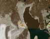

# Simple Image Processing

[](https://colab.research.google.com/github/bacalhau-project/examples/blob/main/data-engineering/image-processing/index.ipynb)
[](https://mybinder.org/v2/gh/bacalhau-project/examples/HEAD?labpath=data-engineering%2Fimage-processing%2Findex.ipynb)

In this example, we will show you how to use Bacalhau to process images on a [Landsat dataset](https://ipfs.io/ipfs/QmeZRGhe4PmjctYVSVHuEiA9oSXnqmYa4kQubSHgWbjv72/).

Bacalhau has the unique capability of operating at a massive scale in a distributed environment. This is made possible because data is naturally sharded across the IPFS network amongst many providers. We can take advantage of this to process images in parallel.

However, before we do that, this notebook shows you how to use Bacalhau to process images using a [much smaller subset](https://cloudflare-ipfs.com/ipfs/QmeZRGhe4PmjctYVSVHuEiA9oSXnqmYa4kQubSHgWbjv72). This is useful for testing and debugging your code.

For a live walk-through of this demo please watch the first part of the video below, otherwise feel free to run the demo yourself by following the steps below.

[](https://www.youtube.com/watch?v=wkOh05J5qgA)

## Prerequistes

Make sure you have the latest `bacalhau` client installed by following the [getting started instructions](../../../getting-started/installation), or using the installation command below (which installs Bacalhau local to the notebook).


```python
!command -v bacalhau >/dev/null 2>&1 || (export BACALHAU_INSTALL_DIR=.; curl -sL https://get.bacalhau.org/install.sh | bash)
path=!echo $PATH
%env PATH=./:{path[0]}
```

    env: PATH=./:./:./:/home/gitpod/.pyenv/versions/3.8.13/bin:/home/gitpod/.pyenv/libexec:/home/gitpod/.pyenv/plugins/python-build/bin:/home/gitpod/.pyenv/plugins/pyenv-virtualenv/bin:/home/gitpod/.pyenv/plugins/pyenv-update/bin:/home/gitpod/.pyenv/plugins/pyenv-installer/bin:/home/gitpod/.pyenv/plugins/pyenv-doctor/bin:/home/gitpod/.pyenv/shims:/ide/bin/remote-cli:/home/gitpod/.nix-profile/bin:/home/gitpod/.local/bin:/home/gitpod/.sdkman/candidates/maven/current/bin:/home/gitpod/.sdkman/candidates/java/current/bin:/home/gitpod/.sdkman/candidates/gradle/current/bin:/workspace/.cargo/bin:/home/gitpod/.rvm/gems/ruby-3.1.2/bin:/home/gitpod/.rvm/gems/ruby-3.1.2@global/bin:/home/gitpod/.rvm/rubies/ruby-3.1.2/bin:/home/gitpod/.pyenv/plugins/pyenv-virtualenv/shims:/home/gitpod/.pyenv/shims:/workspace/go/bin:/home/gitpod/.nix-profile/bin:/ide/bin/remote-cli:/home/gitpod/go/bin:/home/gitpod/go-packages/bin:/home/gitpod/.nvm/versions/node/v16.18.1/bin:/home/gitpod/.yarn/bin:/home/gitpod/.pnpm:/home/gitpod/.pyenv/bin:/workspace/.rvm/bin:/home/gitpod/.cargo/bin:/home/linuxbrew/.linuxbrew/bin:/home/linuxbrew/.linuxbrew/sbin/:/home/gitpod/.local/bin:/usr/games:/usr/local/sbin:/usr/local/bin:/usr/sbin:/usr/bin:/sbin:/bin:/home/gitpod/.nvm/versions/node/v16.18.1/bin:/home/gitpod/.rvm/bin


```bash
bacalhau version
```

    Client Version: v0.3.15
    Server Version: v0.3.15


## Submit the workload

To submit a workload to Bacalhau you can use the `bacalhau docker run` command. This allows you to pass input data volume with a `-v CID:path` argument just like Docker, except the left-hand side of the argument is a [content identifier (CID)](https://github.com/multiformats/cid). This results in Bacalhau mounting a *data volume* inside the container. By default, Bacalhau mounts the input volume at the path `/inputs` inside the container.

Bacalhau also mounts a data volume to store output data. By default `bacalhau docker run` creates an output data volume mounted at `/outputs`. This is a convenient location to store the results of your job. See below for an example.


```bash
bacalhau docker run \
  --wait \
  --wait-timeout-secs 100 \
  --id-only \
  -v QmeZRGhe4PmjctYVSVHuEiA9oSXnqmYa4kQubSHgWbjv72:/input_images \
  dpokidov/imagemagick:7.1.0-47-ubuntu \
  -- magick mogrify -resize 100x100 -quality 100 -path /outputs '/input_images/*.jpg'
```


```python
%env JOB_ID={job_id}
```

    env: JOB_ID=0e4119fd-12f9-42f5-8cd2-54a0d270541e


The job has been submitted and Bacalhau has printed out the related job id.
We store that in an environment variable so that we can reuse it later on.


```bash
bacalhau list --id-filter=${JOB_ID} --no-style
```

     CREATED   ID        JOB                      STATE      VERIFIED  PUBLISHED               
     13:17:34  0e4119fd  Docker dpokidov/imag...  Completed            /ipfs/QmQnern37ueHrs... 


Since the job state is published/complete, the job is ready to be downloaded.

## Get results

First, let us create a new directory that will store our job outputs.
Second, use the `get` verb to download the job outputs into the directory specified by the `--output-dir` argument.


```bash
rm -rf results && mkdir results
bacalhau get ${JOB_ID} --output-dir results
```

    Fetching results of job '0e4119fd-12f9-42f5-8cd2-54a0d270541e'...
    Results for job '0e4119fd-12f9-42f5-8cd2-54a0d270541e' have been written to...
    results


The docker run command above used the `outputs` volume as a results folder so when we download them they will be stored in a  folder within `volumes/outputs`.


```bash
ls -lah results/combined_results/outputs
```

    total 196K
    drwxr-xr-x 2 gitpod gitpod 4.0K Dec 14 13:22 .
    drwxr-xr-x 3 gitpod gitpod   49 Dec 14 13:22 ..
    -rw-r--r-- 3 gitpod gitpod  15K Dec 14 13:22 cafires_vir_2021231_lrg.jpg
    -rw-r--r-- 3 gitpod gitpod  34K Dec 14 13:22 greatsaltlake_oli_2017210_lrg.jpg
    -rw-r--r-- 3 gitpod gitpod  13K Dec 14 13:22 greecefires_oli_2021222_lrg.jpg
    -rw-r--r-- 3 gitpod gitpod  17K Dec 14 13:22 haitiearthquake_oli_20212_lrg.jpg
    -rw-r--r-- 3 gitpod gitpod  42K Dec 14 13:22 iwojima_tmo_2021225_lrg.jpg
    -rw-r--r-- 3 gitpod gitpod  11K Dec 14 13:22 lakemead_etm_2000220_lrg.jpg
    -rw-r--r-- 3 gitpod gitpod  14K Dec 14 13:22 lapalma_oli_2021141_lrg.jpg
    -rw-r--r-- 3 gitpod gitpod  14K Dec 14 13:22 spainfire_oli_2021227_lrg.jpg
    -rw-r--r-- 3 gitpod gitpod  16K Dec 14 13:22 sulphursprings_oli_2019254_lrg.jpg


```python
import glob
from IPython.display import Image, display
for imageName in glob.glob('results/combined_results/outputs/*.jpg'):
    display(Image(filename=imageName))
```


    

    


    

    


    

    


    

    


    

    


    

    


    

    


    

    


    

    


## Where to go next?

* [Take a look at other examples](https://docs.bacalhau.org/examples/)
* [How to run an existing workload on Bacalhau](https://docs.bacalhau.org/getting-started/docker-workload-onboarding)
* [Check out the Bacalhau CLI Reference page](https://docs.bacalhau.org/all-flags)

## Support

Please reach out to the [Bacalhau team via Slack](https://filecoinproject.slack.com/archives/C02RLM3JHUY) to seek help or in case of any issues.
