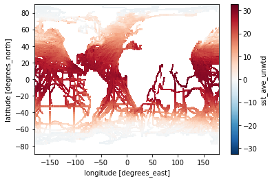
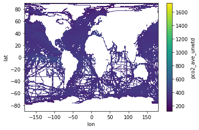

# Oceanography - Data Conversion

[](https://colab.research.google.com/github/bacalhau-project/examples/blob/main/data-engineering/oceanography-conversion/index.ipynb)
[](https://mybinder.org/v2/gh/bacalhau-project/examples/HEAD?labpath=data-engineering/oceanography-conversion/index.ipynb)

The Surface Ocean CO₂ Atlas (SOCAT) contains measurements of the [fugacity](https://en.wikipedia.org/wiki/Fugacity) of CO2 in seawater around the globe. But to calculate how much carbon the ocean is taking up from the atmosphere, these measurements need to be converted to the partial pressure of CO2. We will convert the units by combining measurements of the surface temperature and fugacity.  Python libraries (xarray, pandas, numpy) and the pyseaflux package facilitate this process.

References:
- https://www.socat.info/
- https://seaflux.readthedocs.io/en/latest/api.html?highlight=fCO2_to_pCO2#pyseaflux.fco2_pco2_conversion.fCO2_to_pCO2
- https://github.com/lgloege/bacalhau_socat_test/blob/main/main.py
- https://github.com/wesfloyd/bacalhau_socat_test

### Goal

The goal of this notebook is to investigate the data and convert dockerize the workload so that it can be executed on the Bacalhau network, to take advantage of the distributed storage and compute resources.

### Prerequisites

This example requires Docker. If you don't have Docker installed, you can install it from [here](https://docs.docker.com/install/). Docker commands will not work on hosted notebooks like Google Colab, but the Bacalhau commands will.

Make sure you have the latest `bacalhau` client installed by following the [getting started instructions](../../../getting-started/installation)

## The Data

The raw data is available on the [SOCAT website](https://www.socat.info/). We will use the [SOCATv2021](https://www.socat.info/index.php/version-2021/) dataset in the "Gridded" format to perform this calculation. First, let's take a quick look at some data:


```bash
mkdir -p inputs
curl --output ./inputs/SOCATv2022_tracks_gridded_monthly.nc.zip https://www.socat.info/socat_files/v2022/SOCATv2022_tracks_gridded_monthly.nc.zip
curl --output ./inputs/sst.mnmean.nc https://downloads.psl.noaa.gov/Datasets/noaa.oisst.v2/sst.mnmean.nc
```

Next let's write the requirements.txt and install the dependencies. This file will also be used by the Dockerfile to install the dependencies.


```python
%%writefile requirements.txt
Bottleneck==1.3.5
dask==2022.2.0
fsspec==2022.5.0
netCDF4==1.6.0
numpy==1.21.6
pandas==1.3.5
pip==22.1.2
pyseaflux==2.2.1
scipy==1.7.3
xarray==0.20.2
zarr>=2.0.0
```

    Overwriting requirements.txt


```bash
pip install -r requirements.txt > /dev/null
```

    WARNING: Running pip as the 'root' user can result in broken permissions and conflicting behaviour with the system package manager. It is recommended to use a virtual environment instead: https://pip.pypa.io/warnings/venv


```python
import fsspec # for reading remote files
import xarray as xr
with fsspec.open("./inputs/SOCATv2022_tracks_gridded_monthly.nc.zip", compression='zip') as fp:
    ds = xr.open_dataset(fp)
ds
```


<div><svg style="position: absolute; width: 0; height: 0; overflow: hidden">
<defs>
<symbol id="icon-database" viewBox="0 0 32 32">
<path d="M16 0c-8.837 0-16 2.239-16 5v4c0 2.761 7.163 5 16 5s16-2.239 16-5v-4c0-2.761-7.163-5-16-5z"></path>
<path d="M16 17c-8.837 0-16-2.239-16-5v6c0 2.761 7.163 5 16 5s16-2.239 16-5v-6c0 2.761-7.163 5-16 5z"></path>
<path d="M16 26c-8.837 0-16-2.239-16-5v6c0 2.761 7.163 5 16 5s16-2.239 16-5v-6c0 2.761-7.163 5-16 5z"></path>
</symbol>
<symbol id="icon-file-text2" viewBox="0 0 32 32">
<path d="M28.681 7.159c-0.694-0.947-1.662-2.053-2.724-3.116s-2.169-2.030-3.116-2.724c-1.612-1.182-2.393-1.319-2.841-1.319h-15.5c-1.378 0-2.5 1.121-2.5 2.5v27c0 1.378 1.122 2.5 2.5 2.5h23c1.378 0 2.5-1.122 2.5-2.5v-19.5c0-0.448-0.137-1.23-1.319-2.841zM24.543 5.457c0.959 0.959 1.712 1.825 2.268 2.543h-4.811v-4.811c0.718 0.556 1.584 1.309 2.543 2.268zM28 29.5c0 0.271-0.229 0.5-0.5 0.5h-23c-0.271 0-0.5-0.229-0.5-0.5v-27c0-0.271 0.229-0.5 0.5-0.5 0 0 15.499-0 15.5 0v7c0 0.552 0.448 1 1 1h7v19.5z"></path>
<path d="M23 26h-14c-0.552 0-1-0.448-1-1s0.448-1 1-1h14c0.552 0 1 0.448 1 1s-0.448 1-1 1z"></path>
<path d="M23 22h-14c-0.552 0-1-0.448-1-1s0.448-1 1-1h14c0.552 0 1 0.448 1 1s-0.448 1-1 1z"></path>
<path d="M23 18h-14c-0.552 0-1-0.448-1-1s0.448-1 1-1h14c0.552 0 1 0.448 1 1s-0.448 1-1 1z"></path>
</symbol>
</defs>
</svg>
<style>/* CSS stylesheet for displaying xarray objects in jupyterlab.
 *
 */

:root {
  --xr-font-color0: var(--jp-content-font-color0, rgba(0, 0, 0, 1));
  --xr-font-color2: var(--jp-content-font-color2, rgba(0, 0, 0, 0.54));
  --xr-font-color3: var(--jp-content-font-color3, rgba(0, 0, 0, 0.38));
  --xr-border-color: var(--jp-border-color2, #e0e0e0);
  --xr-disabled-color: var(--jp-layout-color3, #bdbdbd);
  --xr-background-color: var(--jp-layout-color0, white);
  --xr-background-color-row-even: var(--jp-layout-color1, white);
  --xr-background-color-row-odd: var(--jp-layout-color2, #eeeeee);
}

html[theme=dark],
body.vscode-dark {
  --xr-font-color0: rgba(255, 255, 255, 1);
  --xr-font-color2: rgba(255, 255, 255, 0.54);
  --xr-font-color3: rgba(255, 255, 255, 0.38);
  --xr-border-color: #1F1F1F;
  --xr-disabled-color: #515151;
  --xr-background-color: #111111;
  --xr-background-color-row-even: #111111;
  --xr-background-color-row-odd: #313131;
}

.xr-wrap {
  display: block !important;
  min-width: 300px;
  max-width: 700px;
}

.xr-text-repr-fallback {
  /* fallback to plain text repr when CSS is not injected (untrusted notebook) */
  display: none;
}

.xr-header {
  padding-top: 6px;
  padding-bottom: 6px;
  margin-bottom: 4px;
  border-bottom: solid 1px var(--xr-border-color);
}

.xr-header > div,
.xr-header > ul {
  display: inline;
  margin-top: 0;
  margin-bottom: 0;
}

.xr-obj-type,
.xr-array-name {
  margin-left: 2px;
  margin-right: 10px;
}

.xr-obj-type {
  color: var(--xr-font-color2);
}

.xr-sections {
  padding-left: 0 !important;
  display: grid;
  grid-template-columns: 150px auto auto 1fr 20px 20px;
}

.xr-section-item {
  display: contents;
}

.xr-section-item input {
  display: none;
}

.xr-section-item input + label {
  color: var(--xr-disabled-color);
}

.xr-section-item input:enabled + label {
  cursor: pointer;
  color: var(--xr-font-color2);
}

.xr-section-item input:enabled + label:hover {
  color: var(--xr-font-color0);
}

.xr-section-summary {
  grid-column: 1;
  color: var(--xr-font-color2);
  font-weight: 500;
}

.xr-section-summary > span {
  display: inline-block;
  padding-left: 0.5em;
}

.xr-section-summary-in:disabled + label {
  color: var(--xr-font-color2);
}

.xr-section-summary-in + label:before {
  display: inline-block;
  content: '►';
  font-size: 11px;
  width: 15px;
  text-align: center;
}

.xr-section-summary-in:disabled + label:before {
  color: var(--xr-disabled-color);
}

.xr-section-summary-in:checked + label:before {
  content: '▼';
}

.xr-section-summary-in:checked + label > span {
  display: none;
}

.xr-section-summary,
.xr-section-inline-details {
  padding-top: 4px;
  padding-bottom: 4px;
}

.xr-section-inline-details {
  grid-column: 2 / -1;
}

.xr-section-details {
  display: none;
  grid-column: 1 / -1;
  margin-bottom: 5px;
}

.xr-section-summary-in:checked ~ .xr-section-details {
  display: contents;
}

.xr-array-wrap {
  grid-column: 1 / -1;
  display: grid;
  grid-template-columns: 20px auto;
}

.xr-array-wrap > label {
  grid-column: 1;
  vertical-align: top;
}

.xr-preview {
  color: var(--xr-font-color3);
}

.xr-array-preview,
.xr-array-data {
  padding: 0 5px !important;
  grid-column: 2;
}

.xr-array-data,
.xr-array-in:checked ~ .xr-array-preview {
  display: none;
}

.xr-array-in:checked ~ .xr-array-data,
.xr-array-preview {
  display: inline-block;
}

.xr-dim-list {
  display: inline-block !important;
  list-style: none;
  padding: 0 !important;
  margin: 0;
}

.xr-dim-list li {
  display: inline-block;
  padding: 0;
  margin: 0;
}

.xr-dim-list:before {
  content: '(';
}

.xr-dim-list:after {
  content: ')';
}

.xr-dim-list li:not(:last-child):after {
  content: ',';
  padding-right: 5px;
}

.xr-has-index {
  font-weight: bold;
}

.xr-var-list,
.xr-var-item {
  display: contents;
}

.xr-var-item > div,
.xr-var-item label,
.xr-var-item > .xr-var-name span {
  background-color: var(--xr-background-color-row-even);
  margin-bottom: 0;
}

.xr-var-item > .xr-var-name:hover span {
  padding-right: 5px;
}

.xr-var-list > li:nth-child(odd) > div,
.xr-var-list > li:nth-child(odd) > label,
.xr-var-list > li:nth-child(odd) > .xr-var-name span {
  background-color: var(--xr-background-color-row-odd);
}

.xr-var-name {
  grid-column: 1;
}

.xr-var-dims {
  grid-column: 2;
}

.xr-var-dtype {
  grid-column: 3;
  text-align: right;
  color: var(--xr-font-color2);
}

.xr-var-preview {
  grid-column: 4;
}

.xr-var-name,
.xr-var-dims,
.xr-var-dtype,
.xr-preview,
.xr-attrs dt {
  white-space: nowrap;
  overflow: hidden;
  text-overflow: ellipsis;
  padding-right: 10px;
}

.xr-var-name:hover,
.xr-var-dims:hover,
.xr-var-dtype:hover,
.xr-attrs dt:hover {
  overflow: visible;
  width: auto;
  z-index: 1;
}

.xr-var-attrs,
.xr-var-data {
  display: none;
  background-color: var(--xr-background-color) !important;
  padding-bottom: 5px !important;
}

.xr-var-attrs-in:checked ~ .xr-var-attrs,
.xr-var-data-in:checked ~ .xr-var-data {
  display: block;
}

.xr-var-data > table {
  float: right;
}

.xr-var-name span,
.xr-var-data,
.xr-attrs {
  padding-left: 25px !important;
}

.xr-attrs,
.xr-var-attrs,
.xr-var-data {
  grid-column: 1 / -1;
}

dl.xr-attrs {
  padding: 0;
  margin: 0;
  display: grid;
  grid-template-columns: 125px auto;
}

.xr-attrs dt,
.xr-attrs dd {
  padding: 0;
  margin: 0;
  float: left;
  padding-right: 10px;
  width: auto;
}

.xr-attrs dt {
  font-weight: normal;
  grid-column: 1;
}

.xr-attrs dt:hover span {
  display: inline-block;
  background: var(--xr-background-color);
  padding-right: 10px;
}

.xr-attrs dd {
  grid-column: 2;
  white-space: pre-wrap;
  word-break: break-all;
}

.xr-icon-database,
.xr-icon-file-text2 {
  display: inline-block;
  vertical-align: middle;
  width: 1em;
  height: 1.5em !important;
  stroke-width: 0;
  stroke: currentColor;
  fill: currentColor;
}
</style><pre class='xr-text-repr-fallback'>&lt;xarray.Dataset&gt;
Dimensions:                (xlon: 360, ylat: 180, tmnth: 624, bnds: 2)
Coordinates:
  * xlon                   (xlon) float64 -179.5 -178.5 -177.5 ... 178.5 179.5
  * ylat                   (ylat) float64 -89.5 -88.5 -87.5 ... 87.5 88.5 89.5
  * tmnth                  (tmnth) datetime64[ns] 1970-01-16T12:00:00 ... 202...
Dimensions without coordinates: bnds
Data variables: (12/25)
    tmnth_bnds             (tmnth, bnds) datetime64[ns] 1970-01-01 ... 2022-0...
    count_ncruise          (tmnth, ylat, xlon) float64 ...
    fco2_count_nobs        (tmnth, ylat, xlon) float64 ...
    fco2_ave_weighted      (tmnth, ylat, xlon) float32 ...
    fco2_ave_unwtd         (tmnth, ylat, xlon) float32 ...
    fco2_min_unwtd         (tmnth, ylat, xlon) float32 ...
    ...                     ...
    salinity_min_unwtd     (tmnth, ylat, xlon) float32 ...
    salinity_max_unwtd     (tmnth, ylat, xlon) float32 ...
    salinity_std_weighted  (tmnth, ylat, xlon) float32 ...
    salinity_std_unwtd     (tmnth, ylat, xlon) float32 ...
    lat_offset_unwtd       (tmnth, ylat, xlon) float32 ...
    lon_offset_unwtd       (tmnth, ylat, xlon) float32 ...
Attributes:
    history:      PyFerret V7.63 (optimized) 31-May-22
    Conventions:  CF-1.6
    SOCAT_Notes:  SOCAT gridded v2022 26-May-2022
    title:        SOCAT gridded v2022 Monthly 1x1 degree gridded dataset
    summary:      Surface Ocean Carbon Atlas (SOCAT) Gridded (binned) SOCAT o...
    references:   http://www.socat.info/
    caution:      NO INTERPOLATION WAS PERFORMED. SIGNIFICANT BIASES ARE PRES...</pre><div class='xr-wrap' style='display:none'><div class='xr-header'><div class='xr-obj-type'>xarray.Dataset</div></div><ul class='xr-sections'><li class='xr-section-item'><input id='section-9b1c15ef-c4ef-4bcf-91ab-ad4c7e2c7e1c' class='xr-section-summary-in' type='checkbox' disabled ><label for='section-9b1c15ef-c4ef-4bcf-91ab-ad4c7e2c7e1c' class='xr-section-summary'  title='Expand/collapse section'>Dimensions:</label><div class='xr-section-inline-details'><ul class='xr-dim-list'><li><span class='xr-has-index'>xlon</span>: 360</li><li><span class='xr-has-index'>ylat</span>: 180</li><li><span class='xr-has-index'>tmnth</span>: 624</li><li><span>bnds</span>: 2</li></ul></div><div class='xr-section-details'></div></li><li class='xr-section-item'><input id='section-c347a06f-d10b-4017-9b43-f0107dbc00de' class='xr-section-summary-in' type='checkbox'  checked><label for='section-c347a06f-d10b-4017-9b43-f0107dbc00de' class='xr-section-summary' >Coordinates: <span>(3)</span></label><div class='xr-section-inline-details'></div><div class='xr-section-details'><ul class='xr-var-list'><li class='xr-var-item'><div class='xr-var-name'><span class='xr-has-index'>xlon</span></div><div class='xr-var-dims'>(xlon)</div><div class='xr-var-dtype'>float64</div><div class='xr-var-preview xr-preview'>-179.5 -178.5 ... 178.5 179.5</div><input id='attrs-6c6a6729-8271-4b85-99dc-993e7def12b2' class='xr-var-attrs-in' type='checkbox' ><label for='attrs-6c6a6729-8271-4b85-99dc-993e7def12b2' title='Show/Hide attributes'><svg class='icon xr-icon-file-text2'><use xlink:href='#icon-file-text2'></use></svg></label><input id='data-e2ef5c9f-26e2-4401-81f4-4b3e5914349b' class='xr-var-data-in' type='checkbox'><label for='data-e2ef5c9f-26e2-4401-81f4-4b3e5914349b' title='Show/Hide data repr'><svg class='icon xr-icon-database'><use xlink:href='#icon-database'></use></svg></label><div class='xr-var-attrs'><dl class='xr-attrs'><dt><span>units :</span></dt><dd>degrees_east</dd><dt><span>point_spacing :</span></dt><dd>even</dd><dt><span>axis :</span></dt><dd>X</dd><dt><span>modulo :</span></dt><dd>360.0</dd><dt><span>standard_name :</span></dt><dd>longitude</dd></dl></div><div class='xr-var-data'><pre>array([-179.5, -178.5, -177.5, ...,  177.5,  178.5,  179.5])</pre></div></li><li class='xr-var-item'><div class='xr-var-name'><span class='xr-has-index'>ylat</span></div><div class='xr-var-dims'>(ylat)</div><div class='xr-var-dtype'>float64</div><div class='xr-var-preview xr-preview'>-89.5 -88.5 -87.5 ... 88.5 89.5</div><input id='attrs-77c4c6ab-bc18-4cd4-a97c-519eaf67ebcb' class='xr-var-attrs-in' type='checkbox' ><label for='attrs-77c4c6ab-bc18-4cd4-a97c-519eaf67ebcb' title='Show/Hide attributes'><svg class='icon xr-icon-file-text2'><use xlink:href='#icon-file-text2'></use></svg></label><input id='data-afc297e9-770d-4e78-af49-45a8901b5861' class='xr-var-data-in' type='checkbox'><label for='data-afc297e9-770d-4e78-af49-45a8901b5861' title='Show/Hide data repr'><svg class='icon xr-icon-database'><use xlink:href='#icon-database'></use></svg></label><div class='xr-var-attrs'><dl class='xr-attrs'><dt><span>units :</span></dt><dd>degrees_north</dd><dt><span>point_spacing :</span></dt><dd>even</dd><dt><span>axis :</span></dt><dd>Y</dd><dt><span>standard_name :</span></dt><dd>latitude</dd></dl></div><div class='xr-var-data'><pre>array([-89.5, -88.5, -87.5, -86.5, -85.5, -84.5, -83.5, -82.5, -81.5, -80.5,
       -79.5, -78.5, -77.5, -76.5, -75.5, -74.5, -73.5, -72.5, -71.5, -70.5,
       -69.5, -68.5, -67.5, -66.5, -65.5, -64.5, -63.5, -62.5, -61.5, -60.5,
       -59.5, -58.5, -57.5, -56.5, -55.5, -54.5, -53.5, -52.5, -51.5, -50.5,
       -49.5, -48.5, -47.5, -46.5, -45.5, -44.5, -43.5, -42.5, -41.5, -40.5,
       -39.5, -38.5, -37.5, -36.5, -35.5, -34.5, -33.5, -32.5, -31.5, -30.5,
       -29.5, -28.5, -27.5, -26.5, -25.5, -24.5, -23.5, -22.5, -21.5, -20.5,
       -19.5, -18.5, -17.5, -16.5, -15.5, -14.5, -13.5, -12.5, -11.5, -10.5,
        -9.5,  -8.5,  -7.5,  -6.5,  -5.5,  -4.5,  -3.5,  -2.5,  -1.5,  -0.5,
         0.5,   1.5,   2.5,   3.5,   4.5,   5.5,   6.5,   7.5,   8.5,   9.5,
        10.5,  11.5,  12.5,  13.5,  14.5,  15.5,  16.5,  17.5,  18.5,  19.5,
        20.5,  21.5,  22.5,  23.5,  24.5,  25.5,  26.5,  27.5,  28.5,  29.5,
        30.5,  31.5,  32.5,  33.5,  34.5,  35.5,  36.5,  37.5,  38.5,  39.5,
        40.5,  41.5,  42.5,  43.5,  44.5,  45.5,  46.5,  47.5,  48.5,  49.5,
        50.5,  51.5,  52.5,  53.5,  54.5,  55.5,  56.5,  57.5,  58.5,  59.5,
        60.5,  61.5,  62.5,  63.5,  64.5,  65.5,  66.5,  67.5,  68.5,  69.5,
        70.5,  71.5,  72.5,  73.5,  74.5,  75.5,  76.5,  77.5,  78.5,  79.5,
        80.5,  81.5,  82.5,  83.5,  84.5,  85.5,  86.5,  87.5,  88.5,  89.5])</pre></div></li><li class='xr-var-item'><div class='xr-var-name'><span class='xr-has-index'>tmnth</span></div><div class='xr-var-dims'>(tmnth)</div><div class='xr-var-dtype'>datetime64[ns]</div><div class='xr-var-preview xr-preview'>1970-01-16T12:00:00 ... 2021-12-...</div><input id='attrs-102d7d90-99ae-44e2-bc38-3f2a3962d251' class='xr-var-attrs-in' type='checkbox' ><label for='attrs-102d7d90-99ae-44e2-bc38-3f2a3962d251' title='Show/Hide attributes'><svg class='icon xr-icon-file-text2'><use xlink:href='#icon-file-text2'></use></svg></label><input id='data-ba9da0f6-1c95-41dd-be8f-6718c5997a5b' class='xr-var-data-in' type='checkbox'><label for='data-ba9da0f6-1c95-41dd-be8f-6718c5997a5b' title='Show/Hide data repr'><svg class='icon xr-icon-database'><use xlink:href='#icon-database'></use></svg></label><div class='xr-var-attrs'><dl class='xr-attrs'><dt><span>axis :</span></dt><dd>T</dd><dt><span>bounds :</span></dt><dd>tmnth_bnds</dd><dt><span>time_origin :</span></dt><dd>01-JAN-1970</dd><dt><span>standard_name :</span></dt><dd>time</dd></dl></div><div class='xr-var-data'><pre>array([&#x27;1970-01-16T12:00:00.000000000&#x27;, &#x27;1970-02-15T00:00:00.000000000&#x27;,
       &#x27;1970-03-16T12:00:00.000000000&#x27;, ..., &#x27;2021-10-16T12:00:00.000000000&#x27;,
       &#x27;2021-11-16T00:00:00.000000000&#x27;, &#x27;2021-12-16T12:00:00.000000000&#x27;],
      dtype=&#x27;datetime64[ns]&#x27;)</pre></div></li></ul></div></li><li class='xr-section-item'><input id='section-1c2d4894-77d6-46fa-96da-132aad57b354' class='xr-section-summary-in' type='checkbox'  ><label for='section-1c2d4894-77d6-46fa-96da-132aad57b354' class='xr-section-summary' >Data variables: <span>(25)</span></label><div class='xr-section-inline-details'></div><div class='xr-section-details'><ul class='xr-var-list'><li class='xr-var-item'><div class='xr-var-name'><span>tmnth_bnds</span></div><div class='xr-var-dims'>(tmnth, bnds)</div><div class='xr-var-dtype'>datetime64[ns]</div><div class='xr-var-preview xr-preview'>...</div><input id='attrs-fde11b8f-fded-487e-91b5-099a1ba3bf39' class='xr-var-attrs-in' type='checkbox' disabled><label for='attrs-fde11b8f-fded-487e-91b5-099a1ba3bf39' title='Show/Hide attributes'><svg class='icon xr-icon-file-text2'><use xlink:href='#icon-file-text2'></use></svg></label><input id='data-241083da-5c51-4921-aa1c-0c415df9c6ba' class='xr-var-data-in' type='checkbox'><label for='data-241083da-5c51-4921-aa1c-0c415df9c6ba' title='Show/Hide data repr'><svg class='icon xr-icon-database'><use xlink:href='#icon-database'></use></svg></label><div class='xr-var-attrs'><dl class='xr-attrs'></dl></div><div class='xr-var-data'><pre>array([[&#x27;1970-01-01T00:00:00.000000000&#x27;, &#x27;1970-02-01T00:00:00.000000000&#x27;],
       [&#x27;1970-02-01T00:00:00.000000000&#x27;, &#x27;1970-03-01T00:00:00.000000000&#x27;],
       [&#x27;1970-03-01T00:00:00.000000000&#x27;, &#x27;1970-04-01T00:00:00.000000000&#x27;],
       ...,
       [&#x27;2021-10-01T00:00:00.000000000&#x27;, &#x27;2021-11-01T00:00:00.000000000&#x27;],
       [&#x27;2021-11-01T00:00:00.000000000&#x27;, &#x27;2021-12-01T00:00:00.000000000&#x27;],
       [&#x27;2021-12-01T00:00:00.000000000&#x27;, &#x27;2022-01-01T00:00:00.000000000&#x27;]],
      dtype=&#x27;datetime64[ns]&#x27;)</pre></div></li><li class='xr-var-item'><div class='xr-var-name'><span>count_ncruise</span></div><div class='xr-var-dims'>(tmnth, ylat, xlon)</div><div class='xr-var-dtype'>float64</div><div class='xr-var-preview xr-preview'>...</div><input id='attrs-2d069f29-40ca-4882-8a28-584229ed817a' class='xr-var-attrs-in' type='checkbox' ><label for='attrs-2d069f29-40ca-4882-8a28-584229ed817a' title='Show/Hide attributes'><svg class='icon xr-icon-file-text2'><use xlink:href='#icon-file-text2'></use></svg></label><input id='data-d9fb8518-036b-4518-96ba-e82b49a87fe0' class='xr-var-data-in' type='checkbox'><label for='data-d9fb8518-036b-4518-96ba-e82b49a87fe0' title='Show/Hide data repr'><svg class='icon xr-icon-database'><use xlink:href='#icon-database'></use></svg></label><div class='xr-var-attrs'><dl class='xr-attrs'><dt><span>long_name :</span></dt><dd>Number of cruises</dd><dt><span>units :</span></dt><dd>count</dd><dt><span>history :</span></dt><dd>From SOCAT_ABCD_data_for_gridding</dd><dt><span>summary :</span></dt><dd>Number of datasets containing observations in the grid cell</dd></dl></div><div class='xr-var-data'><pre>[40435200 values with dtype=float64]</pre></div></li><li class='xr-var-item'><div class='xr-var-name'><span>fco2_count_nobs</span></div><div class='xr-var-dims'>(tmnth, ylat, xlon)</div><div class='xr-var-dtype'>float64</div><div class='xr-var-preview xr-preview'>...</div><input id='attrs-d71e4cee-b3a1-458e-8161-81e9d284317e' class='xr-var-attrs-in' type='checkbox' ><label for='attrs-d71e4cee-b3a1-458e-8161-81e9d284317e' title='Show/Hide attributes'><svg class='icon xr-icon-file-text2'><use xlink:href='#icon-file-text2'></use></svg></label><input id='data-4fa6eda6-5c75-4887-8e2c-7cc7f13f1bfc' class='xr-var-data-in' type='checkbox'><label for='data-4fa6eda6-5c75-4887-8e2c-7cc7f13f1bfc' title='Show/Hide data repr'><svg class='icon xr-icon-database'><use xlink:href='#icon-database'></use></svg></label><div class='xr-var-attrs'><dl class='xr-attrs'><dt><span>long_name :</span></dt><dd>Number of fco2 obs</dd><dt><span>units :</span></dt><dd>count</dd><dt><span>history :</span></dt><dd>From SOCAT_ABCD_data_for_gridding</dd><dt><span>summary :</span></dt><dd>Total number of observations in the grid cell.</dd></dl></div><div class='xr-var-data'><pre>[40435200 values with dtype=float64]</pre></div></li><li class='xr-var-item'><div class='xr-var-name'><span>fco2_ave_weighted</span></div><div class='xr-var-dims'>(tmnth, ylat, xlon)</div><div class='xr-var-dtype'>float32</div><div class='xr-var-preview xr-preview'>...</div><input id='attrs-38da4d8e-e954-4fc9-a966-e076d71b4666' class='xr-var-attrs-in' type='checkbox' ><label for='attrs-38da4d8e-e954-4fc9-a966-e076d71b4666' title='Show/Hide attributes'><svg class='icon xr-icon-file-text2'><use xlink:href='#icon-file-text2'></use></svg></label><input id='data-2aaaa6ac-9ccf-4de4-b4df-edb73a984596' class='xr-var-data-in' type='checkbox'><label for='data-2aaaa6ac-9ccf-4de4-b4df-edb73a984596' title='Show/Hide data repr'><svg class='icon xr-icon-database'><use xlink:href='#icon-database'></use></svg></label><div class='xr-var-attrs'><dl class='xr-attrs'><dt><span>long_name :</span></dt><dd>fCO2 mean - per cruise weighted</dd><dt><span>units :</span></dt><dd>uatm</dd><dt><span>history :</span></dt><dd>From SOCAT_ABCD_data_for_gridding</dd><dt><span>summary :</span></dt><dd>Mean of fco2 recomputed computed by calculating the arithmetic mean value for each cruise passing through the cell and then averaging these datasets.</dd></dl></div><div class='xr-var-data'><pre>[40435200 values with dtype=float32]</pre></div></li><li class='xr-var-item'><div class='xr-var-name'><span>fco2_ave_unwtd</span></div><div class='xr-var-dims'>(tmnth, ylat, xlon)</div><div class='xr-var-dtype'>float32</div><div class='xr-var-preview xr-preview'>...</div><input id='attrs-96f8219f-9924-454f-92e9-df8ba0fe43bc' class='xr-var-attrs-in' type='checkbox' ><label for='attrs-96f8219f-9924-454f-92e9-df8ba0fe43bc' title='Show/Hide attributes'><svg class='icon xr-icon-file-text2'><use xlink:href='#icon-file-text2'></use></svg></label><input id='data-0066953d-29d8-42e3-b3c7-2c63bcfe8ea9' class='xr-var-data-in' type='checkbox'><label for='data-0066953d-29d8-42e3-b3c7-2c63bcfe8ea9' title='Show/Hide data repr'><svg class='icon xr-icon-database'><use xlink:href='#icon-database'></use></svg></label><div class='xr-var-attrs'><dl class='xr-attrs'><dt><span>long_name :</span></dt><dd>fCO2 mean - unweighted all obs</dd><dt><span>units :</span></dt><dd>uatm</dd><dt><span>history :</span></dt><dd>From SOCAT_ABCD_data_for_gridding</dd><dt><span>summary :</span></dt><dd>Arithmetic mean of all fco2 recomputed values found in the grid cell.</dd></dl></div><div class='xr-var-data'><pre>[40435200 values with dtype=float32]</pre></div></li><li class='xr-var-item'><div class='xr-var-name'><span>fco2_min_unwtd</span></div><div class='xr-var-dims'>(tmnth, ylat, xlon)</div><div class='xr-var-dtype'>float32</div><div class='xr-var-preview xr-preview'>...</div><input id='attrs-4644c3ec-9878-4a52-b59f-c7b980cb89bf' class='xr-var-attrs-in' type='checkbox' ><label for='attrs-4644c3ec-9878-4a52-b59f-c7b980cb89bf' title='Show/Hide attributes'><svg class='icon xr-icon-file-text2'><use xlink:href='#icon-file-text2'></use></svg></label><input id='data-61c67c2b-f3c8-4df5-96be-01dfc5b3a188' class='xr-var-data-in' type='checkbox'><label for='data-61c67c2b-f3c8-4df5-96be-01dfc5b3a188' title='Show/Hide data repr'><svg class='icon xr-icon-database'><use xlink:href='#icon-database'></use></svg></label><div class='xr-var-attrs'><dl class='xr-attrs'><dt><span>long_name :</span></dt><dd>fCO2 min</dd><dt><span>units :</span></dt><dd>uatm</dd><dt><span>history :</span></dt><dd>From SOCAT_ABCD_data_for_gridding</dd><dt><span>summary :</span></dt><dd>Minimum value of fco2 recomputed observed in the grid cell.</dd></dl></div><div class='xr-var-data'><pre>[40435200 values with dtype=float32]</pre></div></li><li class='xr-var-item'><div class='xr-var-name'><span>fco2_max_unwtd</span></div><div class='xr-var-dims'>(tmnth, ylat, xlon)</div><div class='xr-var-dtype'>float32</div><div class='xr-var-preview xr-preview'>...</div><input id='attrs-ebb94e33-76e2-45ca-baa5-b3e5caf1135d' class='xr-var-attrs-in' type='checkbox' ><label for='attrs-ebb94e33-76e2-45ca-baa5-b3e5caf1135d' title='Show/Hide attributes'><svg class='icon xr-icon-file-text2'><use xlink:href='#icon-file-text2'></use></svg></label><input id='data-759e047f-1207-473a-b68f-94c87b86a4ce' class='xr-var-data-in' type='checkbox'><label for='data-759e047f-1207-473a-b68f-94c87b86a4ce' title='Show/Hide data repr'><svg class='icon xr-icon-database'><use xlink:href='#icon-database'></use></svg></label><div class='xr-var-attrs'><dl class='xr-attrs'><dt><span>long_name :</span></dt><dd>fCO2 max</dd><dt><span>units :</span></dt><dd>uatm</dd><dt><span>history :</span></dt><dd>From SOCAT_ABCD_data_for_gridding</dd></dl></div><div class='xr-var-data'><pre>[40435200 values with dtype=float32]</pre></div></li><li class='xr-var-item'><div class='xr-var-name'><span>fco2_std_weighted</span></div><div class='xr-var-dims'>(tmnth, ylat, xlon)</div><div class='xr-var-dtype'>float32</div><div class='xr-var-preview xr-preview'>...</div><input id='attrs-3c67d618-90ce-4ef5-8d0a-83006569d12d' class='xr-var-attrs-in' type='checkbox' ><label for='attrs-3c67d618-90ce-4ef5-8d0a-83006569d12d' title='Show/Hide attributes'><svg class='icon xr-icon-file-text2'><use xlink:href='#icon-file-text2'></use></svg></label><input id='data-9c0bc580-de03-497b-b0ba-6ddd1629c7a5' class='xr-var-data-in' type='checkbox'><label for='data-9c0bc580-de03-497b-b0ba-6ddd1629c7a5' title='Show/Hide data repr'><svg class='icon xr-icon-database'><use xlink:href='#icon-database'></use></svg></label><div class='xr-var-attrs'><dl class='xr-attrs'><dt><span>long_name :</span></dt><dd>fCO2 std dev - per cruise weighted</dd><dt><span>units :</span></dt><dd>uatm</dd><dt><span>history :</span></dt><dd>From SOCAT_ABCD_data_for_gridding</dd><dt><span>summary :</span></dt><dd>A weighted standard deviation of fco2 recomputed computed to account for the differing 
variance estimates for each cruise passing through the cell. The statistical technique is 
described at See http://wapedia.mobi/en/Weighted_mean#7.</dd></dl></div><div class='xr-var-data'><pre>[40435200 values with dtype=float32]</pre></div></li><li class='xr-var-item'><div class='xr-var-name'><span>fco2_std_unwtd</span></div><div class='xr-var-dims'>(tmnth, ylat, xlon)</div><div class='xr-var-dtype'>float32</div><div class='xr-var-preview xr-preview'>...</div><input id='attrs-726893c9-e6ec-45fb-b991-c618707726ef' class='xr-var-attrs-in' type='checkbox' ><label for='attrs-726893c9-e6ec-45fb-b991-c618707726ef' title='Show/Hide attributes'><svg class='icon xr-icon-file-text2'><use xlink:href='#icon-file-text2'></use></svg></label><input id='data-6b14731c-1b36-4f46-a43e-9177e99d0a35' class='xr-var-data-in' type='checkbox'><label for='data-6b14731c-1b36-4f46-a43e-9177e99d0a35' title='Show/Hide data repr'><svg class='icon xr-icon-database'><use xlink:href='#icon-database'></use></svg></label><div class='xr-var-attrs'><dl class='xr-attrs'><dt><span>long_name :</span></dt><dd>fCO2 std dev - unweighted all obs</dd><dt><span>units :</span></dt><dd>uatm</dd><dt><span>history :</span></dt><dd>From SOCAT_ABCD_data_for_gridding</dd><dt><span>summary :</span></dt><dd>The standard deviation of fco2 recomputed computed from the unweighted mean.</dd></dl></div><div class='xr-var-data'><pre>[40435200 values with dtype=float32]</pre></div></li><li class='xr-var-item'><div class='xr-var-name'><span>sst_count_nobs</span></div><div class='xr-var-dims'>(tmnth, ylat, xlon)</div><div class='xr-var-dtype'>float64</div><div class='xr-var-preview xr-preview'>...</div><input id='attrs-9d3697ac-3def-4fa2-a71d-d5ef3d76a680' class='xr-var-attrs-in' type='checkbox' ><label for='attrs-9d3697ac-3def-4fa2-a71d-d5ef3d76a680' title='Show/Hide attributes'><svg class='icon xr-icon-file-text2'><use xlink:href='#icon-file-text2'></use></svg></label><input id='data-2f3cd958-71d5-46e2-b0ef-8fa1c7505497' class='xr-var-data-in' type='checkbox'><label for='data-2f3cd958-71d5-46e2-b0ef-8fa1c7505497' title='Show/Hide data repr'><svg class='icon xr-icon-database'><use xlink:href='#icon-database'></use></svg></label><div class='xr-var-attrs'><dl class='xr-attrs'><dt><span>long_name :</span></dt><dd>Number of valid sst obs</dd><dt><span>units :</span></dt><dd>count</dd><dt><span>history :</span></dt><dd>From SOCAT_ABCD_data_for_gridding</dd><dt><span>summary :</span></dt><dd>Total number of observations in the grid cell.</dd></dl></div><div class='xr-var-data'><pre>[40435200 values with dtype=float64]</pre></div></li><li class='xr-var-item'><div class='xr-var-name'><span>sst_ave_weighted</span></div><div class='xr-var-dims'>(tmnth, ylat, xlon)</div><div class='xr-var-dtype'>float32</div><div class='xr-var-preview xr-preview'>...</div><input id='attrs-49b08c31-7f2e-4b05-8a55-59e72f409cee' class='xr-var-attrs-in' type='checkbox' ><label for='attrs-49b08c31-7f2e-4b05-8a55-59e72f409cee' title='Show/Hide attributes'><svg class='icon xr-icon-file-text2'><use xlink:href='#icon-file-text2'></use></svg></label><input id='data-1637253e-dc12-4e7f-9848-eb8b7c52fcf8' class='xr-var-data-in' type='checkbox'><label for='data-1637253e-dc12-4e7f-9848-eb8b7c52fcf8' title='Show/Hide data repr'><svg class='icon xr-icon-database'><use xlink:href='#icon-database'></use></svg></label><div class='xr-var-attrs'><dl class='xr-attrs'><dt><span>long_name :</span></dt><dd>SST mean - per cruise weighted</dd><dt><span>units :</span></dt><dd>degrees C</dd><dt><span>history :</span></dt><dd>From SOCAT_ABCD_data_for_gridding</dd><dt><span>summary :</span></dt><dd>Mean of sst computed by calculating the arithmetic mean value for each cruise passing through the cell and then averaging these datasets.</dd></dl></div><div class='xr-var-data'><pre>[40435200 values with dtype=float32]</pre></div></li><li class='xr-var-item'><div class='xr-var-name'><span>sst_ave_unwtd</span></div><div class='xr-var-dims'>(tmnth, ylat, xlon)</div><div class='xr-var-dtype'>float32</div><div class='xr-var-preview xr-preview'>...</div><input id='attrs-90835a39-0676-4118-a7d8-78adba390647' class='xr-var-attrs-in' type='checkbox' ><label for='attrs-90835a39-0676-4118-a7d8-78adba390647' title='Show/Hide attributes'><svg class='icon xr-icon-file-text2'><use xlink:href='#icon-file-text2'></use></svg></label><input id='data-5fb292a9-54c7-4bdd-8334-523c33a44de5' class='xr-var-data-in' type='checkbox'><label for='data-5fb292a9-54c7-4bdd-8334-523c33a44de5' title='Show/Hide data repr'><svg class='icon xr-icon-database'><use xlink:href='#icon-database'></use></svg></label><div class='xr-var-attrs'><dl class='xr-attrs'><dt><span>long_name :</span></dt><dd>SST mean - unweighted all obs</dd><dt><span>units :</span></dt><dd>degrees C</dd><dt><span>history :</span></dt><dd>From SOCAT_ABCD_data_for_gridding</dd><dt><span>summary :</span></dt><dd>Arithmetic mean of all sst values found in the grid cell.</dd></dl></div><div class='xr-var-data'><pre>[40435200 values with dtype=float32]</pre></div></li><li class='xr-var-item'><div class='xr-var-name'><span>sst_min_unwtd</span></div><div class='xr-var-dims'>(tmnth, ylat, xlon)</div><div class='xr-var-dtype'>float32</div><div class='xr-var-preview xr-preview'>...</div><input id='attrs-aa5cc183-07ba-4bb9-93da-0c4c363b13cb' class='xr-var-attrs-in' type='checkbox' ><label for='attrs-aa5cc183-07ba-4bb9-93da-0c4c363b13cb' title='Show/Hide attributes'><svg class='icon xr-icon-file-text2'><use xlink:href='#icon-file-text2'></use></svg></label><input id='data-19440e14-a349-467c-93b5-a75b666bf2d5' class='xr-var-data-in' type='checkbox'><label for='data-19440e14-a349-467c-93b5-a75b666bf2d5' title='Show/Hide data repr'><svg class='icon xr-icon-database'><use xlink:href='#icon-database'></use></svg></label><div class='xr-var-attrs'><dl class='xr-attrs'><dt><span>long_name :</span></dt><dd>SST min</dd><dt><span>units :</span></dt><dd>degrees C</dd><dt><span>history :</span></dt><dd>From SOCAT_ABCD_data_for_gridding</dd><dt><span>summary :</span></dt><dd>Minimum value of sst observed in the grid cell.</dd></dl></div><div class='xr-var-data'><pre>[40435200 values with dtype=float32]</pre></div></li><li class='xr-var-item'><div class='xr-var-name'><span>sst_max_unwtd</span></div><div class='xr-var-dims'>(tmnth, ylat, xlon)</div><div class='xr-var-dtype'>float32</div><div class='xr-var-preview xr-preview'>...</div><input id='attrs-33a84412-30fe-4769-82a8-1d22b33fe833' class='xr-var-attrs-in' type='checkbox' ><label for='attrs-33a84412-30fe-4769-82a8-1d22b33fe833' title='Show/Hide attributes'><svg class='icon xr-icon-file-text2'><use xlink:href='#icon-file-text2'></use></svg></label><input id='data-b4492351-6ee0-484b-9f91-a42fc7781cce' class='xr-var-data-in' type='checkbox'><label for='data-b4492351-6ee0-484b-9f91-a42fc7781cce' title='Show/Hide data repr'><svg class='icon xr-icon-database'><use xlink:href='#icon-database'></use></svg></label><div class='xr-var-attrs'><dl class='xr-attrs'><dt><span>long_name :</span></dt><dd>SST max</dd><dt><span>units :</span></dt><dd>degrees C</dd><dt><span>history :</span></dt><dd>From SOCAT_ABCD_data_for_gridding</dd></dl></div><div class='xr-var-data'><pre>[40435200 values with dtype=float32]</pre></div></li><li class='xr-var-item'><div class='xr-var-name'><span>sst_std_weighted</span></div><div class='xr-var-dims'>(tmnth, ylat, xlon)</div><div class='xr-var-dtype'>float32</div><div class='xr-var-preview xr-preview'>...</div><input id='attrs-d71431c3-a7d1-4330-9c91-deadcce62b84' class='xr-var-attrs-in' type='checkbox' ><label for='attrs-d71431c3-a7d1-4330-9c91-deadcce62b84' title='Show/Hide attributes'><svg class='icon xr-icon-file-text2'><use xlink:href='#icon-file-text2'></use></svg></label><input id='data-bebedf9d-f841-4295-9ffb-b66499961e51' class='xr-var-data-in' type='checkbox'><label for='data-bebedf9d-f841-4295-9ffb-b66499961e51' title='Show/Hide data repr'><svg class='icon xr-icon-database'><use xlink:href='#icon-database'></use></svg></label><div class='xr-var-attrs'><dl class='xr-attrs'><dt><span>long_name :</span></dt><dd>SST std dev - per cruise weighted</dd><dt><span>units :</span></dt><dd>degrees C</dd><dt><span>history :</span></dt><dd>From SOCAT_ABCD_data_for_gridding</dd><dt><span>summary :</span></dt><dd>A weighted standard deviation of sst computed to account for the differing 
variance estimates for each cruise passing through the cell. The statistical technique is 
described at See http://wapedia.mobi/en/Weighted_mean#7.</dd></dl></div><div class='xr-var-data'><pre>[40435200 values with dtype=float32]</pre></div></li><li class='xr-var-item'><div class='xr-var-name'><span>sst_std_unwtd</span></div><div class='xr-var-dims'>(tmnth, ylat, xlon)</div><div class='xr-var-dtype'>float32</div><div class='xr-var-preview xr-preview'>...</div><input id='attrs-f06c8891-793a-48e2-bd90-2aa42185c9d0' class='xr-var-attrs-in' type='checkbox' ><label for='attrs-f06c8891-793a-48e2-bd90-2aa42185c9d0' title='Show/Hide attributes'><svg class='icon xr-icon-file-text2'><use xlink:href='#icon-file-text2'></use></svg></label><input id='data-c8390928-16f8-462e-a922-4c2d118ace0c' class='xr-var-data-in' type='checkbox'><label for='data-c8390928-16f8-462e-a922-4c2d118ace0c' title='Show/Hide data repr'><svg class='icon xr-icon-database'><use xlink:href='#icon-database'></use></svg></label><div class='xr-var-attrs'><dl class='xr-attrs'><dt><span>long_name :</span></dt><dd>SST std dev - unweighted all obs</dd><dt><span>units :</span></dt><dd>degrees C</dd><dt><span>history :</span></dt><dd>From SOCAT_ABCD_data_for_gridding</dd><dt><span>summary :</span></dt><dd>The standard deviation of sst computed from the unweighted mean.</dd></dl></div><div class='xr-var-data'><pre>[40435200 values with dtype=float32]</pre></div></li><li class='xr-var-item'><div class='xr-var-name'><span>salinity_count_nobs</span></div><div class='xr-var-dims'>(tmnth, ylat, xlon)</div><div class='xr-var-dtype'>float64</div><div class='xr-var-preview xr-preview'>...</div><input id='attrs-97d01b36-f391-4290-999a-d8bc82193345' class='xr-var-attrs-in' type='checkbox' ><label for='attrs-97d01b36-f391-4290-999a-d8bc82193345' title='Show/Hide attributes'><svg class='icon xr-icon-file-text2'><use xlink:href='#icon-file-text2'></use></svg></label><input id='data-12612a1f-7dea-45ee-b100-097a74704dab' class='xr-var-data-in' type='checkbox'><label for='data-12612a1f-7dea-45ee-b100-097a74704dab' title='Show/Hide data repr'><svg class='icon xr-icon-database'><use xlink:href='#icon-database'></use></svg></label><div class='xr-var-attrs'><dl class='xr-attrs'><dt><span>long_name :</span></dt><dd>Number of valid salinity obs</dd><dt><span>units :</span></dt><dd>count</dd><dt><span>history :</span></dt><dd>From SOCAT_ABCD_data_for_gridding</dd><dt><span>summary :</span></dt><dd>Total number of observations in the grid cell.</dd></dl></div><div class='xr-var-data'><pre>[40435200 values with dtype=float64]</pre></div></li><li class='xr-var-item'><div class='xr-var-name'><span>salinity_ave_weighted</span></div><div class='xr-var-dims'>(tmnth, ylat, xlon)</div><div class='xr-var-dtype'>float32</div><div class='xr-var-preview xr-preview'>...</div><input id='attrs-5ce8555a-78ed-427c-a932-4e53c94d9eec' class='xr-var-attrs-in' type='checkbox' ><label for='attrs-5ce8555a-78ed-427c-a932-4e53c94d9eec' title='Show/Hide attributes'><svg class='icon xr-icon-file-text2'><use xlink:href='#icon-file-text2'></use></svg></label><input id='data-9104e119-0aeb-4942-854c-681da3a29ad2' class='xr-var-data-in' type='checkbox'><label for='data-9104e119-0aeb-4942-854c-681da3a29ad2' title='Show/Hide data repr'><svg class='icon xr-icon-database'><use xlink:href='#icon-database'></use></svg></label><div class='xr-var-attrs'><dl class='xr-attrs'><dt><span>long_name :</span></dt><dd>Salinity mean - per cruise weighted</dd><dt><span>units :</span></dt><dd>PSU</dd><dt><span>history :</span></dt><dd>From SOCAT_ABCD_data_for_gridding</dd><dt><span>summary :</span></dt><dd>Mean of salinity computed by calculating the arithmetic mean value for each cruise passing through the cell and then averaging these datasets.</dd></dl></div><div class='xr-var-data'><pre>[40435200 values with dtype=float32]</pre></div></li><li class='xr-var-item'><div class='xr-var-name'><span>salinity_ave_unwtd</span></div><div class='xr-var-dims'>(tmnth, ylat, xlon)</div><div class='xr-var-dtype'>float32</div><div class='xr-var-preview xr-preview'>...</div><input id='attrs-146d630a-0d1c-49cc-ab25-eb881d298d57' class='xr-var-attrs-in' type='checkbox' ><label for='attrs-146d630a-0d1c-49cc-ab25-eb881d298d57' title='Show/Hide attributes'><svg class='icon xr-icon-file-text2'><use xlink:href='#icon-file-text2'></use></svg></label><input id='data-2a880129-9e87-4723-af66-6dc1ef0f92f6' class='xr-var-data-in' type='checkbox'><label for='data-2a880129-9e87-4723-af66-6dc1ef0f92f6' title='Show/Hide data repr'><svg class='icon xr-icon-database'><use xlink:href='#icon-database'></use></svg></label><div class='xr-var-attrs'><dl class='xr-attrs'><dt><span>long_name :</span></dt><dd>Salinity mean - unweighted all obs</dd><dt><span>units :</span></dt><dd>PSU</dd><dt><span>history :</span></dt><dd>From SOCAT_ABCD_data_for_gridding</dd><dt><span>summary :</span></dt><dd>Arithmetic mean of all salinity values found in the grid cell.</dd></dl></div><div class='xr-var-data'><pre>[40435200 values with dtype=float32]</pre></div></li><li class='xr-var-item'><div class='xr-var-name'><span>salinity_min_unwtd</span></div><div class='xr-var-dims'>(tmnth, ylat, xlon)</div><div class='xr-var-dtype'>float32</div><div class='xr-var-preview xr-preview'>...</div><input id='attrs-eecc51a3-0788-44fc-9163-ae2aebd8b089' class='xr-var-attrs-in' type='checkbox' ><label for='attrs-eecc51a3-0788-44fc-9163-ae2aebd8b089' title='Show/Hide attributes'><svg class='icon xr-icon-file-text2'><use xlink:href='#icon-file-text2'></use></svg></label><input id='data-c2af438b-3036-4e61-82cc-66979d37b741' class='xr-var-data-in' type='checkbox'><label for='data-c2af438b-3036-4e61-82cc-66979d37b741' title='Show/Hide data repr'><svg class='icon xr-icon-database'><use xlink:href='#icon-database'></use></svg></label><div class='xr-var-attrs'><dl class='xr-attrs'><dt><span>long_name :</span></dt><dd>Salinity min</dd><dt><span>units :</span></dt><dd>PSU</dd><dt><span>history :</span></dt><dd>From SOCAT_ABCD_data_for_gridding</dd><dt><span>summary :</span></dt><dd>Minimum value of salinity observed in the grid cell.</dd></dl></div><div class='xr-var-data'><pre>[40435200 values with dtype=float32]</pre></div></li><li class='xr-var-item'><div class='xr-var-name'><span>salinity_max_unwtd</span></div><div class='xr-var-dims'>(tmnth, ylat, xlon)</div><div class='xr-var-dtype'>float32</div><div class='xr-var-preview xr-preview'>...</div><input id='attrs-8cb50eca-ca05-4252-a91c-0a5db6ad5438' class='xr-var-attrs-in' type='checkbox' ><label for='attrs-8cb50eca-ca05-4252-a91c-0a5db6ad5438' title='Show/Hide attributes'><svg class='icon xr-icon-file-text2'><use xlink:href='#icon-file-text2'></use></svg></label><input id='data-ef804465-9edd-4517-bf0d-7bfb34429ffd' class='xr-var-data-in' type='checkbox'><label for='data-ef804465-9edd-4517-bf0d-7bfb34429ffd' title='Show/Hide data repr'><svg class='icon xr-icon-database'><use xlink:href='#icon-database'></use></svg></label><div class='xr-var-attrs'><dl class='xr-attrs'><dt><span>long_name :</span></dt><dd>Salinity max</dd><dt><span>units :</span></dt><dd>PSU</dd><dt><span>history :</span></dt><dd>From SOCAT_ABCD_data_for_gridding</dd></dl></div><div class='xr-var-data'><pre>[40435200 values with dtype=float32]</pre></div></li><li class='xr-var-item'><div class='xr-var-name'><span>salinity_std_weighted</span></div><div class='xr-var-dims'>(tmnth, ylat, xlon)</div><div class='xr-var-dtype'>float32</div><div class='xr-var-preview xr-preview'>...</div><input id='attrs-55909ce9-0f2a-4f22-a68d-bc36b9a76a0c' class='xr-var-attrs-in' type='checkbox' ><label for='attrs-55909ce9-0f2a-4f22-a68d-bc36b9a76a0c' title='Show/Hide attributes'><svg class='icon xr-icon-file-text2'><use xlink:href='#icon-file-text2'></use></svg></label><input id='data-c9494ac5-710a-46cb-b07c-c020585a6ffe' class='xr-var-data-in' type='checkbox'><label for='data-c9494ac5-710a-46cb-b07c-c020585a6ffe' title='Show/Hide data repr'><svg class='icon xr-icon-database'><use xlink:href='#icon-database'></use></svg></label><div class='xr-var-attrs'><dl class='xr-attrs'><dt><span>long_name :</span></dt><dd>Salinity std dev - per cruise weighted</dd><dt><span>units :</span></dt><dd>PSU</dd><dt><span>history :</span></dt><dd>From SOCAT_ABCD_data_for_gridding</dd><dt><span>summary :</span></dt><dd>A weighted standard deviation of salinity computed to account for the differing 
variance estimates for each cruise passing through the cell. The statistical technique is 
described at See http://wapedia.mobi/en/Weighted_mean#7.</dd></dl></div><div class='xr-var-data'><pre>[40435200 values with dtype=float32]</pre></div></li><li class='xr-var-item'><div class='xr-var-name'><span>salinity_std_unwtd</span></div><div class='xr-var-dims'>(tmnth, ylat, xlon)</div><div class='xr-var-dtype'>float32</div><div class='xr-var-preview xr-preview'>...</div><input id='attrs-cb098450-d7fc-4d8a-8b5a-5022d00206ff' class='xr-var-attrs-in' type='checkbox' ><label for='attrs-cb098450-d7fc-4d8a-8b5a-5022d00206ff' title='Show/Hide attributes'><svg class='icon xr-icon-file-text2'><use xlink:href='#icon-file-text2'></use></svg></label><input id='data-e1dbe30a-5043-4df4-bb02-e9da566f7bff' class='xr-var-data-in' type='checkbox'><label for='data-e1dbe30a-5043-4df4-bb02-e9da566f7bff' title='Show/Hide data repr'><svg class='icon xr-icon-database'><use xlink:href='#icon-database'></use></svg></label><div class='xr-var-attrs'><dl class='xr-attrs'><dt><span>long_name :</span></dt><dd>Salinity std dev - unweighted all obs</dd><dt><span>units :</span></dt><dd>PSU</dd><dt><span>history :</span></dt><dd>From SOCAT_ABCD_data_for_gridding</dd><dt><span>summary :</span></dt><dd>The standard deviation of salinity computed from the unweighted mean.</dd></dl></div><div class='xr-var-data'><pre>[40435200 values with dtype=float32]</pre></div></li><li class='xr-var-item'><div class='xr-var-name'><span>lat_offset_unwtd</span></div><div class='xr-var-dims'>(tmnth, ylat, xlon)</div><div class='xr-var-dtype'>float32</div><div class='xr-var-preview xr-preview'>...</div><input id='attrs-1f5dc43a-0f4f-40eb-9066-0f02b695a310' class='xr-var-attrs-in' type='checkbox' ><label for='attrs-1f5dc43a-0f4f-40eb-9066-0f02b695a310' title='Show/Hide attributes'><svg class='icon xr-icon-file-text2'><use xlink:href='#icon-file-text2'></use></svg></label><input id='data-a109fc39-dbe2-4fd9-bce8-e4f515905ea1' class='xr-var-data-in' type='checkbox'><label for='data-a109fc39-dbe2-4fd9-bce8-e4f515905ea1' title='Show/Hide data repr'><svg class='icon xr-icon-database'><use xlink:href='#icon-database'></use></svg></label><div class='xr-var-attrs'><dl class='xr-attrs'><dt><span>long_name :</span></dt><dd>Latitude average offset from cell center</dd><dt><span>units :</span></dt><dd>Deg N</dd><dt><span>history :</span></dt><dd>From SOCAT_ABCD_data_for_gridding</dd><dt><span>summary :</span></dt><dd>The arithmetic average of latitude offsets from the grid cell center for all observations in 
the grid cell. The value of this offset can vary from -0.5 to 0.5. A value of zero indicates 
that the computed fco2 mean values are representative of the grid cell center position.</dd></dl></div><div class='xr-var-data'><pre>[40435200 values with dtype=float32]</pre></div></li><li class='xr-var-item'><div class='xr-var-name'><span>lon_offset_unwtd</span></div><div class='xr-var-dims'>(tmnth, ylat, xlon)</div><div class='xr-var-dtype'>float32</div><div class='xr-var-preview xr-preview'>...</div><input id='attrs-5c081b93-8617-4746-90ab-e7f98733852e' class='xr-var-attrs-in' type='checkbox' ><label for='attrs-5c081b93-8617-4746-90ab-e7f98733852e' title='Show/Hide attributes'><svg class='icon xr-icon-file-text2'><use xlink:href='#icon-file-text2'></use></svg></label><input id='data-3aa53643-f724-468e-89ad-e0866f31ad09' class='xr-var-data-in' type='checkbox'><label for='data-3aa53643-f724-468e-89ad-e0866f31ad09' title='Show/Hide data repr'><svg class='icon xr-icon-database'><use xlink:href='#icon-database'></use></svg></label><div class='xr-var-attrs'><dl class='xr-attrs'><dt><span>long_name :</span></dt><dd>Longitude average offset from cell center</dd><dt><span>units :</span></dt><dd>Deg E</dd><dt><span>history :</span></dt><dd>From SOCAT_ABCD_data_for_gridding</dd><dt><span>summary :</span></dt><dd>The arithmetic average of longitude offsets from the grid cell center for all observations in 
the grid cell. The value of this offset can vary from -0.5 to 0.5. A value of zero indicates 
that the computed fco2 mean values are representative of the grid cell center position.</dd></dl></div><div class='xr-var-data'><pre>[40435200 values with dtype=float32]</pre></div></li></ul></div></li><li class='xr-section-item'><input id='section-3829163c-f189-4862-a050-ff821c3aa20c' class='xr-section-summary-in' type='checkbox'  checked><label for='section-3829163c-f189-4862-a050-ff821c3aa20c' class='xr-section-summary' >Attributes: <span>(7)</span></label><div class='xr-section-inline-details'></div><div class='xr-section-details'><dl class='xr-attrs'><dt><span>history :</span></dt><dd>PyFerret V7.63 (optimized) 31-May-22</dd><dt><span>Conventions :</span></dt><dd>CF-1.6</dd><dt><span>SOCAT_Notes :</span></dt><dd>SOCAT gridded v2022 26-May-2022</dd><dt><span>title :</span></dt><dd>SOCAT gridded v2022 Monthly 1x1 degree gridded dataset</dd><dt><span>summary :</span></dt><dd>Surface Ocean Carbon Atlas (SOCAT) Gridded (binned) SOCAT observations, with a spatial 
grid of 1x1 degree and monthly in time. The gridded fields are computed using only SOCAT 
datasets with QC flags of A through D and SOCAT data points flagged with WOCE flag values of 2.</dd><dt><span>references :</span></dt><dd>http://www.socat.info/</dd><dt><span>caution :</span></dt><dd>NO INTERPOLATION WAS PERFORMED. SIGNIFICANT BIASES ARE PRESENT IN THESE GRIDDED RESULTS DUE TO THE 
ARBITRARY AND SPARSE LOCATIONS OF DATA VALUES IN BOTH SPACE AND TIME.</dd></dl></div></li></ul></div></div>


```python
time_slice = slice("2010", "2020") # select a decade
res = ds['sst_ave_unwtd'].sel(tmnth=time_slice).mean(dim='tmnth') # average over time
res.plot() # plot the result

```


    <matplotlib.collections.QuadMesh at 0x7fe2a53a8850>


    

    


We can see that the dataset contains lat-long coordinates, the date, and a series of seawater measurements. Above you can see a plot of the average surface sea temperature (sst) between 2010-2020, where recording buoys and boats have travelled.

## The Task - Large Scale Data Conversion

The goal of this notebook is to convert the data from fugacity of CO2 (fCO2) to partial pressure of CO2 (pCO2). This is a common task in oceanography, and is performed by combining the measurements of the surface temperature and fugacity. The conversion is performed by the [pyseaflux](https://seaflux.readthedocs.io/en/latest/api.html?highlight=fCO2_to_pCO2#pyseaflux.fco2_pco2_conversion.fCO2_to_pCO2) package.

To execute this workload on the Bacalhau network we need to perform three steps:

1. Upload the data to IPFS
2. Create a docker image with the code and dependencies
3. Run the docker image on the Bacalhau network using the IPFS data

### Upload the Data to IPFS

The first step is to upload the data to IPFS. The simplest way to do this is to use a third party service to "pin" data to the IPFS network, to ensure that the data exists and is available. To do this you need an account with a pinning service like [web3.storage](https://web3.storage/) or [Pinata](https://pinata.cloud/). Once registered you can use their UI or API or SDKs to upload files.

For the purposes of this example I:
1. Downloaded the latest monthly data from the [SOCAT website](https://www.socat.info/)
2. Downloaded the latest long-term global sea surface temperature data from [NOAA](https://downloads.psl.noaa.gov/Datasets/noaa.oisst.v2/sst.mnmean.nc) - information about that dataset can be found [here](https://psl.noaa.gov/data/gridded/data.noaa.oisst.v2.highres.html).
3. Pinned the data to IPFS

This resulted in the IPFS CID of `bafybeidunikexxu5qtuwc7eosjpuw6a75lxo7j5ezf3zurv52vbrmqwf6y`.

<!-- TODO: Add link to notebook showing people how to upload data to IPFS -->

### Create a Docker Image to Process the Data

Next we will create the docker image that will process the data. The docker image will contain the code and dependencies needed to perform the conversion. This code originated with [lgloege](https://github.com/lgloege/bacalhau_socat_test) via [wesfloyd](https://github.com/wesfloyd/bacalhau_socat_test/). Thank you! 🤗

:::tip
For more information about working with custom containers, see the [custom containers example](../../workload-onboarding/custom-containers/).
:::

The key thing to watch out for here is the paths to the data. I'm using the default bacalhau output directory `/outputs` to write my data to. And the input data is mounted to the `/inputs` directory. But as you will see in a moment, web3.storage has added another `input` directory that we need to account for.


```python
%%writefile main.py
import fsspec
import xarray as xr
import pandas as pd
import numpy as np
import pyseaflux


def lon_360_to_180(ds=None, lonVar=None):
    lonVar = "lon" if lonVar is None else lonVar
    return (ds.assign_coords({lonVar: (((ds[lonVar] + 180) % 360) - 180)})
            .sortby(lonVar)
            .astype(dtype='float32', order='C'))


def center_dates(ds):
    # start and end date
    start_date = str(ds.time[0].dt.strftime('%Y-%m').values)
    end_date = str(ds.time[-1].dt.strftime('%Y-%m').values)

    # monthly dates centered on 15th of each month
    dates = pd.date_range(start=f'{start_date}-01T00:00:00.000000000',
                          end=f'{end_date}-01T00:00:00.000000000',
                          freq='MS') + np.timedelta64(14, 'D')

    return ds.assign(time=dates)


def get_and_process_sst(url=None):
    # get noaa sst
    if url is None:
        url = ("/inputs/sst.mnmean.nc")

    with fsspec.open(url) as fp:
        ds = xr.open_dataset(fp)
        ds = lon_360_to_180(ds)
        ds = center_dates(ds)
        return ds


def get_and_process_socat(url=None):
    if url is None:
        url = ("/inputs/SOCATv2022_tracks_gridded_monthly.nc.zip")

    with fsspec.open(url, compression='zip') as fp:
        ds = xr.open_dataset(fp)
        ds = ds.rename({"xlon": "lon", "ylat": "lat", "tmnth": "time"})
        ds = center_dates(ds)
        return ds


def main():
    print("Load SST and SOCAT data")
    ds_sst = get_and_process_sst()
    ds_socat = get_and_process_socat()

    print("Merge datasets together")
    time_slice = slice("1981-12", "2022-05")
    ds_out = xr.merge([ds_sst['sst'].sel(time=time_slice),
                       ds_socat['fco2_ave_unwtd'].sel(time=time_slice)])

    print("Calculate pco2 from fco2")
    ds_out['pco2_ave_unwtd'] = xr.apply_ufunc(
        pyseaflux.fCO2_to_pCO2,
        ds_out['fco2_ave_unwtd'],
        ds_out['sst'])

    print("Add metadata")
    ds_out['pco2_ave_unwtd'].attrs['units'] = 'uatm'
    ds_out['pco2_ave_unwtd'].attrs['notes'] = ("calculated using" +
                                               "NOAA OI SST V2" +
                                               "and pyseaflux package")

    print("Save data")
    ds_out.to_zarr("/processed.zarr")
    import shutil
    shutil.make_archive("/outputs/processed.zarr", 'zip', "/processed.zarr")
    print("Zarr file written to disk, job completed successfully")

if __name__ == "__main__":
    main()
```

    Overwriting main.py


```python
%%writefile Dockerfile
FROM python:slim

RUN apt-get update && apt-get -y upgrade \
    && apt-get install -y --no-install-recommends \
    g++ \
    && rm -rf /var/lib/apt/lists/*

WORKDIR /project

COPY ./requirements.txt /project

RUN pip3 install -r requirements.txt

COPY ./main.py /project

CMD ["python","main.py"]
```

    Overwriting Dockerfile


### Test the Container Locally

Before we upload the container to the Bacalhau network, we should test it locally to make sure it works.


```bash
docker run \
	-v $(pwd)/inputs:/inputs \
	-v $(pwd)/outputs:/outputs \
	ghcr.io/bacalhau-project/examples/socat:0.0.11
```

    Zarr file written to disk, job completed successfully


### Run a Bacalhau Job

Now that we have the data in IPFS and the docker image pushed, we can run a job on the Bacalhau network.

I find it useful to first run a simple test with a known working container to ensure the data is located in the place I expect, because some storage providers add their own opinions. E.g. web3.storage wraps the directory uploads in a top level directory.


```bash
rm -rf stdout stderr volumes shards
bacalhau docker run \
        --download \
        --inputs bafybeidunikexxu5qtuwc7eosjpuw6a75lxo7j5ezf3zurv52vbrmqwf6y \
        ubuntu -- ls /inputs
```

    d26d6c9a-ede3-47fd-9c2c-9be272eaf4f5
    
    SOCATv2022_tracks_gridded_monthly.nc.zip
    sst.mnmean.nc
    


    16:34:34.748 | INF ipfs/downloader.go:115 > Found 1 result shards, downloading to temporary folder.
    16:34:37.741 | INF ipfs/downloader.go:195 > Combining shard from output volume 'outputs' to final location: '/Users/phil/source/bacalhau-project/examples/data-engineering/oceanography-conversion'


Then I like to run a simple test with my custom container ...


```bash
rm -rf stdout stderr volumes shards
bacalhau docker run \
	--inputs bafybeidunikexxu5qtuwc7eosjpuw6a75lxo7j5ezf3zurv52vbrmqwf6y \
	--download \
	ghcr.io/bacalhau-project/examples/socat:0.0.11 -- ls -la /inputs/
```

    8cb67fbe-6574-4597-95df-006f5aaa5f88
    
    total 98296
    drwxr-xr-x 2 root root     4096 Sep 23 14:15 .
    drwxr-xr-x 1 root root     4096 Sep 26 15:34 ..
    -rw-r--r-- 1 root root 37249557 Sep 23 14:15 SOCATv2022_tracks_gridded_monthly.nc.zip
    -rw-r--r-- 1 root root 63390820 Sep 23 14:15 sst.mnmean.nc
    


    16:35:02.943 | INF ipfs/downloader.go:115 > Found 1 result shards, downloading to temporary folder.
    16:35:05.635 | INF ipfs/downloader.go:195 > Combining shard from output volume 'outputs' to final location: '/Users/phil/source/bacalhau-project/examples/data-engineering/oceanography-conversion'


And finally let's run the full job. This time I will not download the data immediately, because the job takes around 100s. And it takes another few minutes to download the results. The commands are below, but you will need to wait until the job completes before they work.


```bash
bacalhau docker run \
        --inputs bafybeidunikexxu5qtuwc7eosjpuw6a75lxo7j5ezf3zurv52vbrmqwf6y \
        --wait \
        ghcr.io/bacalhau-project/examples/socat:0.0.11 -- python main.py
```

## Get Results

Now let's download and display the result from the results directory. We can use the `bacalhau results` command to download the results from the output data volume. The `--output-dir` argument specifies the directory to download the results to.


```bash
rm -rf results
mkdir -p ./results # Temporary directory to store the results
bacalhau get --output-dir ./results ${JOB_ID} # Download the results
```

    16:42:05.115 | INF bacalhau/get.go:67 > Fetching results of job '8e162098-f9bc-4733-8c98-c2e89ebefc5e'...
    16:42:08.66 | INF ipfs/downloader.go:115 > Found 1 result shards, downloading to temporary folder.
    16:43:04.83 | INF ipfs/downloader.go:195 > Combining shard from output volume 'outputs' to final location: '/Users/phil/source/bacalhau-project/examples/data-engineering/oceanography-conversion/results'


```bash
cat ./results/stdout
```

    Load SST and SOCAT data
    Merge datasets together
    Calculate pco2 from fco2
    Add metadata
    Save data
    Zarr file written to disk, job completed successfully


```bash
ls ./results/volumes/outputs
```

    processed.zarr.zip


```python
import shutil
shutil.unpack_archive("./results/volumes/outputs/processed.zarr.zip", "./results/volumes/outputs/")
```


```python
import xarray as xr
ds = xr.open_dataset("./results/volumes/outputs/", engine='zarr')
ds
```


<div><svg style="position: absolute; width: 0; height: 0; overflow: hidden">
<defs>
<symbol id="icon-database" viewBox="0 0 32 32">
<path d="M16 0c-8.837 0-16 2.239-16 5v4c0 2.761 7.163 5 16 5s16-2.239 16-5v-4c0-2.761-7.163-5-16-5z"></path>
<path d="M16 17c-8.837 0-16-2.239-16-5v6c0 2.761 7.163 5 16 5s16-2.239 16-5v-6c0 2.761-7.163 5-16 5z"></path>
<path d="M16 26c-8.837 0-16-2.239-16-5v6c0 2.761 7.163 5 16 5s16-2.239 16-5v-6c0 2.761-7.163 5-16 5z"></path>
</symbol>
<symbol id="icon-file-text2" viewBox="0 0 32 32">
<path d="M28.681 7.159c-0.694-0.947-1.662-2.053-2.724-3.116s-2.169-2.030-3.116-2.724c-1.612-1.182-2.393-1.319-2.841-1.319h-15.5c-1.378 0-2.5 1.121-2.5 2.5v27c0 1.378 1.122 2.5 2.5 2.5h23c1.378 0 2.5-1.122 2.5-2.5v-19.5c0-0.448-0.137-1.23-1.319-2.841zM24.543 5.457c0.959 0.959 1.712 1.825 2.268 2.543h-4.811v-4.811c0.718 0.556 1.584 1.309 2.543 2.268zM28 29.5c0 0.271-0.229 0.5-0.5 0.5h-23c-0.271 0-0.5-0.229-0.5-0.5v-27c0-0.271 0.229-0.5 0.5-0.5 0 0 15.499-0 15.5 0v7c0 0.552 0.448 1 1 1h7v19.5z"></path>
<path d="M23 26h-14c-0.552 0-1-0.448-1-1s0.448-1 1-1h14c0.552 0 1 0.448 1 1s-0.448 1-1 1z"></path>
<path d="M23 22h-14c-0.552 0-1-0.448-1-1s0.448-1 1-1h14c0.552 0 1 0.448 1 1s-0.448 1-1 1z"></path>
<path d="M23 18h-14c-0.552 0-1-0.448-1-1s0.448-1 1-1h14c0.552 0 1 0.448 1 1s-0.448 1-1 1z"></path>
</symbol>
</defs>
</svg>
<style>/* CSS stylesheet for displaying xarray objects in jupyterlab.
 *
 */

:root {
  --xr-font-color0: var(--jp-content-font-color0, rgba(0, 0, 0, 1));
  --xr-font-color2: var(--jp-content-font-color2, rgba(0, 0, 0, 0.54));
  --xr-font-color3: var(--jp-content-font-color3, rgba(0, 0, 0, 0.38));
  --xr-border-color: var(--jp-border-color2, #e0e0e0);
  --xr-disabled-color: var(--jp-layout-color3, #bdbdbd);
  --xr-background-color: var(--jp-layout-color0, white);
  --xr-background-color-row-even: var(--jp-layout-color1, white);
  --xr-background-color-row-odd: var(--jp-layout-color2, #eeeeee);
}

html[theme=dark],
body.vscode-dark {
  --xr-font-color0: rgba(255, 255, 255, 1);
  --xr-font-color2: rgba(255, 255, 255, 0.54);
  --xr-font-color3: rgba(255, 255, 255, 0.38);
  --xr-border-color: #1F1F1F;
  --xr-disabled-color: #515151;
  --xr-background-color: #111111;
  --xr-background-color-row-even: #111111;
  --xr-background-color-row-odd: #313131;
}

.xr-wrap {
  display: block !important;
  min-width: 300px;
  max-width: 700px;
}

.xr-text-repr-fallback {
  /* fallback to plain text repr when CSS is not injected (untrusted notebook) */
  display: none;
}

.xr-header {
  padding-top: 6px;
  padding-bottom: 6px;
  margin-bottom: 4px;
  border-bottom: solid 1px var(--xr-border-color);
}

.xr-header > div,
.xr-header > ul {
  display: inline;
  margin-top: 0;
  margin-bottom: 0;
}

.xr-obj-type,
.xr-array-name {
  margin-left: 2px;
  margin-right: 10px;
}

.xr-obj-type {
  color: var(--xr-font-color2);
}

.xr-sections {
  padding-left: 0 !important;
  display: grid;
  grid-template-columns: 150px auto auto 1fr 20px 20px;
}

.xr-section-item {
  display: contents;
}

.xr-section-item input {
  display: none;
}

.xr-section-item input + label {
  color: var(--xr-disabled-color);
}

.xr-section-item input:enabled + label {
  cursor: pointer;
  color: var(--xr-font-color2);
}

.xr-section-item input:enabled + label:hover {
  color: var(--xr-font-color0);
}

.xr-section-summary {
  grid-column: 1;
  color: var(--xr-font-color2);
  font-weight: 500;
}

.xr-section-summary > span {
  display: inline-block;
  padding-left: 0.5em;
}

.xr-section-summary-in:disabled + label {
  color: var(--xr-font-color2);
}

.xr-section-summary-in + label:before {
  display: inline-block;
  content: '►';
  font-size: 11px;
  width: 15px;
  text-align: center;
}

.xr-section-summary-in:disabled + label:before {
  color: var(--xr-disabled-color);
}

.xr-section-summary-in:checked + label:before {
  content: '▼';
}

.xr-section-summary-in:checked + label > span {
  display: none;
}

.xr-section-summary,
.xr-section-inline-details {
  padding-top: 4px;
  padding-bottom: 4px;
}

.xr-section-inline-details {
  grid-column: 2 / -1;
}

.xr-section-details {
  display: none;
  grid-column: 1 / -1;
  margin-bottom: 5px;
}

.xr-section-summary-in:checked ~ .xr-section-details {
  display: contents;
}

.xr-array-wrap {
  grid-column: 1 / -1;
  display: grid;
  grid-template-columns: 20px auto;
}

.xr-array-wrap > label {
  grid-column: 1;
  vertical-align: top;
}

.xr-preview {
  color: var(--xr-font-color3);
}

.xr-array-preview,
.xr-array-data {
  padding: 0 5px !important;
  grid-column: 2;
}

.xr-array-data,
.xr-array-in:checked ~ .xr-array-preview {
  display: none;
}

.xr-array-in:checked ~ .xr-array-data,
.xr-array-preview {
  display: inline-block;
}

.xr-dim-list {
  display: inline-block !important;
  list-style: none;
  padding: 0 !important;
  margin: 0;
}

.xr-dim-list li {
  display: inline-block;
  padding: 0;
  margin: 0;
}

.xr-dim-list:before {
  content: '(';
}

.xr-dim-list:after {
  content: ')';
}

.xr-dim-list li:not(:last-child):after {
  content: ',';
  padding-right: 5px;
}

.xr-has-index {
  font-weight: bold;
}

.xr-var-list,
.xr-var-item {
  display: contents;
}

.xr-var-item > div,
.xr-var-item label,
.xr-var-item > .xr-var-name span {
  background-color: var(--xr-background-color-row-even);
  margin-bottom: 0;
}

.xr-var-item > .xr-var-name:hover span {
  padding-right: 5px;
}

.xr-var-list > li:nth-child(odd) > div,
.xr-var-list > li:nth-child(odd) > label,
.xr-var-list > li:nth-child(odd) > .xr-var-name span {
  background-color: var(--xr-background-color-row-odd);
}

.xr-var-name {
  grid-column: 1;
}

.xr-var-dims {
  grid-column: 2;
}

.xr-var-dtype {
  grid-column: 3;
  text-align: right;
  color: var(--xr-font-color2);
}

.xr-var-preview {
  grid-column: 4;
}

.xr-var-name,
.xr-var-dims,
.xr-var-dtype,
.xr-preview,
.xr-attrs dt {
  white-space: nowrap;
  overflow: hidden;
  text-overflow: ellipsis;
  padding-right: 10px;
}

.xr-var-name:hover,
.xr-var-dims:hover,
.xr-var-dtype:hover,
.xr-attrs dt:hover {
  overflow: visible;
  width: auto;
  z-index: 1;
}

.xr-var-attrs,
.xr-var-data {
  display: none;
  background-color: var(--xr-background-color) !important;
  padding-bottom: 5px !important;
}

.xr-var-attrs-in:checked ~ .xr-var-attrs,
.xr-var-data-in:checked ~ .xr-var-data {
  display: block;
}

.xr-var-data > table {
  float: right;
}

.xr-var-name span,
.xr-var-data,
.xr-attrs {
  padding-left: 25px !important;
}

.xr-attrs,
.xr-var-attrs,
.xr-var-data {
  grid-column: 1 / -1;
}

dl.xr-attrs {
  padding: 0;
  margin: 0;
  display: grid;
  grid-template-columns: 125px auto;
}

.xr-attrs dt,
.xr-attrs dd {
  padding: 0;
  margin: 0;
  float: left;
  padding-right: 10px;
  width: auto;
}

.xr-attrs dt {
  font-weight: normal;
  grid-column: 1;
}

.xr-attrs dt:hover span {
  display: inline-block;
  background: var(--xr-background-color);
  padding-right: 10px;
}

.xr-attrs dd {
  grid-column: 2;
  white-space: pre-wrap;
  word-break: break-all;
}

.xr-icon-database,
.xr-icon-file-text2 {
  display: inline-block;
  vertical-align: middle;
  width: 1em;
  height: 1.5em !important;
  stroke-width: 0;
  stroke: currentColor;
  fill: currentColor;
}
</style><pre class='xr-text-repr-fallback'>&lt;xarray.Dataset&gt;
Dimensions:         (time: 486, lat: 180, lon: 360)
Coordinates:
  * lat             (lat) float32 -89.5 -88.5 -87.5 -86.5 ... 87.5 88.5 89.5
  * lon             (lon) float32 -179.5 -178.5 -177.5 ... 177.5 178.5 179.5
  * time            (time) datetime64[ns] 1981-12-15 1982-01-15 ... 2022-05-15
Data variables:
    fco2_ave_unwtd  (time, lat, lon) float32 ...
    pco2_ave_unwtd  (time, lat, lon) float32 ...
    sst             (time, lat, lon) float32 ...
Attributes: (12/13)
    actual_range:          [-1.7999995946884155, 35.56861877441406]
    cell_methods:          time: mean (monthly from weekly values interpolate...
    dataset:               NOAA Optimum Interpolation (OI) SST V2
    level_desc:            Surface
    long_name:             Monthly Mean of Sea Surface Temperature
    parent_stat:           Weekly Mean
    ...                    ...
    standard_name:         sea_surface_temperature
    statistic:             Mean
    units:                 degC
    unpacked_valid_range:  [-5.0, 40.0]
    valid_range:           [-500, 4000]
    var_desc:              Sea Surface Temperature</pre><div class='xr-wrap' style='display:none'><div class='xr-header'><div class='xr-obj-type'>xarray.Dataset</div></div><ul class='xr-sections'><li class='xr-section-item'><input id='section-a32bb500-0f36-456e-ab12-c644def470d9' class='xr-section-summary-in' type='checkbox' disabled ><label for='section-a32bb500-0f36-456e-ab12-c644def470d9' class='xr-section-summary'  title='Expand/collapse section'>Dimensions:</label><div class='xr-section-inline-details'><ul class='xr-dim-list'><li><span class='xr-has-index'>time</span>: 486</li><li><span class='xr-has-index'>lat</span>: 180</li><li><span class='xr-has-index'>lon</span>: 360</li></ul></div><div class='xr-section-details'></div></li><li class='xr-section-item'><input id='section-adcb4e71-b648-4844-b74c-cadd3569f169' class='xr-section-summary-in' type='checkbox'  checked><label for='section-adcb4e71-b648-4844-b74c-cadd3569f169' class='xr-section-summary' >Coordinates: <span>(3)</span></label><div class='xr-section-inline-details'></div><div class='xr-section-details'><ul class='xr-var-list'><li class='xr-var-item'><div class='xr-var-name'><span class='xr-has-index'>lat</span></div><div class='xr-var-dims'>(lat)</div><div class='xr-var-dtype'>float32</div><div class='xr-var-preview xr-preview'>-89.5 -88.5 -87.5 ... 88.5 89.5</div><input id='attrs-b3310fe2-c570-444c-b302-a57454bb7688' class='xr-var-attrs-in' type='checkbox' disabled><label for='attrs-b3310fe2-c570-444c-b302-a57454bb7688' title='Show/Hide attributes'><svg class='icon xr-icon-file-text2'><use xlink:href='#icon-file-text2'></use></svg></label><input id='data-4f115a5b-acc1-4cc5-9822-cc86c90613cd' class='xr-var-data-in' type='checkbox'><label for='data-4f115a5b-acc1-4cc5-9822-cc86c90613cd' title='Show/Hide data repr'><svg class='icon xr-icon-database'><use xlink:href='#icon-database'></use></svg></label><div class='xr-var-attrs'><dl class='xr-attrs'></dl></div><div class='xr-var-data'><pre>array([-89.5, -88.5, -87.5, -86.5, -85.5, -84.5, -83.5, -82.5, -81.5, -80.5,
       -79.5, -78.5, -77.5, -76.5, -75.5, -74.5, -73.5, -72.5, -71.5, -70.5,
       -69.5, -68.5, -67.5, -66.5, -65.5, -64.5, -63.5, -62.5, -61.5, -60.5,
       -59.5, -58.5, -57.5, -56.5, -55.5, -54.5, -53.5, -52.5, -51.5, -50.5,
       -49.5, -48.5, -47.5, -46.5, -45.5, -44.5, -43.5, -42.5, -41.5, -40.5,
       -39.5, -38.5, -37.5, -36.5, -35.5, -34.5, -33.5, -32.5, -31.5, -30.5,
       -29.5, -28.5, -27.5, -26.5, -25.5, -24.5, -23.5, -22.5, -21.5, -20.5,
       -19.5, -18.5, -17.5, -16.5, -15.5, -14.5, -13.5, -12.5, -11.5, -10.5,
        -9.5,  -8.5,  -7.5,  -6.5,  -5.5,  -4.5,  -3.5,  -2.5,  -1.5,  -0.5,
         0.5,   1.5,   2.5,   3.5,   4.5,   5.5,   6.5,   7.5,   8.5,   9.5,
        10.5,  11.5,  12.5,  13.5,  14.5,  15.5,  16.5,  17.5,  18.5,  19.5,
        20.5,  21.5,  22.5,  23.5,  24.5,  25.5,  26.5,  27.5,  28.5,  29.5,
        30.5,  31.5,  32.5,  33.5,  34.5,  35.5,  36.5,  37.5,  38.5,  39.5,
        40.5,  41.5,  42.5,  43.5,  44.5,  45.5,  46.5,  47.5,  48.5,  49.5,
        50.5,  51.5,  52.5,  53.5,  54.5,  55.5,  56.5,  57.5,  58.5,  59.5,
        60.5,  61.5,  62.5,  63.5,  64.5,  65.5,  66.5,  67.5,  68.5,  69.5,
        70.5,  71.5,  72.5,  73.5,  74.5,  75.5,  76.5,  77.5,  78.5,  79.5,
        80.5,  81.5,  82.5,  83.5,  84.5,  85.5,  86.5,  87.5,  88.5,  89.5],
      dtype=float32)</pre></div></li><li class='xr-var-item'><div class='xr-var-name'><span class='xr-has-index'>lon</span></div><div class='xr-var-dims'>(lon)</div><div class='xr-var-dtype'>float32</div><div class='xr-var-preview xr-preview'>-179.5 -178.5 ... 178.5 179.5</div><input id='attrs-70271c35-6dd4-4f52-8d32-2295651ac80e' class='xr-var-attrs-in' type='checkbox' disabled><label for='attrs-70271c35-6dd4-4f52-8d32-2295651ac80e' title='Show/Hide attributes'><svg class='icon xr-icon-file-text2'><use xlink:href='#icon-file-text2'></use></svg></label><input id='data-1282f990-5f87-4f9f-8b5d-47816c73068d' class='xr-var-data-in' type='checkbox'><label for='data-1282f990-5f87-4f9f-8b5d-47816c73068d' title='Show/Hide data repr'><svg class='icon xr-icon-database'><use xlink:href='#icon-database'></use></svg></label><div class='xr-var-attrs'><dl class='xr-attrs'></dl></div><div class='xr-var-data'><pre>array([-179.5, -178.5, -177.5, ...,  177.5,  178.5,  179.5], dtype=float32)</pre></div></li><li class='xr-var-item'><div class='xr-var-name'><span class='xr-has-index'>time</span></div><div class='xr-var-dims'>(time)</div><div class='xr-var-dtype'>datetime64[ns]</div><div class='xr-var-preview xr-preview'>1981-12-15 ... 2022-05-15</div><input id='attrs-3c7fac40-92eb-4aee-a862-e5f59e8653ed' class='xr-var-attrs-in' type='checkbox' disabled><label for='attrs-3c7fac40-92eb-4aee-a862-e5f59e8653ed' title='Show/Hide attributes'><svg class='icon xr-icon-file-text2'><use xlink:href='#icon-file-text2'></use></svg></label><input id='data-b105f006-0dfa-495b-9684-9abb6a6cd10a' class='xr-var-data-in' type='checkbox'><label for='data-b105f006-0dfa-495b-9684-9abb6a6cd10a' title='Show/Hide data repr'><svg class='icon xr-icon-database'><use xlink:href='#icon-database'></use></svg></label><div class='xr-var-attrs'><dl class='xr-attrs'></dl></div><div class='xr-var-data'><pre>array([&#x27;1981-12-15T00:00:00.000000000&#x27;, &#x27;1982-01-15T00:00:00.000000000&#x27;,
       &#x27;1982-02-15T00:00:00.000000000&#x27;, ..., &#x27;2022-03-15T00:00:00.000000000&#x27;,
       &#x27;2022-04-15T00:00:00.000000000&#x27;, &#x27;2022-05-15T00:00:00.000000000&#x27;],
      dtype=&#x27;datetime64[ns]&#x27;)</pre></div></li></ul></div></li><li class='xr-section-item'><input id='section-8042df3e-b7c1-4225-a206-ffe3de3322ea' class='xr-section-summary-in' type='checkbox'  checked><label for='section-8042df3e-b7c1-4225-a206-ffe3de3322ea' class='xr-section-summary' >Data variables: <span>(3)</span></label><div class='xr-section-inline-details'></div><div class='xr-section-details'><ul class='xr-var-list'><li class='xr-var-item'><div class='xr-var-name'><span>fco2_ave_unwtd</span></div><div class='xr-var-dims'>(time, lat, lon)</div><div class='xr-var-dtype'>float32</div><div class='xr-var-preview xr-preview'>...</div><input id='attrs-44cf1a38-06b1-41f2-b994-29418540be1e' class='xr-var-attrs-in' type='checkbox' ><label for='attrs-44cf1a38-06b1-41f2-b994-29418540be1e' title='Show/Hide attributes'><svg class='icon xr-icon-file-text2'><use xlink:href='#icon-file-text2'></use></svg></label><input id='data-d708e0be-e55b-4022-bced-b721376dfb1d' class='xr-var-data-in' type='checkbox'><label for='data-d708e0be-e55b-4022-bced-b721376dfb1d' title='Show/Hide data repr'><svg class='icon xr-icon-database'><use xlink:href='#icon-database'></use></svg></label><div class='xr-var-attrs'><dl class='xr-attrs'><dt><span>history :</span></dt><dd>From SOCAT_ABCD_data_for_gridding</dd><dt><span>long_name :</span></dt><dd>fCO2 mean - unweighted all obs</dd><dt><span>summary :</span></dt><dd>Arithmetic mean of all fco2 recomputed values found in the grid cell.</dd><dt><span>units :</span></dt><dd>uatm</dd></dl></div><div class='xr-var-data'><pre>[31492800 values with dtype=float32]</pre></div></li><li class='xr-var-item'><div class='xr-var-name'><span>pco2_ave_unwtd</span></div><div class='xr-var-dims'>(time, lat, lon)</div><div class='xr-var-dtype'>float32</div><div class='xr-var-preview xr-preview'>...</div><input id='attrs-591ad2d2-54c5-4ac3-aa2a-34c2f7f509ec' class='xr-var-attrs-in' type='checkbox' ><label for='attrs-591ad2d2-54c5-4ac3-aa2a-34c2f7f509ec' title='Show/Hide attributes'><svg class='icon xr-icon-file-text2'><use xlink:href='#icon-file-text2'></use></svg></label><input id='data-f5b97e41-34a9-4d8d-9f14-b8af6b0ca1bc' class='xr-var-data-in' type='checkbox'><label for='data-f5b97e41-34a9-4d8d-9f14-b8af6b0ca1bc' title='Show/Hide data repr'><svg class='icon xr-icon-database'><use xlink:href='#icon-database'></use></svg></label><div class='xr-var-attrs'><dl class='xr-attrs'><dt><span>notes :</span></dt><dd>calculated usingNOAA OI SST V2and pyseaflux package</dd><dt><span>units :</span></dt><dd>uatm</dd></dl></div><div class='xr-var-data'><pre>[31492800 values with dtype=float32]</pre></div></li><li class='xr-var-item'><div class='xr-var-name'><span>sst</span></div><div class='xr-var-dims'>(time, lat, lon)</div><div class='xr-var-dtype'>float32</div><div class='xr-var-preview xr-preview'>...</div><input id='attrs-372e8e7d-af20-414a-8009-2b3374f3b28f' class='xr-var-attrs-in' type='checkbox' ><label for='attrs-372e8e7d-af20-414a-8009-2b3374f3b28f' title='Show/Hide attributes'><svg class='icon xr-icon-file-text2'><use xlink:href='#icon-file-text2'></use></svg></label><input id='data-edbec3e2-0d2f-4737-9512-146f6ce4e12f' class='xr-var-data-in' type='checkbox'><label for='data-edbec3e2-0d2f-4737-9512-146f6ce4e12f' title='Show/Hide data repr'><svg class='icon xr-icon-database'><use xlink:href='#icon-database'></use></svg></label><div class='xr-var-attrs'><dl class='xr-attrs'><dt><span>actual_range :</span></dt><dd>[-1.7999995946884155, 35.56861877441406]</dd><dt><span>cell_methods :</span></dt><dd>time: mean (monthly from weekly values interpolated to daily)</dd><dt><span>dataset :</span></dt><dd>NOAA Optimum Interpolation (OI) SST V2</dd><dt><span>level_desc :</span></dt><dd>Surface</dd><dt><span>long_name :</span></dt><dd>Monthly Mean of Sea Surface Temperature</dd><dt><span>parent_stat :</span></dt><dd>Weekly Mean</dd><dt><span>precision :</span></dt><dd>2</dd><dt><span>standard_name :</span></dt><dd>sea_surface_temperature</dd><dt><span>statistic :</span></dt><dd>Mean</dd><dt><span>units :</span></dt><dd>degC</dd><dt><span>unpacked_valid_range :</span></dt><dd>[-5.0, 40.0]</dd><dt><span>valid_range :</span></dt><dd>[-500, 4000]</dd><dt><span>var_desc :</span></dt><dd>Sea Surface Temperature</dd></dl></div><div class='xr-var-data'><pre>[31492800 values with dtype=float32]</pre></div></li></ul></div></li><li class='xr-section-item'><input id='section-6cbbd560-e0fe-46e9-b355-b037be318430' class='xr-section-summary-in' type='checkbox'  ><label for='section-6cbbd560-e0fe-46e9-b355-b037be318430' class='xr-section-summary' >Attributes: <span>(13)</span></label><div class='xr-section-inline-details'></div><div class='xr-section-details'><dl class='xr-attrs'><dt><span>actual_range :</span></dt><dd>[-1.7999995946884155, 35.56861877441406]</dd><dt><span>cell_methods :</span></dt><dd>time: mean (monthly from weekly values interpolated to daily)</dd><dt><span>dataset :</span></dt><dd>NOAA Optimum Interpolation (OI) SST V2</dd><dt><span>level_desc :</span></dt><dd>Surface</dd><dt><span>long_name :</span></dt><dd>Monthly Mean of Sea Surface Temperature</dd><dt><span>parent_stat :</span></dt><dd>Weekly Mean</dd><dt><span>precision :</span></dt><dd>2</dd><dt><span>standard_name :</span></dt><dd>sea_surface_temperature</dd><dt><span>statistic :</span></dt><dd>Mean</dd><dt><span>units :</span></dt><dd>degC</dd><dt><span>unpacked_valid_range :</span></dt><dd>[-5.0, 40.0]</dd><dt><span>valid_range :</span></dt><dd>[-500, 4000]</dd><dt><span>var_desc :</span></dt><dd>Sea Surface Temperature</dd></dl></div></li></ul></div></div>


```python
ds['pco2_ave_unwtd'].mean(dim='time').plot()
```


    <matplotlib.collections.QuadMesh at 0x128b97a90>


    

    

