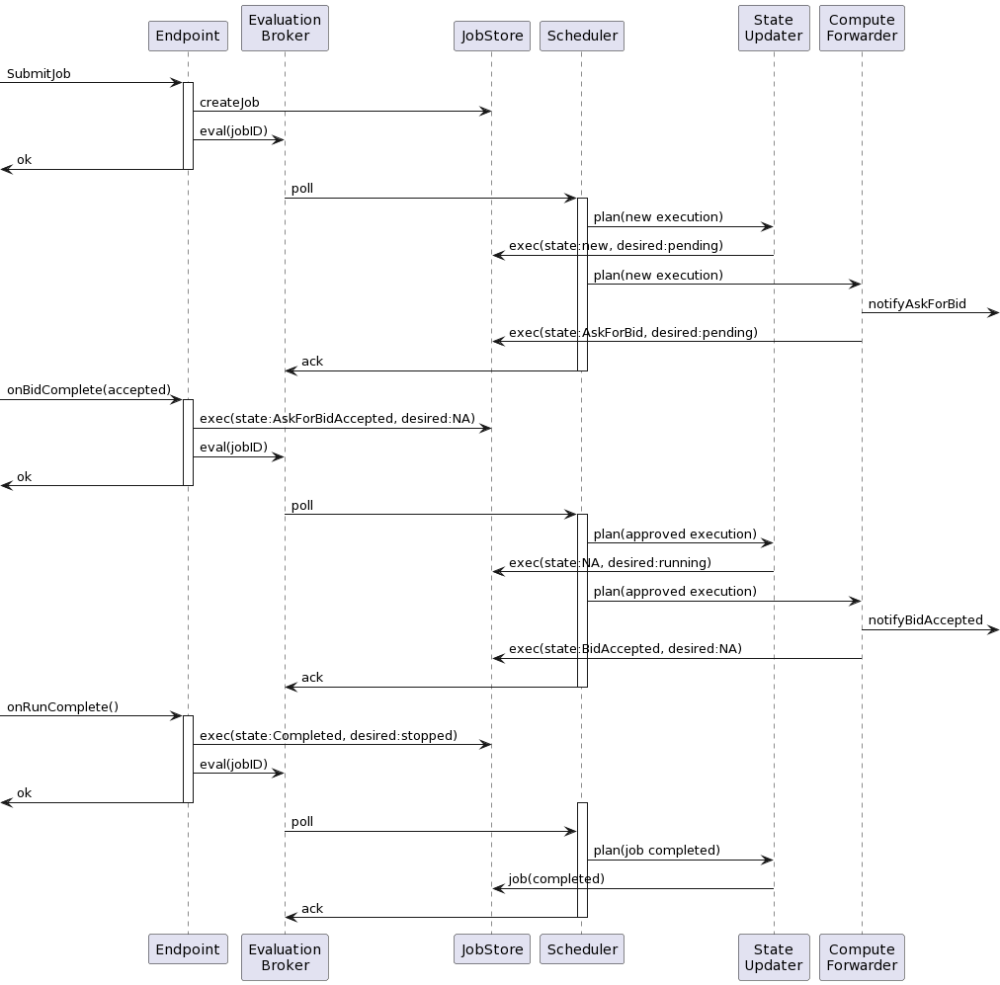

# Package orchestrator

Package orchestrator is responsible for scheduling jobs on a network of compute nodes. It consists of the main components that enable job evaluation, scheduling, and planning. The primary components of the orchestrator package are as follows:

### EvaluationBroker

EvaluationBroker is a queue of jobs that require reevaluation and comparison of the job's desired state and actual state in the network. Evaluations can be triggered by different sources, including job submission, updates, node failure, and more. Jobs are added to the EvaluationBroker when they need to be processed and their state compared to the desired state.

### Worker

Worker represents a long-running goroutine that polls evaluations from the EvaluationBroker, passes the evaluation to the right scheduler based on the job type, and then acknowledges back the evaluation to the EvaluationBroker on successful processing. Multiple workers can exist within a single orchestrator, each responsible for processing evaluations concurrently.

### Scheduler

Scheduler holds all the business logic required to compare the job's desired state and the observed state. Based on its observations, a scheduler can propose a plan that may include new executions, termination of existing ones, or approvals for pending executions. The scheduler is also responsible for finding placement for executions and ranking of nodes.

### Planner

Planner executes the plan suggested by the scheduler. Existing planners include:
- StateUpdater: This planner updates the job store with the desired changes resulting from the evaluation.
- ComputeForwarder: This planner notifies compute nodes with the proposed changes and updates the job store with the final observed state if the notification is successful. It handles communication with the compute nodes.

# Execution

Execution represents a mapping of a job to a compute node, where a job can have multiple active executions based on the desired executions count. Each execution is represented by two components:
- [models.ExecutionStateType](/pkg/model/execution_state.go): Represents the current observed state type of the execution
- [models.ExecutionDesiredState](/pkg/model/execution_state.go): Represents the desired state of the execution as provided by the scheduler.

The following sequence diagram shows the flow of an execution from the time it is created until it is completed, along with the different components that can mutate its state:

[PlantUML Diagram](https://www.plantuml.com/plantuml/png/hPBBhjiW48RtF0KwArlgUG5KLN5waTf55eswouR0jAN1W33aylOTNDl4JfqSIzaam7mpyy_yNZM1-n1hJHp-Aw4SDu6-V3RIMMN22-KDXUuoGOvSHnwKDJkpzlO0_X-CpsFmczrlW_NGXfjq6iUtuZV8gBlyfhzDeC03xCmF9tdeoVJKFOpXZxPsCU5Vh3znBxi4v-tvGWXv_J2CnEWsxciLK2FX8gWZ5ilpzWUA6QrmHeK7H10V1TFGhFqj_jZzrqybUVzA1u1HUo0IRkkJb87vUMX6dTKwIydR64x8ZqR75CrDOU14uGmY9aTASara-IrHj3662U-eX4PvaCoX9cL-bUCsxSB-NxyD9OPHOuFwUQcQ0svxhMGEtVOSe7kTyqAv6Erj8AOUMeCba-aQ0XHS2701PFdOqJbvLLSYoznKvTiTdpVycOvpvxmzWbnc-wRAG_bepBphqnwprkU5tJL_Tg-Bd9yO_psQmVZbXdUfru8GSWxaSzo-7M3s0tZaDlQbefSxQpHIHQOMRNQ5kcEj_m80)

At a high level, the scheduler is responsible for updating the execution's desired state, while other components are responsible for updating the observed state as follows:
- The endpoint receives requests from end users and callbacks from the compute nodes. Its primary responsibility is to update the execution's observed state and notify the scheduler of the new state by enqueuing an evaluation.

- The scheduler polls an evaluation and create new executions or update the desired state of existing ones. It does not modify the observed state. It does that through the help of the state updater.

- The compute proxy receives the plan and updates the execution's observed state after notifying the compute node of the change.
