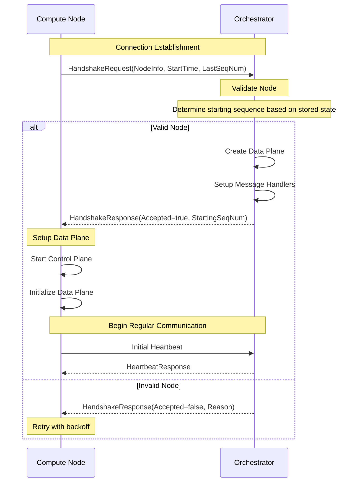
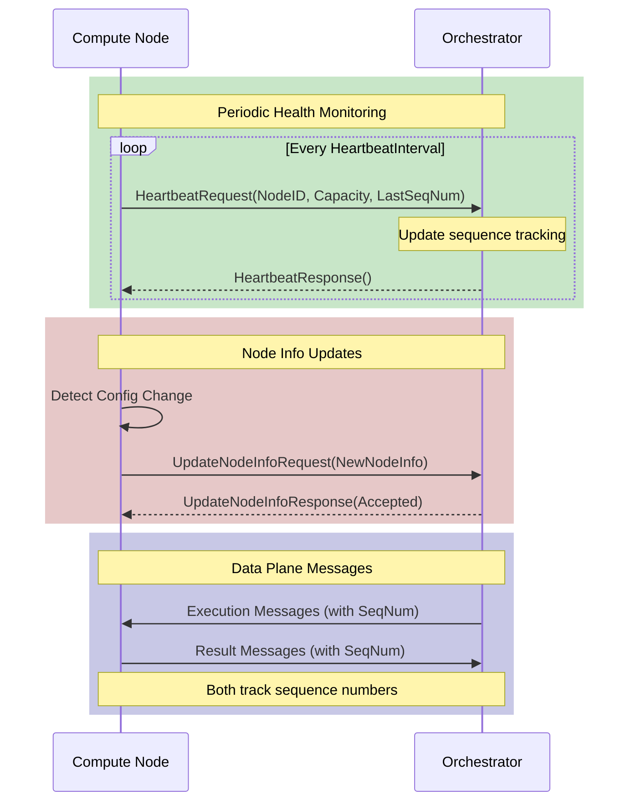
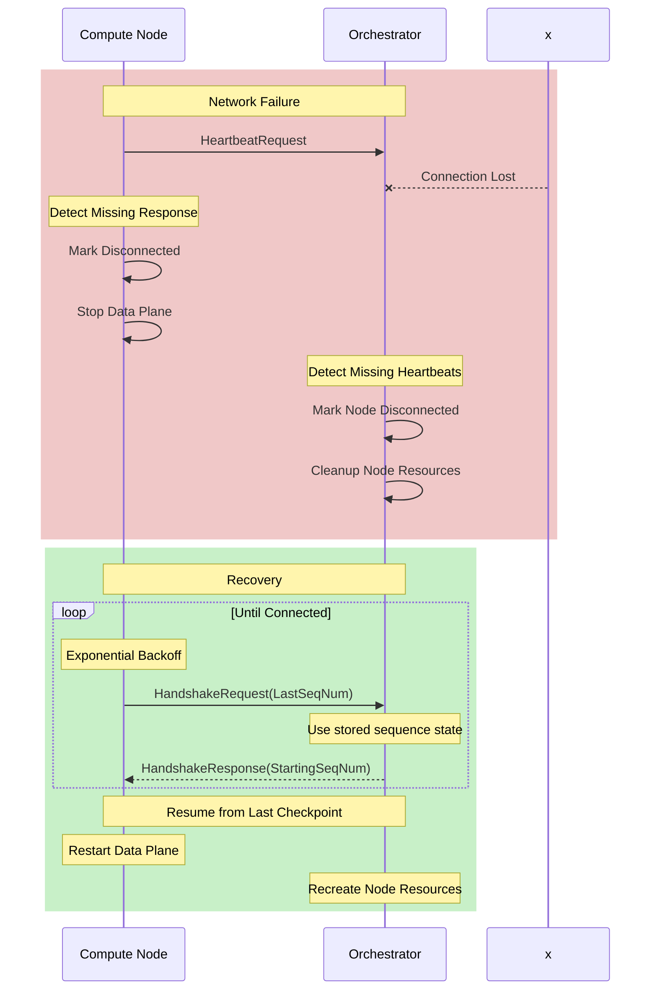

# NCL Protocol Documentation

The NCL (NATS Client Library) Protocol manages reliable bidirectional communication between compute nodes and orchestrators in the Bacalhau network. It provides ordered async message delivery, connection health monitoring, and automatic recovery from failures.

## Table of Contents
1. [Definitions & Key Concepts](#definitions--key-concepts)
2. [Architecture Overview](#architecture-overview)
3. [Message Sequencing](#message-sequencing)
4. [Connection Lifecycle](#connection-lifecycle)
5. [Message Contracts](#message-contracts)
6. [Communication Flows](#communication-flows)
7. [Component Dependencies](#component-dependencies)
8. [Configuration](#configuration)
9. [Glossary](#glossary)

## Definitions & Key Concepts

### Events and Messages
- **Event**: An immutable record of a state change in the local system
- **Message**: A communication packet sent between nodes derived from events
- **Sequence Number**: A monotonically increasing identifier for ordering events and messages

### Node Information
- **Node ID**: Unique identifier for each compute node
- **Resources**: Computational resources like CPU, Memory, GPU
- **Available Capacity**: Currently free resources on a node
- **Queue Used Capacity**: Resources allocated to queued jobs

### Connection States
- **Disconnected**: No active connection, no message processing
- **Connecting**: Attempting to establish connection
- **Connected**: Active message processing and health monitoring

Transitions between states occur based on:
- Successful/failed handshakes
- Missing heartbeats
- Network failures
- Explicit disconnection

## Architecture Overview

The protocol consists of two main planes:

### Control Plane
- Handles connection establishment and health monitoring
- Manages periodic heartbeats and node info updates
- Maintains connection state and health metrics
- Handles checkpointing for recovery

### Data Plane
- Provides reliable, ordered message delivery
- Manages event watching and dispatching
- Tracks message sequences for both sides
- Handles recovery from network failures

### NATS Subject Structure
```
bacalhau.global.compute.<nodeID>.in.msgs  - Messages to compute node
bacalhau.global.compute.<nodeID>.out.msgs - Messages from compute node
bacalhau.global.compute.<nodeID>.out.ctrl - Control messages from compute
bacalhau.global.compute.*.out.ctrl       - Global control channel
```

## Message Sequencing

### Overview

The NCL protocol integrates with a local event watcher system to decouple event processing from message delivery. Each node maintains its own ordered ledger of events that the protocol watches and selectively publishes. This decoupling provides several benefits:

- Clean separation between business logic and message transport
- Reliable local event ordering
- Simple checkpointing and recovery
- Built-in replay capabilities

### Event Flow Architecture

```
Local Event Store          NCL Protocol              Remote Node
┌──────────────┐    ┌─────────────────────┐    ┌──────────────┐
│              │    │  1. Watch Events     │    │              │
│  Ordered     │◄───┤  2. Filter Relevant  │    │              │
│  Event       │    │  3. Create Messages  │───►│   Receive    │
│  Ledger      │    │  4. Track Sequences  │    │   Process    │
│              │    │  5. Checkpoint       │    │              │
└──────────────┘    └─────────────────────┘    └──────────────┘
```

### Sequence Number Management

Each side maintains its own view of message processing:

1. **Orchestrator's View**
   - Tracks which messages each compute node has processed
   - Updates this view based on heartbeat reports
   - Uses its stored view for reconnection decisions
   - For new nodes, starts from latest sequence to avoid overwhelming them

2. **Compute Node's View**
   - Tracks which messages it has processed from orchestrator
   - Reports progress through periodic heartbeats
   - Maintains local checkpoints for recovery

This independent tracking helps handle edge cases like:
- Node restarts with fresh state
- Orchestrator recovery from data loss
- Network partitions

### Key Components

1. **Event Store**
    - Maintains ordered sequence of all local events
    - Each event has unique monotonic sequence number
    - Supports seeking and replay from any position

2. **Event Watcher**
    - Watches event store for new entries
    - Filters events relevant for transport
    - Supports resuming from checkpoint

3. **Message Dispatcher**
    - Creates messages from events
    - Manages reliable delivery
    - Tracks publish acknowledgments


## Connection Lifecycle

### Initial Connection

1. **Handshake**
    - Compute node initiates connection by sending HandshakeRequest
    - Includes node info, start time, and last processed sequence number
    - Orchestrator validates request and accepts/rejects connection
    - On acceptance, orchestrator creates dedicated data plane for node
    - Orchestrator determines starting sequence based on stored state:
        - For reconnecting nodes: Uses last known processed sequence
        - For new nodes: Starts from latest sequence number

2. **Data Plane Setup**
    - Both sides establish message subscriptions
    - Create ordered publishers for reliable delivery
    - Initialize event watchers and dispatchers
    - Set up sequence tracking

### Ongoing Communication

1. **Health Monitoring**
    - Compute nodes send periodic heartbeats
    - Include current capacity and last processed sequence number
    - Orchestrator updates its view of node progress
    - Missing heartbeats trigger disconnection

2. **Node Info Updates**
    - Compute nodes send updates when configuration changes
    - Includes updated capacity, features, labels
    - Orchestrator maintains current node state

3. **Message Flow**
    - Data flows through separate control/data subjects
    - Messages include sequence numbers for ordering
    - Both sides track processed sequences independently
    - Failed deliveries trigger automatic recovery

## Message Contracts

### Handshake Messages

```typescript
// Request sent by compute node to initiate connection
HandshakeRequest {
    NodeInfo: models.NodeInfo
    StartTime: Time
    LastOrchestratorSeqNum: uint64  // For reference only
}

// Response from orchestrator
HandshakeResponse {
    Accepted: boolean
    Reason: string          // Only set if not accepted
    LastComputeSeqNum: uint64
    StartingOrchestratorSeqNum: uint64  // Determined by orchestrator
}
```

### Heartbeat Messages

```typescript
// Periodic heartbeat from compute node
HeartbeatRequest {
    NodeID: string
    AvailableCapacity: Resources
    QueueUsedCapacity: Resources
    LastOrchestratorSeqNum: uint64  // Used to update orchestrator's view
}

// Acknowledgment from orchestrator
HeartbeatResponse {
    LastComputeSeqNum: uint64
}
```

### Node Info Update Messages

```typescript
// Node info update notification
UpdateNodeInfoRequest {
    NodeInfo: NodeInfo  // Same structure as in HandshakeRequest
}

UpdateNodeInfoResponse {
    Accepted: boolean
    Reason: string     // Only set if not accepted
}
```

## Communication Flows

### Initial Connection and Handshake
The following sequence shows the initial connection establishment between compute node and orchestrator:


### Regular Operation Flow

The following sequence shows the ongoing communication pattern between compute node and orchestrator, including periodic health checks and configuration updates:


During regular operation:
- Heartbeats occur every HeartbeatInterval (default 15s)
- Heartbeats include last processed sequence number, allowing orchestrator to track progress
- Configuration changes trigger immediate updates
- Data plane messages flow continuously in both directions
- Both sides maintain sequence tracking and acknowledgments

### Failure Recover Flow
The protocol provides comprehensive failure recovery through several mechanisms:


#### Failure Detection
- Missing heartbeats beyond threshold
- NATS connection failures
- Message publish failures

#### Recovery Process
1. Both sides independently detect failure
2. Clean up existing resources
3. Compute node initiates reconnection
4. Resume from last checkpoint:
    - Load last checkpoint sequence
    - Resume event watching
    - Rebuild publish state
    - Resend pending messages
5. Continue normal operation

This process ensures:
- No messages are lost
- Messages remain ordered
- Efficient recovery
- At-least-once delivery
- Proper handling of node restarts and state resets

## Component Dependencies

### Compute Node Components:

```
ConnectionManager
├── ControlPlane
│   ├── NodeInfoProvider
│   │   └── Monitors node state changes
│   ├── MessageHandler
│   │   └── Processes control messages
│   └── Checkpointer
│       └── Saves progress state
└── DataPlane
    ├── LogStreamServer
    │   └── Handles job output streaming
    ├── MessageHandler
    │   └── Processes execution messages
    ├── MessageCreator
    │   └── Formats outgoing messages
    └── EventStore
        └── Tracks execution events
```

### Orchestrator Components:

```
ComputeManager
├── NodeManager
│   ├── Tracks node states
│   └── Manages node lifecycle
├── MessageHandler
│   └── Processes node messages
├── MessageCreatorFactory
│   └── Creates per-node message handlers
└── DataPlane (per node)
    ├── Subscriber
    │   └── Handles incoming messages
    ├── Publisher
    │   └── Sends ordered messages
    └── Dispatcher
        └── Watches and sends events
```

## Configuration

### Connection Management
- `HeartbeatInterval`: How often compute nodes send heartbeats (default: 15s)
- `HeartbeatMissFactor`: Number of missed heartbeats before disconnection (default: 5)
- `NodeInfoUpdateInterval`: How often node info updates are checked (default: 60s)
- `RequestTimeout`: Timeout for individual requests (default: 10s)

### Recovery Settings
- `ReconnectInterval`: Base interval between reconnection attempts (default: 10s)
- `BaseRetryInterval`: Initial retry delay after failure (default: 5s)
- `MaxRetryInterval`: Maximum retry delay (default: 5m)

### Data Plane Settings
- `CheckpointInterval`: How often sequence progress is saved (default: 30s)

## Glossary

- **Checkpoint**: A saved position in the event sequence used for recovery
- **Handshake**: Initial connection protocol between compute node and orchestrator
- **Heartbeat**: Periodic health check message from compute node to orchestrator
- **Node Info**: Current state and capabilities of a compute node
- **Sequence Number**: Monotonically increasing identifier used for message ordering